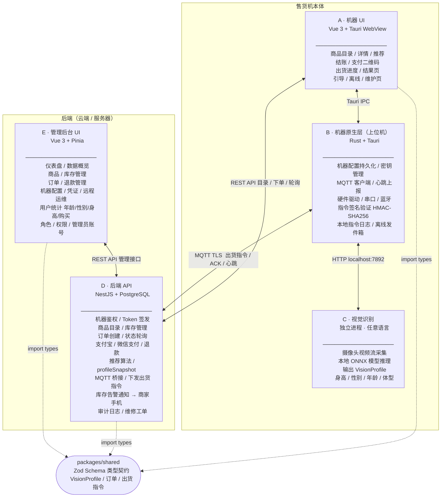

# VEM — 智能自动售货机软件系统

带机器视觉 + 实时推荐的自动售货机全栈软件系统，涵盖售货机端 UI、上位机原生层、视觉识别服务、后端 API 以及运营管理后台。

---

## 模块总览



| 模块            | 位置                     | 技术栈                    | 对外接口                                           |
| --------------- | ------------------------ | ------------------------- | -------------------------------------------------- |
| A · 机器 UI     | `apps/machine`           | Vue 3 + Tauri WebView     | Tauri IPC、REST API                                |
| B · 机器原生层  | `apps/machine/src-tauri` | Rust + Tauri              | Tauri IPC 命令、MQTT                               |
| C · 视觉识别    | _(待实现)_               | 任意语言                  | `POST localhost:7892/infer` → `VisionProfile` JSON |
| D · 后端 API    | `apps/service-api`       | NestJS 11 + PostgreSQL 16 | REST API、MQTT                                     |
| E · 管理后台 UI | `apps/admin-ui`          | Vue 3 + Ant Design Vue    | REST API                                           |
| shared          | `packages/shared`        | TypeScript + Zod          | npm 包，被 A/D/E 引用                              |
| db              | `packages/db`            | Drizzle ORM               | npm 包，被 D 引用                                  |

---

## 仓库结构

```
vem/
├── apps/
│   ├── machine/          # 模块 A+B：售货机端 UI（Vue）+ 原生层（Rust/Tauri）
│   ├── service-api/      # 模块 D：后端 API（NestJS）
│   └── admin-ui/         # 模块 E：管理后台（Vue）
├── packages/
│   ├── shared/           # 跨模块 Zod Schema / 类型契约
│   └── db/               # Drizzle Schema / 迁移文件 / DB 客户端
├── docs/                 # 设计文档与架构图
├── CONTRIBUTING.md       # 协作开发规范
├── turbo.json            # Turborepo 任务配置
└── pnpm-workspace.yaml
```

---

## 快速开始

### 环境要求

推荐使用 Dev Container（仓库已内置 `.devcontainer` 配置），自动提供以下依赖：

- Node.js 24+、pnpm 10+
- Rust stable（`apps/machine` 原生层）
- Docker（PostgreSQL + MQTT 基础设施）

不使用 Dev Container 时需手动安装上述工具。

### 启动后端

```bash
# 1. 安装依赖
pnpm install

# 2. 启动 PostgreSQL + MQTT
docker compose -f apps/service-api/docker-compose.yml up -d

# 3. 配置环境变量
cp apps/service-api/.env.example apps/service-api/.env
# 编辑 .env，填写数据库连接串和支付密钥等

# 4. 执行数据库迁移
pnpm --filter @vem/db migrate

# 5. 启动开发服务器（http://localhost:3000）
pnpm --filter service-api dev
```

### 启动管理后台

```bash
pnpm --filter admin-ui dev
# 默认访问 http://localhost:5173
```

### 启动售货机端

```bash
pnpm --filter machine dev
# Tauri 开发窗口将自动打开
```

### 启动售货机 daemon

```bash
cargo run -p vending-daemon -- --console --data-dir ./.local/vending-daemon --bind 127.0.0.1:7891
```

daemon console 模式会在数据目录创建 `machine-config.json`、`state.db`、`ipc-token` 与 `logs/machine-events.jsonl`。本机 UI 或调试工具访问 `/v1/*` 时需要读取 `ipc-token` 并携带 `Authorization: Bearer <token>`。

### 全量本地检查

```bash
pnpm exec oxfmt . && pnpm turbo typecheck && pnpm turbo lint && pnpm turbo test
```

---

## 技术栈一览

| 类型           | 工具                                                                                               |
| -------------- | -------------------------------------------------------------------------------------------------- |
| 包管理         | [pnpm](https://pnpm.io/) 10                                                                        |
| Monorepo 编排  | [Turborepo](https://turborepo.dev/) 2                                                              |
| 主要语言       | TypeScript（A/D/E/shared/db）、Rust（B 原生层）                                                    |
| 后端框架       | [NestJS](https://nestjs.com/) 11                                                                   |
| 数据库         | PostgreSQL 16 + [Drizzle ORM](https://orm.drizzle.team/)                                           |
| 消息队列       | Eclipse Mosquitto 2（MQTT over TLS）                                                               |
| 前端框架       | [Vue 3](https://vuejs.org/) + [Vite](https://vitejs.dev/)                                          |
| 桌面容器       | [Tauri](https://v2.tauri.app/) 2                                                                   |
| 管理后台 UI 库 | [Ant Design Vue](https://www.antdv-next.com/)                                                      |
| Schema 验证    | [Zod](https://zod.dev/)                                                                            |
| 测试框架       | [Vitest](https://vitest.dev/) + [Playwright](https://playwright.dev/)                              |
| 格式化 / Lint  | [oxfmt](https://github.com/nicolo-ribaudo/oxfmt)、[oxlint](https://oxc.rs/docs/guide/usage/linter) |

---

## 协作开发

本项目使用 GitHub Flow 进行协作，所有变更通过 Pull Request 合并进 `main`。

详见 [CONTRIBUTING.md](./CONTRIBUTING.md)。
