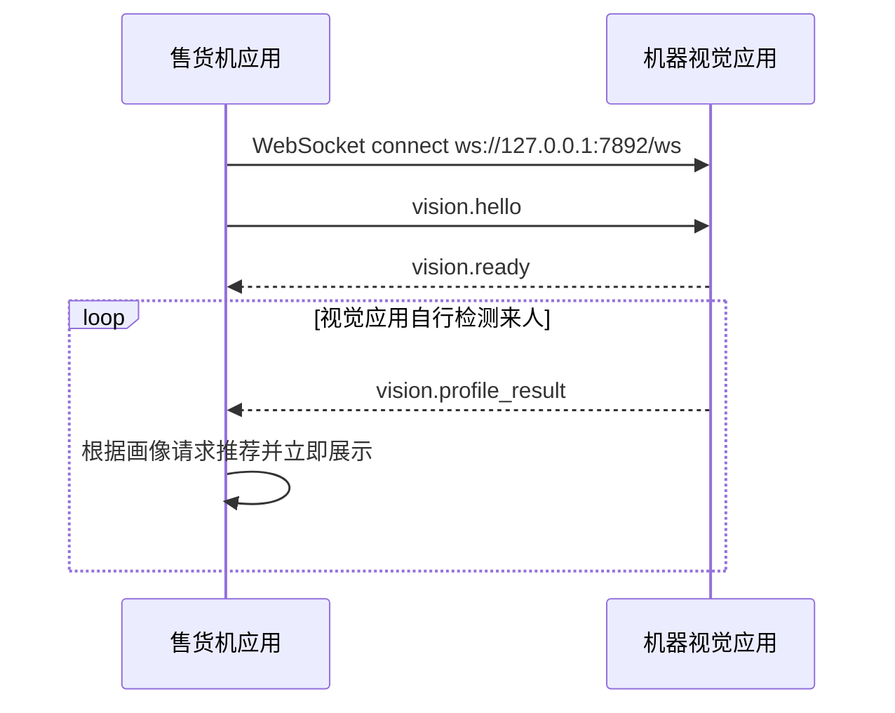

# 机器视觉模块通信协议

> 版本：`vem.vision.v1`
> 默认地址：`ws://127.0.0.1:7892/ws`
> 修改日期：2026-06-03
> 适用范围：本机机器视觉应用与售货机应用之间的 WebSocket 通信。

## 1. 设计变化

旧版逻辑是：红外/雷达检测来人 -> 售货机原生层发送识别指令 -> 视觉层唤醒并返回识别数据 -> 售货机应用请求推荐。

新版逻辑是：机器视觉应用自行负责摄像头、人体检测、采集和推理；只要识别到可用画像数据，就通过本协议主动推送给售货机应用。售货机应用收到画像后立即刷新推荐；没有推荐信息时继续展示默认商品列表，可由应用侧做轮播或随机推荐。

## 2. 职责边界

售货机应用负责：

- 连接本机视觉 WebSocket 服务；
- 发送握手和心跳；
- 接收视觉画像推送；
- 将画像转换为推荐请求并立即刷新推荐商品；
- 视觉未连接、未收到画像或推荐失败时展示默认商品列表；
- 部署时按配置启动、维护、关闭视觉进程。

机器视觉应用负责：

- 自行检测是否有人进入识别范围；
- 自行管理摄像头、模型加载、采集和推理；
- 有可用识别数据时主动推送 `vision.profile_result`；
- 未检测到有效人员时保持静默，不推送消息；
- 设备异常或协议异常时推送 `vision.error`；
- 只监听本地回环地址，不暴露到公网。

## 3. 传输层约定

| 项目       | 约定                                         |
| ---------- | -------------------------------------------- |
| Transport  | WebSocket，UTF-8 JSON 文本帧                 |
| 监听地址   | 默认 `127.0.0.1:7892`，路径 `/ws`            |
| 单帧大小   | 建议不超过 64 KiB；不要传图片/视频帧         |
| 二进制数据 | 禁止；如需调试图像，返回本地文件路径或摘要   |
| 心跳       | 双方可发送 `vision.ping` / `vision.pong`     |
| 推送模型   | 视觉层检测到可用画像后主动推送               |
| 安全       | 仅绑定 `127.0.0.1` / `::1`，不要监听公网地址 |

## 4. 消息信封

所有消息都使用统一 JSON 信封：

```json
{
  "protocol": "vem.vision.v1",
  "type": "vision.profile_result",
  "messageId": "018fb994-c70e-7ec2-b4c3-90e6a7f2c8f1",
  "timestamp": "2026-06-03T12:00:00.000Z",
  "payload": {}
}
```

| 字段        | 类型         | 必填 | 说明                                |
| ----------- | ------------ | ---- | ----------------------------------- |
| `protocol`  | string       | 是   | 固定为 `vem.vision.v1`              |
| `type`      | string       | 是   | 消息类型                            |
| `messageId` | string       | 是   | 发送方生成，用于日志追踪；建议 UUID |
| `timestamp` | ISO datetime | 是   | 发送时间                            |
| `payload`   | object       | 是   | 不同消息类型的载荷                  |

## 5. 售货机应用 -> 视觉层

### 5.1 `vision.hello`

连接建立后，售货机应用先发送握手消息。握手只声明身份和能力，不触发识别。

```json
{
  "protocol": "vem.vision.v1",
  "type": "vision.hello",
  "messageId": "hello-001",
  "timestamp": "2026-06-03T12:00:00.000Z",
  "payload": {
    "clientRole": "machine",
    "machineCode": "M001",
    "protocolVersion": 1,
    "capabilities": ["profile_push"]
  }
}
```

### 5.2 `vision.ping`

```json
{
  "protocol": "vem.vision.v1",
  "type": "vision.ping",
  "messageId": "ping-001",
  "timestamp": "2026-06-03T12:00:03.000Z",
  "payload": {}
}
```

> 新版协议不再包含 `vision.start_profile` 和 `vision.cancel`。识别生命周期由视觉应用自行管理。

## 6. 视觉层 -> 售货机应用

### 6.1 `vision.ready`

视觉层收到 `vision.hello` 后返回。售货机应用收到后保持连接，等待后续画像推送。

```json
{
  "protocol": "vem.vision.v1",
  "type": "vision.ready",
  "messageId": "ready-001",
  "timestamp": "2026-06-03T12:00:00.100Z",
  "payload": {
    "serverName": "vem-vision-python",
    "serverVersion": "0.2.0",
    "cameraReady": true,
    "modelReady": true,
    "capabilities": ["profile_push"]
  }
}
```

### 6.2 `vision.profile_result`

视觉层识别到可用画像时主动推送。每次推送代表一次识别事件。

```json
{
  "protocol": "vem.vision.v1",
  "type": "vision.profile_result",
  "messageId": "result-001",
  "timestamp": "2026-06-03T12:00:04.000Z",
  "payload": {
    "eventId": "vision-event-20260603-0001",
    "detectedAt": "2026-06-03T12:00:03.900Z",
    "profile": {
      "personPresent": true,
      "heightCm": 172,
      "shoulderWidthCm": null,
      "ageRange": "adult",
      "gender": "unknown",
      "bodyType": "regular",
      "upperColor": "dark",
      "confidence": 0.86
    },
    "quality": {
      "overall": "good",
      "warnings": []
    }
  }
}
```

画像字段说明：

| 字段              | 类型                | 必填 | 说明                                                               |
| ----------------- | ------------------- | ---- | ------------------------------------------------------------------ |
| `personPresent`   | boolean             | 是   | 是否识别到人。实践中检测到人时通常为 `true`                        |
| `heightCm`        | number \| null      | 否   | 身高厘米，有效范围 80–240。超出范围或无法测量时返回 `null`         |
| `shoulderWidthCm` | number \| null      | 否   | 肩宽厘米，有效范围 20–80。超出范围或无法测量时返回 `null`          |
| `ageRange`        | enum/string         | 否   | `child` / `teen` / `adult` / `senior` / `unknown`；图像质量不足（模糊、亮度低等）时返回 `"unknown"` |
| `gender`          | enum/string         | 否   | `male` / `female` / `unknown`；图像质量不足时返回 `"unknown"`；仅用于推荐，不做身份识别 |
| `bodyType`        | enum/string         | 否   | `slim` / `regular` / `strong` / `unknown`；图像质量不足时返回 `"unknown"` |
| `upperColor`      | string              | 否   | 上衣主色简述；图像质量不足时返回 `"unknown"`                       |
| `confidence`      | number              | 否   | 0–1 置信度                                                         |

#### `null` 与 `"unknown"` 的区别

- **数值字段**（`heightCm`、`shoulderWidthCm`）：当处理逻辑判断测量值超出合理边界（如身高 > 240 cm）或无法从图像中提取有效数值时，视觉层**显式返回 `null`**。接收方应将 `null` 视为"数值不可用"并在推荐逻辑中忽略该维度。
- **枚举/字符串字段**（`ageRange`、`gender`、`bodyType`、`upperColor`）：当图像质量不足（模糊、亮度不够）导致模型无法分类时，视觉层**返回字符串 `"unknown"`**。接收方应将 `"unknown"` 视为"无法判断"并在推荐逻辑中忽略该维度，而非将其视为一个独立的分类值。

### 6.3 `vision.error`

视觉层异常、设备不可用或协议错误时推送标准错误。未检测到有效人员不是异常，视觉应用应保持静默，不发送 `vision.error`。

```json
{
  "protocol": "vem.vision.v1",
  "type": "vision.error",
  "messageId": "error-001",
  "timestamp": "2026-06-03T12:00:04.000Z",
  "payload": {
    "code": "camera_unavailable",
    "message": "摄像头无法打开",
    "retryable": true
  }
}
```

错误码：

| code                  | retryable | 说明                      |
| --------------------- | --------- | ------------------------- |
| `invalid_message`     | 否        | JSON 格式或字段不符合协议 |
| `unsupported_version` | 否        | 协议版本不兼容            |
| `camera_unavailable`  | 是        | 摄像头不可用              |
| `model_not_ready`     | 是        | 模型未加载完成            |
| `internal_error`      | 是        | 视觉层内部异常            |

### 6.4 `vision.pong`

视觉层收到 `vision.ping` 后返回。

## 7. 正常时序



## 8. 售货机应用降级策略

- 连接失败：继续展示默认商品列表，并记录视觉模块未连接；
- 长时间未收到画像推送：继续默认轮播或随机推荐；
- `camera_unavailable` / `model_not_ready`：维护页显示告警；
- 推荐接口失败：保留默认商品列表；
- 收到未知消息类型：忽略并记录，不中断连接；
- 收到非 JSON 文本：返回 `invalid_message` 或关闭连接；
- 画像字段为 `null` 或 `"unknown"`：忽略该维度，继续推荐或使用默认列表。

## 9. 本仓库模拟服务

`apps/vision-mock` 用于离开真实摄像头和模型环境做联调：

- 默认监听 `ws://127.0.0.1:7892/ws`；
- `VISION_MOCK_SCENARIO=success`：握手后主动推送正常画像；
- `VISION_MOCK_SCENARIO=no_person`：握手后保持静默，不推送画像或错误；
- `VISION_MOCK_SCENARIO=camera_unavailable`：握手后主动推送摄像头错误；
- `VISION_MOCK_PUSH_INTERVAL_MS=1000`：配置握手后多久推送模拟事件。

售货机应用的浏览器/Tauri WebView 层会保持 WebSocket 订阅，收到画像后立即调用推荐逻辑；没有画像或推荐为空时继续展示默认商品。
