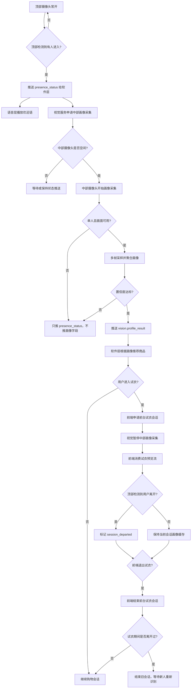

# 摄像头布置与识别流程方案

本文档记录售货机视觉模块的最终摄像头方案，用于对齐结构设计、前端试衣、软件推荐层、智能语音层和视觉服务实现。

## 方案结论

采用“两类摄像头、两套职责”的方案：

| 摄像头 | 安装位置 | 常开状态 | 主要职责 |
| --- | --- | --- | --- |
| 顶部球形摄像头 | 售货机顶部，俯视或广角观察柜体前方区域 | 常开 | 判断有没有人进入、有没有人离开、是否多人 |
| 中部正面摄像头 | 屏幕旁边或屏幕中上区域，面向用户 | 按需开启 | 人物字段识别、推荐画像采集、前端试衣画面 |

核心原则：

- 顶部摄像头只负责场景状态，不负责人物画像字段。
- 中部摄像头负责高质量正面画面，是人物字段推送和试衣的主摄像头。
- 试衣功能优先级高于视觉画像采集。
- 中部摄像头由视觉服务或本地摄像头管理层独占物理设备；前端试衣通过前台试衣会话消费预览流，不直接打开物理摄像头。
- 只有“单人 + 中部摄像头画面可用 + 画像置信度达标”时，才推送人物字段。

## 职责边界

### 顶部球形摄像头

顶部摄像头负责低成本、持续运行的场景感知：

- 检测售货机前方是否有人进入。
- 判断用户是否离开交互区域。
- 判断是否存在多人。
- 给中部摄像头、软件层、语音层提供触发信号。

顶部摄像头不用于：

- 年龄识别。
- 性别识别。
- 身高、肩宽、体型估计。
- 上衣颜色识别。
- 试衣画面。

### 中部正面摄像头

中部摄像头负责高价值画面：

- 采集人物画像字段。
- 采集用户正面或准正面上半身画面。
- 支持前端试衣功能。
- 在视觉画像采集和前台试衣会话之间进行逻辑控制权切换。

中部摄像头输出的人物字段包括：

- `personPresent`
- `heightCm`
- `shoulderWidthCm`
- `ageRange`
- `gender`
- `bodyType`
- `upperColor`
- `confidence`

## 主流程



## 状态机建议

视觉服务建议维护会话状态：

| 状态 | 含义 |
| --- | --- |
| `EMPTY` | 顶部摄像头未检测到用户 |
| `APPROACH_DETECTED` | 顶部摄像头检测到有人进入 |
| `WAIT_FRONT_CAMERA` | 等待中部摄像头空闲或等待正面画面可用 |
| `PROFILING` | 中部摄像头正在采集画像字段 |
| `PROFILE_PUSHED` | 已推送本次会话画像 |
| `BROWSING` | 用户正在浏览或软件层正在推荐 |
| `TRYON_ACTIVE` | 前台试衣会话正在使用中部摄像头预览流 |
| `TRYON_RETURNED` | 前台试衣会话已结束 |
| `DEPARTED` | 顶部摄像头确认用户离开 |
| `MULTIPLE_PEOPLE` | 检测到多人，不推送画像字段 |

## 画像采集策略

中部摄像头不建议只抓一帧，也不建议无限等待。建议采用短窗口采样：

| 参数 | 建议值 |
| --- | --- |
| 采样窗口 | `1.5s - 2.5s` |
| 最大等待时间 | `3s` |
| 采样间隔 | `200ms - 300ms` |
| 目标帧数 | `5 - 8` 帧 |
| 提前结束条件 | 画像字段完整且置信度达标 |

画像推送条件：

```text
顶部摄像头确认有人
+ 顶部摄像头未检测到多人
+ 中部摄像头空闲
+ 中部摄像头检测到单人
+ 正面/上半身画面可用
+ 多帧聚合置信度达标
=> 推送 vision.profile_result
```

如果超过最大等待时间仍无法得到可用画像：

- 不推送 `vision.profile_result`。
- 只推送 `vision.presence_status`。
- 软件层可以先展示通用推荐。
- 后续如果中部画面变得可用，可以补推画像结果。

## 推送时机

不建议“顶部一看到人就推画像字段”，也不建议完全沿用旧的“靠近后立即采集同一路摄像头”逻辑。

推荐时机：

1. 顶部摄像头检测到用户进入交互区。
2. 软件层和语音层收到 `presence_status`。
3. 语音层立即播放欢迎语。
4. 视觉服务尝试启动中部画像采集。
5. 中部摄像头在短窗口内采集人物画像。
6. 置信度达标后推送 `vision.profile_result`。
7. 软件层进行推荐。

这样可以兼顾响应速度和画像质量。

## 中部摄像头控制权

中部摄像头需要明确控制权，建议抽象为：

```text
owner = idle | vision | tryon_session
```

优先级：

```text
tryon_session > vision > idle
```

控制规则：

- 视觉服务只有在 `owner=idle` 时才能启动中部画像采集。
- 前端进入试衣时，可以申请前台试衣会话。
- 如果当前 `owner=vision`，视觉服务应暂停中部画像采集并切换为前台试衣会话。
- 试衣期间，视觉服务暂停中部摄像头画像采集。
- 试衣期间，顶部摄像头继续监控用户是否离开。
- 前端退出试衣后，需要明确结束前台试衣会话。

## 试衣期间的特殊逻辑

试衣期间中部摄像头由前台试衣会话使用，视觉服务不再采集中部画像字段。

顶部摄像头仍然常开，并持续判断用户是否离开：

| 情况 | 处理 |
| --- | --- |
| 试衣期间用户未离开 | 试衣结束后继续沿用当前会话画像，不重复推荐 |
| 试衣期间顶部确认用户离开 | 标记 `session_departed=true` |
| 前台试衣会话结束后顶部仍无人 | 结束会话，清空画像缓存 |
| 前台试衣会话结束后顶部检测到新人 | 重新进入欢迎、画像采集、推荐流程 |

## 多人场景

多人场景下不推送人物画像字段。

判断逻辑：

- 顶部摄像头检测到多人，进入 `MULTIPLE_PEOPLE`。
- 中部摄像头检测到多人，也进入 `MULTIPLE_PEOPLE`。
- 多人状态只推送 `vision.presence_status`。
- 软件层可以提示“请一位用户站到屏幕前”。
- 直到顶部摄像头重新确认单人或无人后，再允许进入画像流程。

建议新增或使用类似状态：

```json
{
  "type": "vision.presence_status",
  "payload": {
    "state": "multiple_people",
    "reason": "multiple_people_detected",
    "personPresent": true
  }
}
```

## 与现有视觉逻辑的差异

当前视觉逻辑更接近单摄像头：

```text
检测到有人/靠近
-> 采集同一路摄像头画面
-> 聚合画像字段
-> 推送 profile_result
```

新方案需要调整为：

```text
顶部摄像头检测场景状态
-> 中部摄像头申请控制权
-> 中部摄像头采集画像字段
-> 试衣时暂停中部画像采集并提供预览流
-> 顶部摄像头持续负责离开判断
```

需要避免：

- 顶部摄像头检测到人后直接推送画像字段。
- 中部摄像头处于前台试衣会话时，视觉服务仍尝试采集画像字段。
- 试衣结束后无条件重新画像，导致重复推荐。
- 多人场景下误推某一个人的画像字段。

## 软件层与前端协作点

### 软件层

软件层需要处理三类消息：

- `vision.presence_status`：有人、无人、多人、等待正面画面等状态。
- `vision.profile_result`：人物画像字段，用于推荐。
- `vision.person_departed`：用户离开，用于结束会话或清空推荐上下文。

### 智能语音层

语音层建议使用顶部摄像头触发的状态：

- 顶部检测到有人进入时播放欢迎语。
- 多人时可播放引导语。
- 用户离开后可停止当前交互语音或重置会话。

### 前端试衣

前端进入试衣前：

- 向视觉服务或摄像头管理层申请前台试衣会话。
- 等待前台试衣会话确认，并消费视觉服务或摄像头管理层提供的预览流。

前端退出试衣后：

- 主动结束前台试衣会话。
- 返回试衣结束状态。
- 视觉服务根据顶部摄像头状态决定是否继续当前会话。

## 后续实现建议

配置层建议从单摄像头扩展为多摄像头：

```json
{
  "cameras": {
    "top": {
      "index": 0,
      "role": "presence",
      "always_on": true
    },
    "front": {
      "index": 1,
      "role": "profile_tryon",
      "priority": ["tryon_session", "vision"]
    }
  }
}
```

视觉服务建议新增：

- 顶部摄像头 presence monitor。
- 中部摄像头 ownership manager。
- 会话状态机。
- 画像缓存。
- 试衣期间离开标记。
- 多人状态 reason。

## 待确认问题

以下问题需要结构、前端、软件层和视觉一起确认：

1. 顶部球形摄像头的实际视场角和安装高度。
2. 顶部摄像头是否能稳定覆盖售货机前方 `600mm - 1200mm` 交互区。
3. 前台试衣预览流使用 HTTP MJPEG、WebRTC 还是本地 WebSocket 帧流。
4. 前端试衣结束时，如何明确通知视觉服务结束前台试衣会话。
5. 软件层是否允许先展示通用推荐，再根据画像结果刷新推荐。
6. 多人状态下的界面和语音提示文案。
