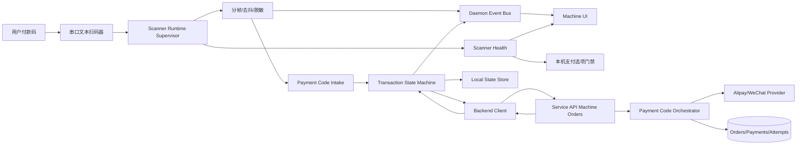
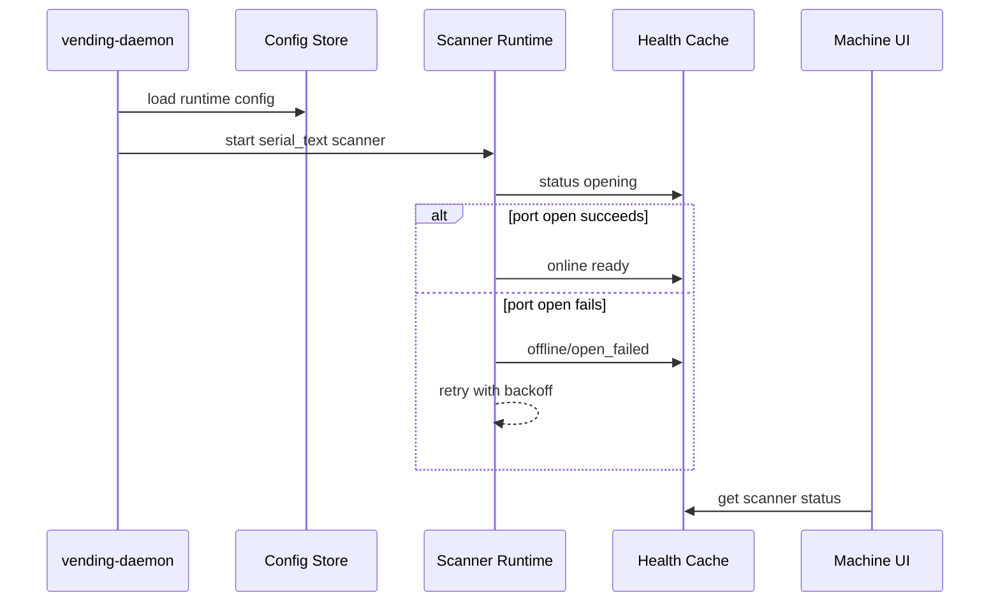
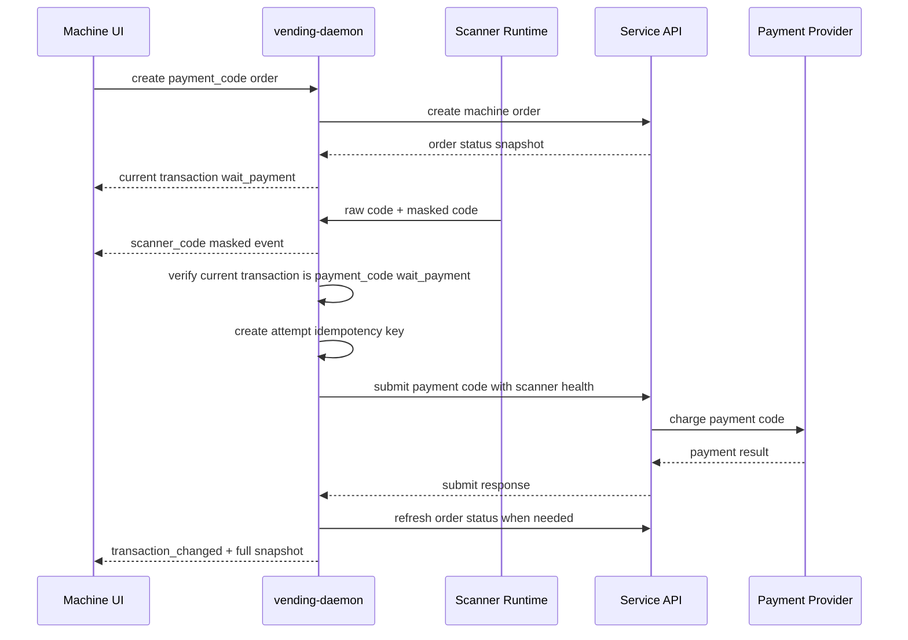
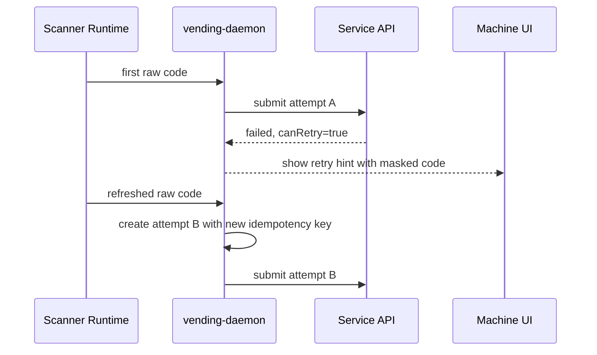

# 主动扫码真实适配设计规格说明

**状态**：草案
**日期**：2026-05-30

## 问题与目标

当前系统已经具备 `payment_code` 后端扣款链路、daemon 串口扫码骨架、付款码脱敏和去抖能力，但还不能形成真实扫码器生产闭环：自动扫码提交来源值与后端合同不一致，同一订单的重扫幂等语义不正确，扫码器健康与断线恢复不足，daemon 暴露给 UI 的交易快照信息也不够完整。

本功能目标是把主动扫码支付收敛为一条可量产的服务层链路：扫码器以串口文本流形态接入 `vending-daemon`，daemon 负责读取、分帧、脱敏、健康监管、付款码提交和交易状态同步，machine UI 只展示扫码器状态、脱敏码和支付进度。成功状态是：用户选择付款码支付后出示付款码，真实扫码器读取后自动扣款，成功进入出货，失败时可刷新付款码重试，全链路不在 UI、日志或本地 SQLite 中保存付款码明文。

## 设计决策与假设

本轮不向用户追问，以下决策基于需求目标和现有代码库现状确定：

- 目标扫码器形态限定为 `serial_text`：包括 USB CDC/COM、RS232、TTL 转串口等会输出文本帧的设备。维护配置只应把 `disabled` 与 `serial_text` 作为本轮可操作形态。
- 生产读取边界放在 `vending-daemon`，不恢复旧 Tauri native scanner 路径，也不让 UI 持有付款码明文。
- 后端真实支付能力沿用现有 `payment_code`、支付宝付款码和微信付款码实现；本设计只补齐机器端真实扫码适配、合同对齐、健康与重试语义。
- 自动扫码提交来源使用语义化的 `serial_text`。后端和共享合同需要接受该来源；既有来源值继续被解析以保护历史记录和开发工具，本生产链路只产生 `serial_text`。
- 单次有效扫码对应一次付款码 attempt；同一次提交的网络重试复用同一个幂等键，失败后用户刷新付款码再次扫码必须生成新的幂等键。

被挑战并调整的原始假设：

- “只把 source 改成一个后端已接受的字符串就足够”：不成立。source 修复只能打通请求，生产闭环还需要 scanner health、attempt 重试语义和交易快照同步。
- “读到码就提交当前订单”：不成立。daemon 必须判断当前交易确实是付款码支付且处于等待付款状态，否则只能广播脱敏事件并忽略 raw code。
- “一个订单复用一个 idempotencyKey”：不成立。这会让付款码失败后的重扫 replay 旧 attempt，违背后端 `canRetry` 语义。

关键替代路径比较：

- **daemon 读取并提交** vs **UI 读取后转交 daemon**：选择 daemon。付款码是支付凭证，读取与提交必须独立于 WebView 焦点、路由和 UI 重启，并与本地状态、健康、日志脱敏、网络重试保持一致。
- **复用 `tauri_scanner` 来源值** vs **新增/使用 `serial_text` 来源值**：选择 `serial_text`。当前主线已迁移到 daemon，继续使用 Tauri 命名会掩盖设备形态，影响运维统计和故障定位。
- **收到第一笔码后标记 scanner online** vs **scanner runtime 主动维护健康状态**：选择主动健康。生产运维需要知道串口未配置、打开失败、端口占用、读取失败、重连中和已恢复，而不是等到第一次扫码才显示在线。

## 约束条件

- 不破坏现有二维码支付、mock 支付、后端 `payment_code` provider 编排、支付回调、查单和撤销语义。
- 付款码明文只能短暂存在于 daemon 内存和后端 provider 调用入参中，不进入 UI 事件、日志、SQLite、本地配置、WebSocket payload 或管理端查询响应。
- daemon 是交易本地权威入口：UI 可重启，daemon 继续监管扫码器和当前交易；daemon 重启后只能恢复不含明文的交易摘要，用户需要重新扫码才能产生新的提交。
- 扫码串口配置必须与下位机出货串口配置分离，不能在扫码适配器未配置时回退使用硬件出货串口。
- 只有当前交易为付款码支付且仍在等待付款时，daemon 才消费 raw code 并提交后端。
- 当扫码器未配置、离线或重连中时，daemon 应在本机支付选项中禁用付款码支付；其他支付方式不受影响。
- 后端 source 合同、daemon 提交来源、payment code attempt 存储和 UI 展示必须使用同一套来源语义。
- 所有错误信息面向操作员可诊断，但不得包含付款码明文、机器密钥、MQTT 密钥或支付 provider 密钥。

## 架构

系统以 daemon 为生产主链路。扫码器只对 daemon 暴露文本帧；daemon 将同一帧拆成两个不同安全级别的数据流：脱敏事件流给 UI，raw code 只进入付款码提交路径。付款提交完成后，daemon 以服务端订单状态和本地交易摘要共同驱动 UI 路由，而不是让 UI 自行推断支付结果。

## 组件设计

### Scanner Runtime Supervisor

- **职责**：按照本机配置打开 `serial_text` 扫码串口，持续读取文本帧，维护健康状态，处理断线重连，并把扫码结果分发为安全的 masked event 与受控的 raw code 内存消息。
- **接口**：输入为 scanner adapter、串口路径、波特率、帧结尾符和关闭信号；输出为 scanner health、masked scanner event、raw payment code 内存消息。
- **依赖**：本机配置、串口异步读取能力、core scanner framer、daemon event bus、运行时状态缓存和本地健康事件记录。

### Scanner Framer 与 Redactor

- **职责**：识别 CRLF/LF/CR/无结尾符文本帧，丢弃控制字符，对 1.5 秒内重复码去抖，并生成 raw 与 masked 两种表示。
- **接口**：输入为字节块和当前时间；输出为付款码对象，其中 raw code 仅供 daemon 内部提交路径使用，masked code 可进入 UI 和日志安全上下文。
- **依赖**：无外部服务依赖，应保持纯逻辑以便单元测试覆盖。

### Scanner Health 与本机支付选项门禁

- **职责**：表达扫码器是否可用于真实付款码支付，并把端口未配置、打开失败、端口占用、读取失败、重连中、已连接、已禁用等状态转换为 UI 可读消息和健康事件。
- **接口**：提供 scanner status snapshot、health component、payment option gating 信号。付款码支付可用时 `online=true` 且 adapter 为 `serial_text`；不可用时付款码选项本机禁用。
- **依赖**：runtime status cache、本地健康事件、daemon payment options 代理、维护页展示。

### Payment Code Intake

- **职责**：消费 scanner runtime 产生的 raw code，并在提交前进行交易状态门禁、attempt 幂等管理和安全提交。
- **接口**：输入为 raw payment code；输出为付款码提交请求、交易状态更新、operator hint 和 transaction changed event。
- **依赖**：Transaction State Machine、Local State Store、Backend Client、Scanner Health。

### Attempt Idempotency Manager

- **职责**：确保“一次有效扫码 = 一次 attempt”，同时保证同一次 HTTP 提交网络重试不会重复扣款。
- **接口**：为当前扫码生成 attempt token、idempotency key 和本地 attempt 摘要；提交成功收到服务端响应后记录 attempt 状态；失败且允许重试时关闭本地 attempt，下一次扫码生成新 key。
- **依赖**：本地 order session、服务端 submit response、后端 active attempt 冲突语义。

### Transaction State Machine

- **职责**：创建付款码订单、恢复当前交易、提交付款码、同步服务端订单状态，并向 UI 提供完整交易快照。
- **接口**：输入为创建订单参数、付款码提交结果、订单状态查询结果；输出为 Current Transaction Snapshot 和 transaction changed event。
- **依赖**：Backend Client、Local State Store、daemon event bus、服务端 machine order status 合同。

### Backend Client 与 Service API 合同

- **职责**：daemon 与后端之间使用统一的付款码提交合同，传递 `machineCode`、`authCode`、`idempotencyKey`、`source=serial_text` 和 scanner health。
- **接口**：提交接口返回 orderNo、paymentNo、attemptNo、attempt status、nextAction、message、canRetry、serverTime；订单状态接口返回完整订单、支付、付款码 attempt、出货和退款摘要。
- **依赖**：机器鉴权 token、共享 schema、后端 Payment Code Orchestrator。

### Machine UI 支付页

- **职责**：在付款码支付页展示“请出示付款码”、扫码模块状态、最近一次脱敏码、服务端 operator hint 和交易路由结果。
- **接口**：读取 daemon current transaction、scanner status、payment options 和 event stream；不提供生产手动输入入口，不读取或保存付款码明文。
- **依赖**：daemon IPC client、checkout store、scanner store、startup route decision。

### 维护与诊断界面

- **职责**：让维护人员配置扫码串口、波特率和帧结尾符，查看 scanner status，执行扫码器自检，并在端口错误时获得可操作诊断。
- **接口**：配置保存后由 daemon 重启或重载生效；自检返回 adapter、online、port、message 和最近状态更新时间。
- **依赖**：daemon config store、scanner runtime health、可用串口枚举能力。

## 数据模型

### Scanner 配置

- `adapter`：本轮生产值为 `serial_text` 或 `disabled`。
- `port`：扫码器串口路径，Windows 形态通常为 COM 口，Linux 形态通常为 tty 设备。
- `baudRate`：扫码器串口波特率。
- `frameSuffix`：文本帧结束规则，支持 CRLF、LF、CR、无结尾符。

### Raw Payment Code

- `authCode`：付款码明文，仅存在于 daemon 内存提交路径和后端 provider 调用栈。
- `maskedCode`：脱敏展示值，可进入 UI event、本地 attempt 摘要和服务端 attempt 查询。
- `scannedAt`：daemon 接收时间，用于去抖、诊断和 UI 最近扫码展示。

### Scanner Health

- `online`：当前扫码器是否可用于付款码支付。
- `adapter`：当前 scanner adapter，生产链路为 `serial_text`。
- `port`：当前扫码串口，允许为空以表达未配置。
- `level` 与 `code`：健康级别和机器可读错误码。
- `message`：操作员可读说明。
- `updatedAt`：最后状态更新时间。

### Payment Code Attempt

- `attemptNo`：服务端同一订单下递增编号。
- `idempotencyKey`：单次有效扫码 attempt 的幂等键。
- `source`：生产自动扫码来源为 `serial_text`。
- `status`：created、submitting、user_confirming、querying、succeeded、failed、reversed、unknown、manual_handling、canceled 等服务端状态。
- `maskedAuthCode`：脱敏码。
- `scannerHealth`：提交时 daemon 看到的扫码器健康快照。
- `canRetry` 与 `message`：后端对 UI 和 daemon 重试策略的指示。

### Current Transaction Snapshot

daemon 对 UI 暴露的当前交易快照应覆盖以下概念字段：订单号、订单状态、总金额、支付单号、支付方式、支付 provider、支付状态、支付 URL、过期时间、付款码 attempt 摘要、出货摘要、下一步动作、错误码、错误消息、operator hint 和更新时间。该快照是 UI 路由和展示的唯一输入。

## 数据流

### 启动与健康

### 付款码支付

### 失败后重扫

## 错误处理

- **扫码器未配置**：scanner health 为 offline，message 指向缺少扫码串口；本机禁用付款码支付选项，维护页提示配置端口。
- **串口打开失败或端口占用**：scanner runtime 记录 open_failed，进入退避重连；UI 显示不可用，付款码支付不可选，二维码等其他支付方式继续可用。
- **读取失败或设备断开**：scanner health 转为 reconnecting/offline，当前未完成扫码不自动提交；重连成功后恢复 online。
- **重复扫码**：framer 在去抖窗口内丢弃同码重复帧，不创建 attempt，不触发后端提交。
- **无当前订单或订单不是付款码支付**：daemon 只可广播脱敏 scanner event 用于诊断，不消费 raw code，不调用后端。
- **订单已离开等待付款状态**：daemon 忽略后续 raw code，并用 transaction snapshot 驱动 UI 到出货或结果页。
- **已有 active attempt**：daemon 不创建新 attempt；若服务端返回 in_progress，UI 显示“正在确认支付结果”，等待后端查询或状态刷新。
- **后端鉴权失败**：daemon 记录 backend auth 错误，当前付款码提交失败，维护状态提示机器密钥或 token 问题。
- **后端合同校验失败**：视为发布阻断错误；daemon 记录 contract invalid，不继续重试，维护状态提示版本不匹配。
- **后端离线或网络超时**：同一次内存中的提交可复用同一 idempotency key 进行短暂重试；若 daemon 重启或 raw code 丢失，要求用户重新扫码。
- **支付失败且 `canRetry=true`**：daemon 关闭当前本地 attempt，UI 提示用户刷新付款码后重试，下一次扫码生成新 idempotency key。
- **支付结果未知或用户确认中**：后端 orchestrator 负责查单/撤销流程；daemon 定期刷新订单状态，UI 禁止重复提交并显示确认中。
- **敏感信息泄露风险**：日志、event、SQLite 和 UI schema 只允许 masked code、hash 或 provider-safe payload；测试必须覆盖明文缺失。

## 测试策略

- **核心单元测试**：覆盖扫码分帧后缀、控制字符丢弃、重复码去抖、脱敏格式和 public event 不含 `authCode`。
- **daemon scanner 测试**：用 PTY 模拟真实串口，覆盖打开成功、打开失败、读失败、断线重连、健康状态转换、masked event、raw code 不落库不落日志。
- **daemon 交易测试**：覆盖只有 `payment_code + wait_payment` 才提交、非等待态忽略、自动提交 source 为 `serial_text`、提交携带 scanner health、失败后重扫生成新 idempotency key、同一次网络重试复用 key。
- **后端合同测试**：共享 schema 接受 `serial_text` 来源和 scanner health；service API 创建 attempt 时存储 masked/hash 与 scanner health；相同幂等键 replay；新扫码失败后可创建新 attempt；active attempt 冲突保持原语义。
- **UI 合同测试**：daemon current transaction schema 与 UI 期望字段一致；付款码支付页展示 scanner status、masked code 和 operator hint；scanner 离线时本机禁用付款码支付选项；生产路径不依赖旧 native scanner API。
- **端到端测试**：使用 mock backend/provider 与 PTY scanner 验证从创建付款码订单、扫码提交、支付成功、进入出货的闭环；覆盖支付失败后刷新付款码重试成功；覆盖 UI 重启后仍能从 daemon 当前交易恢复。
- **Windows/真机 smoke**：在工控机上使用真实 COM 口扫码器验证端口配置、扫码速度、拔插重连、端口占用诊断、扫码支付成功、支付失败重扫和日志脱敏。

## 验收标准

- 串口文本扫码器配置为 `serial_text` 后，daemon 能在无 UI 焦点依赖的情况下读取真实付款码并自动提交后端。
- 自动提交请求通过后端 schema 校验，source 为 `serial_text`，并包含 scanner health。
- 付款码支付成功后，UI 在不接触明文的情况下展示支付成功并进入出货流程。
- 付款码失败且允许重试时，用户刷新付款码再次扫码会创建新的后端 attempt，而不是 replay 旧 attempt。
- 扫码器离线、未配置、端口占用或断线时，UI 和维护页能显示明确状态，付款码支付在本机不可选，其他支付方式保持可用。
- UI、WebSocket event、本地 SQLite、daemon 日志和管理查询均不出现付款码明文。
- daemon 和 UI 的当前交易快照合同一致，UI 刷新或重启后能恢复订单状态和正确路由。
- Linux 自动化 PTY 测试与 Windows 真机 smoke 均覆盖成功支付、失败重扫、断线重连和敏感信息脱敏。
