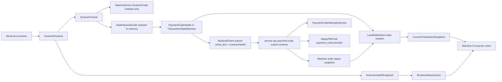

# 主动扫码真实适配实现计划

**目标：** 将 `serial_text` 串口文本扫码器接入 `vending-daemon` 生产付款码链路，实现健康监管、脱敏事件、每次扫码 attempt 幂等、后端合同对齐和 machine UI 状态恢复。

**架构：** 生产边界收敛到 daemon：scanner runtime 负责串口读取、分帧、脱敏、健康与重连，payment code intake 负责交易门禁、attempt key 和后端提交，UI 只消费脱敏事件、scanner status 和 current transaction snapshot。后端共享 schema 接受 `serial_text` 来源并持久化 scanner health，service-api 继续负责 provider 扣款、查单和撤销。

**技术栈：** Rust `tokio`/`tokio-serial`/`axum`/`sqlx`/`wiremock`，TypeScript `zod`/NestJS/Drizzle/Vitest，Vue 3/Pinia/Vite。

---

## 背景与目标

规格文件 `@docs/active-scan-real-adapter/spec.md` 要求真实扫码器以串口文本流接入 daemon，daemon 读取付款码后自动提交后端，并保证 UI、WebSocket event、本地 SQLite、daemon 日志和管理查询都不出现付款码明文。当前代码已经有付款码后端链路和 daemon 串口骨架，但存在以下已核实阻断点：

- `@apps/vending-daemon/src/scanner.rs:L32-L45` 将 `serial_text` source 映射为 `"serial"`，非 `serial_text` 分支还可能回退使用出货串口 `serial_port_path`。
- `@apps/vending-daemon/src/shutdown.rs:L237-L277` 的 watcher 只要当前 snapshot 有 `order_no` 就提交，并把 source 写成 `"scanner"`。
- `@packages/shared/src/schemas/orders.ts:L102-L123` 的 `paymentCodeSourceSchema` 不接受生产来源 `serial_text`。
- `@apps/vending-daemon/src/backend.rs:L181-L198` 提交付款码时没有传 `scannerHealth`。
- `@apps/vending-daemon/src/state/store.rs:L684-L743` 对同一个订单复用一个 `idempotencyKey`，不符合“每次有效扫码 = 一次 attempt”。
- `@apps/vending-daemon/src/ipc.rs:L515-L530` 和 `@apps/vending-daemon/src/transaction.rs:L42-L92` 返回的交易 snapshot 只有 `orderNo/status/nextAction/updatedAt`，但 machine UI 的 schema 需要完整字段，见 `@apps/machine/src/daemon/schemas.ts:L95-L120`。
- `@apps/vending-daemon/src/ipc.rs:L28-L35` 的 scanner status 只有 `online/adapter/message/updatedAt`，不能表达端口、健康级别和错误码。
- `@apps/machine/src/config/machine-config.ts:L11-L16` 与 `@apps/machine/src/views/MaintenanceView.vue:L93-L100` 暴露了本轮不实现的 scanner adapter 选项；本计划只保留 `disabled` 和 `serial_text`。

本计划不实现任何非串口文本扫码目标；生产配置、验收和测试仅围绕 `disabled` 与 `serial_text`。

## 架构图



## 文件结构映射

```text
crates/vending-core/src/
  scanner.rs                    修改：RawPaymentCode 增加 scannedAtMs；新增 ScannerHealthSnapshot 和 source 常量
  domain.rs                     修改：CurrentTransactionSnapshot 增加 paymentCodeAttempt 摘要字段

packages/shared/src/
  schemas/orders.ts             修改：paymentCodeSourceSchema 接受 serial_text；状态响应暴露 attempt 摘要
  contracts.spec.ts             修改：合同测试改为 serial_text + scannerHealth

apps/service-api/src/
  orders/orders.service.ts      修改：status 响应保留 serial_text source 与 attempt canRetry
  orders/machine-orders.controller.spec.ts 修改：submit 测试使用 serial_text
  payments/payment-code-attempts.service.spec.ts 修改：source/scannerHealth 存储断言
  payments/payment-code-flow.spec.ts 修改：成功、失败重扫、active attempt 测试使用 serial_text

apps/vending-daemon/src/
  backend.rs                    修改：submit_payment_code 接受 scannerHealth，加入同 key 短暂网络重试调用方支持
  config.rs                     修改：ScannerAdapterKind 仅保留 Disabled/SerialText
  events.rs                     修改：新增 scanner_health_changed；scanner_code 带 source，不带 authCode
  scanner.rs                    修改：runtime supervisor 增加健康状态、退避重连、严格 scanner 串口
  shutdown.rs                   修改：启动 scanner health cache；watcher 调用 serial_text intake
  state/store.rs                修改：新增完整 transaction snapshot、attempt lifecycle 方法
  transaction.rs                修改：创建订单/提交付款码/刷新订单状态返回 CurrentTransactionSnapshot
  ipc.rs                        修改：current transaction/schema/status/payment options gating/移除生产明文提交入口

apps/vending-daemon/tests/
  scanner_vision.rs             修改：PTY 覆盖扫码提交、失败重扫、断线重连、敏感信息脱敏
  ipc_contract.rs               修改：current transaction 与 scanner status 字段合同

apps/machine/src/
  daemon/schemas.ts             修改：scanner status、event、transaction schema 对齐 daemon
  stores/scanner.ts             修改：保存 level/code/port/lastMaskedCode
  stores/checkout.ts            修改：消费 paymentCodeAttempt 和 operatorHint
  config/machine-config.ts      修改：scanner adapter 仅 disabled/serial_text
  views/MaintenanceView.vue     修改：只展示 serial_text 配置和 scanner status 自检
  views/PaymentView.vue         修改：付款码页展示 scanner health、masked code、retry hint

scripts/windows/
  vending-daemon-smoke.ps1      修改：记录 scanner status、断线重连和脱敏检查的机器可读 smoke 输出
```

## 实现步骤

### 阶段 1：共享合同与核心类型

#### 步骤 1.1：编写 shared source 合同的失败测试

**目的：** 先锁定后端 schema 必须接受生产自动扫码来源 `serial_text` 和 scanner health。

**操作：** 修改 `@packages/shared/src/contracts.spec.ts:L417-L438` 的用例输入。当前测试使用 `"tauri_scanner"` 并断言该值，改为 `serial_text`，同时补齐 `scannerHealth.port/message`。

```ts
const submit = paymentCodeSubmitSchema.parse({
  machineCode: "M001",
  authCode: "28763443825664394",
  idempotencyKey: "scan-20260524-0001",
  source: "serial_text",
  scannerHealth: {
    online: true,
    adapter: "serial_text",
    port: "/dev/ttyUSB1",
    message: "scanner ready",
  },
});
expect(submit.source).toBe("serial_text");
expect(JSON.stringify(submit)).toContain("scannerHealth");
expect(JSON.stringify(submit)).toContain("serial_text");
```

**验证：** 运行 `pnpm --filter @vem/shared exec vitest run src/contracts.spec.ts`，预期当前实现失败，错误指向 `paymentCodeSourceSchema` 不接受 `serial_text`。

**依赖：** 无依赖。

#### 步骤 1.2：更新 shared schema 的付款码来源

**目的：** 让 service-api、machine UI 和管理查询共享同一套 `serial_text` 来源语义。

**操作：** 修改 `@packages/shared/src/schemas/orders.ts:L102-L108`。保留现有历史/开发来源 `tauri_scanner`、`browser_test`、`manual_dev`，新增生产来源 `serial_text`；不新增任何非串口文本生产来源。

```ts
export const paymentCodeSourceSchema = z.enum([
  "serial_text",
  "tauri_scanner",
  "browser_test",
  "manual_dev",
]);
```

如果 `@packages/shared/src/schemas/orders.ts:L182-L194` 的 `paymentCodeAttempt` 只包含扁平字段，扩展为后续 UI 可直接消费的摘要，保留原字段以兼容现有响应：

```ts
paymentCodeAttempt: z
  .object({
    attemptNo: z.int().positive(),
    status: paymentCodeAttemptStatusSchema,
    maskedAuthCode: z.string().max(32).nullable(),
    source: paymentCodeSourceSchema.nullable(),
    idempotencyKey: z.string().max(128).nullable(),
    submittedAt: z.iso.datetime().nullable(),
    lastCheckedAt: z.iso.datetime().nullable(),
    canRetry: z.boolean(),
    message: z.string().max(256).nullable(),
  })
  .nullable(),
```

**验证：** 运行 `pnpm --filter @vem/shared exec vitest run src/contracts.spec.ts`，预期步骤 1.1 的测试通过，且 `payment_code` 创建订单测试仍通过。

**依赖：** 步骤 1.1。

#### 步骤 1.3：扩展 core scanner 类型

**目的：** 让 daemon 内部 raw code、公开 scanner event 和 scanner health 使用同一组可序列化类型，并保证 raw code 不会被 public event 序列化。

**操作：** 修改 `@crates/vending-core/src/scanner.rs:L12-L24`。当前 `RawPaymentCode` 只有 `auth_code/masked_code`，`PublicScannerEvent` 只有 masked/source/scannedAt。增加扫描时间、生产 source 常量和 health snapshot。

```rust
pub const PAYMENT_CODE_SOURCE_SERIAL_TEXT: &str = "serial_text";

#[derive(Debug, Clone, PartialEq, Eq)]
pub struct RawPaymentCode {
    pub auth_code: String,
    pub masked_code: String,
    pub scanned_at_ms: u128,
}

#[derive(Debug, Clone, PartialEq, Eq, Serialize, Deserialize)]
#[serde(rename_all = "camelCase")]
pub struct ScannerHealthSnapshot {
    pub online: bool,
    pub adapter: String,
    pub port: Option<String>,
    pub level: crate::health::HealthLevel,
    pub code: String,
    pub message: String,
    pub updated_at: String,
}
```

同时修改 `ScannerFramer::flush()` 的 push 逻辑 `@crates/vending-core/src/scanner.rs:L83-L86`：

```rust
out.push(RawPaymentCode {
    masked_code: mask_code(&code),
    auth_code: code,
    scanned_at_ms: now_ms,
});
```

在 `@crates/vending-core/src/scanner.rs:L125-L133` 的 public event 测试中把 source 改成 `"serial_text"`，并新增 health 序列化断言：

```rust
let health = ScannerHealthSnapshot {
    online: true,
    adapter: PAYMENT_CODE_SOURCE_SERIAL_TEXT.to_string(),
    port: Some("/dev/ttyUSB1".to_string()),
    level: crate::health::HealthLevel::Ok,
    code: "SCANNER_READY".to_string(),
    message: "scanner ready".to_string(),
    updated_at: "2026-05-30T00:00:00.000Z".to_string(),
};
let value = serde_json::to_value(&health).expect("serialize health");
assert_eq!(value["adapter"], "serial_text");
assert!(!value.to_string().contains("authCode"));
```

**验证：** 运行 `cargo test -p vending-core scanner --lib` 和 `cargo test -p vending-core --test scanner_contract`，预期退出码 0。

**依赖：** 无依赖。

#### 步骤 1.4：扩展 core 当前交易 snapshot 合同

**目的：** 让 daemon 返回 machine UI 已声明需要的完整交易字段，并显式携带 payment code attempt 摘要。

**操作：** 修改 `@crates/vending-core/src/domain.rs:L68-L89`。当前 `CurrentTransactionSnapshot` 已有大部分字段但没有结构化 attempt。添加类型与字段：

```rust
#[derive(Debug, Clone, Serialize, Deserialize)]
#[serde(rename_all = "camelCase")]
pub struct PaymentCodeAttemptSummary {
    pub attempt_no: Option<i64>,
    pub status: Option<String>,
    pub masked_auth_code: Option<String>,
    pub source: Option<String>,
    pub idempotency_key: Option<String>,
    pub submitted_at: Option<String>,
    pub last_checked_at: Option<String>,
    pub can_retry: bool,
    pub message: Option<String>,
}
```

在 `CurrentTransactionSnapshot` 结构体 `@crates/vending-core/src/domain.rs:L70-L89` 中加入：

```rust
pub payment_code_attempt: Option<PaymentCodeAttemptSummary>,
```

更新 `current_transaction_snapshot_uses_payment_url_and_hides_sensitive_fields` 测试 `@crates/vending-core/src/domain.rs:L133-L164`，构造 `payment_code_attempt`，并断言 JSON 只有 `maskedAuthCode`：

```rust
payment_code_attempt: Some(PaymentCodeAttemptSummary {
    attempt_no: Some(1),
    status: Some("failed".to_string()),
    masked_auth_code: Some("6212****3456".to_string()),
    source: Some("serial_text".to_string()),
    idempotency_key: Some("ORDER-001:attempt-1".to_string()),
    submitted_at: None,
    last_checked_at: None,
    can_retry: true,
    message: Some("请刷新付款码后重试".to_string()),
}),
```

**验证：** 运行 `cargo test -p vending-core domain --lib`，预期退出码 0，JSON 不包含 `authCode`、机器密钥、MQTT 密钥字段。

**依赖：** 无依赖。

### 程序化验收标准

- 需求覆盖：
  - 规格“Backend Client 与 Service API 合同”中 `source=serial_text` 和 scanner health。
  - 规格“Current Transaction Snapshot”完整交易快照字段。
  - 规格“付款码明文只能短暂存在于 daemon 内存和后端 provider 调用入参”。
- 检查：
  - `pnpm --filter @vem/shared exec vitest run src/contracts.spec.ts` -> 退出码 0，`paymentCodeSubmitSchema` 接受 `serial_text` 和 scannerHealth。
  - `cargo test -p vending-core --lib` -> 退出码 0，scanner/domain 序列化测试不包含 `authCode`。
  - `cargo test -p vending-core --test scanner_contract` -> 退出码 0，分帧、控制字符丢弃、去抖仍通过。
- 制品 / 输出：
  - shared 合同中 `PaymentCodeSource` 包含 `serial_text`。
  - core JSON snapshot 中出现 `paymentCodeAttempt.maskedAuthCode`，不出现明文付款码字段。

### 阶段 2：daemon scanner runtime 健康与重连

#### 步骤 2.1：收紧 daemon scanner adapter 配置

**目的：** 本轮只允许维护配置选择 `disabled` 或 `serial_text`，并禁止扫码器未配置时回退到出货串口。

**操作：** 修改 `@apps/vending-daemon/src/config.rs:L21-L28`：

```rust
#[derive(Debug, Clone, Serialize, Deserialize, PartialEq, Eq)]
#[serde(rename_all = "snake_case")]
pub enum ScannerAdapterKind {
    Disabled,
    SerialText,
}
```

保持默认值 `@apps/vending-daemon/src/config.rs:L106-L118` 为 `ScannerAdapterKind::Disabled`。保留 `normalize_public_config()` 中 `serial_text` 必须有 `scannerSerialPortPath` 的校验 `@apps/vending-daemon/src/config.rs:L207-L213`。删除 `@apps/vending-daemon/src/scanner.rs:L32-L45` 对其它 adapter 的 source/port 分支。

**验证：** 运行 `cargo test -p vending-daemon config --lib`，预期 `normalize_public_config_validates_required_fields` 仍在 `scannerAdapter=serial_text` 且无 `scannerSerialPortPath` 时返回明确错误。

**依赖：** 阶段 1。

#### 步骤 2.2：编写 scanner runtime 健康失败测试

**目的：** 先捕获当前 runtime 打开失败后静默退出、status cache 不更新的问题。

**操作：** 在 `@apps/vending-daemon/src/scanner.rs:L97-L128` 的测试模块新增单元测试，构造一个不存在的串口路径并订阅事件，断言发出 `scanner_health_changed`。

```rust
#[tokio::test]
async fn scanner_runtime_reports_open_failed_without_raw_code() {
    let (raw_tx, mut raw_rx) = mpsc::channel(4);
    let (event_tx, mut event_rx) = broadcast::channel(8);
    let config = crate::config::MachinePublicConfig {
        scanner_adapter: ScannerAdapterKind::SerialText,
        scanner_serial_port_path: Some("/dev/vem-missing-scanner".to_string()),
        ..default_public_config()
    };
    let runtime = ScannerRuntime::from_config(
        &config,
        raw_tx,
        event_tx,
        CancellationToken::new(),
    );

    let handle = tokio::spawn(runtime.run());
    let event = tokio::time::timeout(std::time::Duration::from_secs(2), event_rx.recv())
        .await
        .expect("health event")
        .expect("event");
    handle.abort();

    let payload = serde_json::to_value(event).expect("event json");
    assert_eq!(payload["type"], "scanner_health_changed");
    assert_eq!(payload["snapshot"]["online"], false);
    assert_eq!(payload["snapshot"]["adapter"], "serial_text");
    assert_eq!(payload["snapshot"]["code"], "SCANNER_OPEN_FAILED");
    assert!(raw_rx.try_recv().is_err());
}
```

**验证：** 运行 `cargo test -p vending-daemon scanner_runtime_reports_open_failed_without_raw_code --lib`，预期当前实现失败，因为事件类型还不存在且 runtime 直接返回 Err。

**依赖：** 步骤 2.1。

#### 步骤 2.3：新增 scanner health event 并更新 status cache

**目的：** 让 daemon 事件流和 `/v1/scanner/status` 能表达打开失败、重连中、已连接、已禁用等状态。

**操作：** 修改 `@apps/vending-daemon/src/events.rs:L18-L23`，为 `DaemonEvent` 添加事件并给 scanner code 带 source：

```rust
ScannerHealthChanged {
    event_id: String,
    updated_at: String,
    snapshot: vending_core::scanner::ScannerHealthSnapshot,
},
ScannerCode {
    event_id: String,
    updated_at: String,
    masked_code: String,
    source: String,
    scanned_at_ms: u128,
},
```

更新测试 `@apps/vending-daemon/src/events.rs:L55-L67`，断言 `ScannerCode` JSON 包含 `"source":"serial_text"`、`maskedCode`、`scannedAtMs`，不包含 `authCode`。

修改 `@apps/vending-daemon/src/ipc.rs:L28-L35`，删除本地 `ScannerStatusSnapshot` 结构体，改用 `vending_core::scanner::ScannerHealthSnapshot`。修改 `RuntimeStatusCache` `@apps/vending-daemon/src/ipc.rs:L57-L62` 的 scanner 类型：

```rust
pub scanner: Arc<tokio::sync::RwLock<vending_core::scanner::ScannerHealthSnapshot>>,
```

修改初始化 `@apps/vending-daemon/src/ipc.rs:L88-L96`：

```rust
scanner: Arc::new(tokio::sync::RwLock::new(
    vending_core::scanner::ScannerHealthSnapshot {
        online: false,
        adapter: serde_json::to_value(&public.scanner_adapter)
            .ok()
            .and_then(|value| value.as_str().map(ToString::to_string))
            .unwrap_or_else(|| "unknown".to_string()),
        port: public.scanner_serial_port_path.clone(),
        level: vending_core::health::HealthLevel::Offline,
        code: "SCANNER_INITIALIZING".to_string(),
        message: "scanner runtime initializing".to_string(),
        updated_at: crate::state::store::now_iso(),
    },
)),
```

修改 `cache_daemon_events()` `@apps/vending-daemon/src/shutdown.rs:L301-L340`，用 `ScannerHealthChanged` 覆盖 status cache；`ScannerCode` 只更新 last code message，不把缺少 health 的扫码事件当作唯一上线信号。

```rust
DaemonEvent::ScannerHealthChanged { snapshot, .. } => {
    let mut cache = status_cache.scanner.write().await;
    *cache = snapshot;
}
DaemonEvent::ScannerCode { masked_code, .. } => {
    let mut cache = status_cache.scanner.write().await;
    cache.message = format!("last code {masked_code}");
    cache.updated_at = updated_at;
}
```

**验证：** 运行 `cargo test -p vending-daemon events --lib` 和 `cargo test -p vending-daemon ipc --lib`，预期事件和 status cache schema 编译通过。

**依赖：** 步骤 1.3。

#### 步骤 2.4：实现 scanner runtime supervisor 状态机

**目的：** 打开失败、读取失败和断线后不让任务静默结束，而是进入退避重连并持续报告 health。

**操作：** 重写 `@apps/vending-daemon/src/scanner.rs:L25-L94` 的 `ScannerRuntime::from_config()` 与 `run()`。保留现有 `ScannerRuntimeConfig`，把 `source` 固定为 `vending_core::scanner::PAYMENT_CODE_SOURCE_SERIAL_TEXT`，port 只来自 `scanner_serial_port_path`。增加 helper：

```rust
fn health_snapshot(
    &self,
    online: bool,
    level: vending_core::health::HealthLevel,
    code: &str,
    message: impl Into<String>,
) -> vending_core::scanner::ScannerHealthSnapshot {
    vending_core::scanner::ScannerHealthSnapshot {
        online,
        adapter: self.config.source.clone(),
        port: self.config.port_path.clone(),
        level,
        code: code.to_string(),
        message: message.into(),
        updated_at: crate::state::store::now_iso(),
    }
}

fn emit_health(&self, snapshot: vending_core::scanner::ScannerHealthSnapshot) {
    let _ = self.tx_events.send(DaemonEvent::ScannerHealthChanged {
        event_id: Uuid::new_v4().simple().to_string(),
        updated_at: snapshot.updated_at.clone(),
        snapshot,
    });
}
```

`run()` 使用以下控制流：

```rust
pub async fn run(self) -> Result<(), String> {
    if self.config.source == "disabled" {
        self.emit_health(self.health_snapshot(
            false,
            vending_core::health::HealthLevel::Offline,
            "SCANNER_DISABLED",
            "scanner disabled",
        ));
        self.shutdown.cancelled().await;
        return Ok(());
    }

    let Some(port_path) = self.config.port_path.clone() else {
        self.emit_health(self.health_snapshot(
            false,
            vending_core::health::HealthLevel::Offline,
            "SCANNER_PORT_MISSING",
            "scanner serial port is not configured",
        ));
        self.shutdown.cancelled().await;
        return Ok(());
    };

    let mut backoff_ms = 500_u64;
    loop {
        self.emit_health(self.health_snapshot(
            false,
            vending_core::health::HealthLevel::Degraded,
            "SCANNER_OPENING",
            format!("opening scanner serial port {port_path}"),
        ));

        match tokio_serial::new(&port_path, self.config.baud_rate).open_native_async() {
            Ok(port) => {
                backoff_ms = 500;
                self.emit_health(self.health_snapshot(
                    true,
                    vending_core::health::HealthLevel::Ok,
                    "SCANNER_READY",
                    "scanner ready",
                ));
                self.read_loop(port).await?;
            }
            Err(error) => {
                self.emit_health(self.health_snapshot(
                    false,
                    vending_core::health::HealthLevel::Offline,
                    "SCANNER_OPEN_FAILED",
                    format!("open scanner serial failed: {error}"),
                ));
            }
        }

        tokio::select! {
            _ = self.shutdown.cancelled() => return Ok(()),
            _ = tokio::time::sleep(std::time::Duration::from_millis(backoff_ms)) => {
                backoff_ms = (backoff_ms * 2).min(10_000);
            }
        }
    }
}
```

把现有读循环 `@apps/vending-daemon/src/scanner.rs:L71-L93` 提取为 `read_loop()`: 成功 frame 时发送 `ScannerCode { source: self.config.source.clone(), scanned_at_ms: raw.scanned_at_ms }` 和 raw channel；read error 时发送 `SCANNER_RECONNECTING` 并返回 `Ok(())` 触发外层重连；shutdown 返回 `Ok(())`。

**验证：** 运行：

- `cargo test -p vending-daemon scanner_runtime_reports_open_failed_without_raw_code --lib` -> 退出码 0。
- `cargo test -p vending-daemon scanner_runtime_with_disabled_adapter_returns_ok --lib` -> 退出码 0，测试期望更新为收到 `SCANNER_DISABLED` health 后取消 runtime，而不是立即退出。

**依赖：** 步骤 2.3。

#### 步骤 2.5：扩展 PTY scanner 自动化测试

**目的：** 用 Linux PTY 覆盖真实串口文本读取、脱敏事件、health status 和断线重连信号。

**操作：** 修改 `@apps/vending-daemon/tests/scanner_vision.rs:L33-L64`。现有测试只等待 status 包含 masked code；扩展为：

```rust
let scanner = daemon.get_json("/v1/scanner/status").await;
assert_eq!(scanner["adapter"], "serial_text");
assert_eq!(scanner["online"], true);
assert_eq!(scanner["code"], "SCANNER_READY");
assert!(scanner.to_string().contains("6212****3456"));
assert!(!scanner.to_string().contains("621234567890123456"));
```

新增 `scanner_open_failure_reports_offline()`：用不存在端口启动 daemon，轮询 `/v1/scanner/status` 直到 `code == "SCANNER_OPEN_FAILED"`，断言 status 包含 `online:false`、`adapter:"serial_text"`、`level:"offline"` 和可读 `message`，且 event/log 不包含付款码明文。

**验证：** 运行 `cargo test -p vending-daemon --test scanner_vision scanner_code_is_masked_in_events_and_not_persisted_plaintext` 和 `cargo test -p vending-daemon --test scanner_vision scanner_open_failure_reports_offline`，预期退出码 0。

**依赖：** 步骤 2.4。

### 程序化验收标准

- 需求覆盖：
  - 规格“Scanner Runtime Supervisor”打开串口、健康监管、断线恢复。
  - 规格“Scanner Health 与本机支付选项门禁”中的未配置、打开失败、重连中、已连接状态表达。
  - 规格“扫码串口配置必须与下位机出货串口配置分离”。
- 检查：
  - `cargo test -p vending-daemon scanner --lib` -> 退出码 0，disabled/open_failed/ready/reconnecting 单元测试通过。
  - `cargo test -p vending-daemon --test scanner_vision` -> 退出码 0，PTY 事件、status、敏感信息脱敏通过。
  - `cargo test -p vending-daemon config --lib` -> 退出码 0，`serial_text` 无 `scannerSerialPortPath` 仍失败。
- 制品 / 输出：
  - `/v1/scanner/status` 返回 `online/adapter/port/level/code/message/updatedAt`。
  - scanner code WebSocket event 只包含 `maskedCode/source/scannedAtMs`，不包含 `authCode`。

### 阶段 3：daemon 付款码 intake、attempt 幂等与完整交易快照

#### 步骤 3.1：编写 attempt key 失败后重扫测试

**目的：** 固化“失败可重试后的下一次扫码必须生成新 idempotency key”的规则。

**操作：** 在 `@apps/vending-daemon/src/state/store.rs:L1277-L1302` 附近新增测试。当前 `get_or_create_payment_attempt_key()` 会复用旧 key，此测试应先失败。

```rust
#[tokio::test]
async fn payment_code_retry_scan_creates_new_idempotency_key() {
    let temp = TempDir::new().expect("temp");
    let store = LocalStateStore::open(&temp.path().join("state.db"))
        .await
        .expect("open");
    store.upsert_order_session(OrderSessionUpsert {
        order_no: "ORDER-RETRY",
        payment_method: "payment_code",
        payment_provider: Some("alipay"),
        items_json: json!([]),
        status: "waiting_payment",
        next_action: "wait_payment",
        payment_attempt_json: None,
        recovery_strategy: "local",
        last_backend_status_json: None,
        last_error: None,
    }).await.expect("seed");

    let first = store
        .begin_payment_code_attempt(
            "ORDER-RETRY",
            "6212****3456",
            "serial_text",
            1_000,
            None,
        )
        .await
        .expect("first");
    store.finish_payment_code_attempt(
        "ORDER-RETRY",
        "failed",
        true,
        Some("付款码无效或支付失败，请刷新付款码后重试"),
    ).await.expect("finish");
    let second = store
        .begin_payment_code_attempt(
            "ORDER-RETRY",
            "6212****9999",
            "serial_text",
            2_000,
            None,
        )
        .await
        .expect("second");

    assert_ne!(first, second);
    let data = store.load_attempt_json("ORDER-RETRY").await.expect("json").expect("attempt");
    assert_eq!(data["maskedAuthCode"], "6212****9999");
    assert_eq!(data["source"], "serial_text");
    assert!(!data.to_string().contains("621234567890123456"));
}
```

**验证：** 运行 `cargo test -p vending-daemon payment_code_retry_scan_creates_new_idempotency_key --lib` 和 `cargo test -p vending-daemon payment_code_active_attempt_blocks_new_scan --lib`，预期当前实现失败，因为 lifecycle 方法和 active attempt 门禁尚不存在。

**依赖：** 阶段 1。

同一测试模块还要新增 active attempt 覆盖：

- `payment_code_active_attempt_blocks_new_scan`：seed `payment_attempt_json.status="submitting"` 后再次调用 `begin_payment_code_attempt()`，预期返回明确错误且原 `idempotencyKey` 不变。
- `payment_code_user_confirming_attempt_blocks_new_scan`：seed `status="user_confirming"`，预期同样不创建新 attempt。
- `payment_code_failed_retryable_attempt_allows_new_scan`：seed `status="failed", canRetry=true`，预期创建新 key。

#### 步骤 3.2：实现 LocalStateStore attempt lifecycle

**目的：** 用本地 order session 记录每次扫码 attempt 的脱敏摘要和状态，同时避免保存明文；已有 active attempt 时不创建新 attempt。

**操作：** 在 `@apps/vending-daemon/src/state/store.rs:L684-L773` 替换旧的 `get_or_create_payment_attempt_key()` 和扩展 `record_payment_attempt_summary()`。新增 `StoreError::ActivePaymentCodeAttempt`，并新增方法：

```rust
pub async fn begin_payment_code_attempt(
    &self,
    order_no: &str,
    masked_auth_code: &str,
    source: &str,
    scanned_at_ms: u128,
    scanner_health: Option<&vending_core::scanner::ScannerHealthSnapshot>,
) -> Result<String, StoreError> {
    if let Some(existing) = self.load_attempt_json(order_no).await? {
        let status = existing.get("status").and_then(|value| value.as_str());
        let can_retry = existing
            .get("canRetry")
            .and_then(|value| value.as_bool())
            .unwrap_or(false);
        if matches!(status, Some("submitting" | "user_confirming" | "querying" | "processing")) {
            return Err(StoreError::ActivePaymentCodeAttempt);
        }
        if matches!(status, Some("failed" | "manual_handling" | "unknown")) && !can_retry {
            return Err(StoreError::ActivePaymentCodeAttempt);
        }
    }

    let idempotency_key = format!("{}:{}", order_no, Uuid::new_v4().simple());
    let payload = serde_json::json!({
        "idempotencyKey": idempotency_key,
        "maskedAuthCode": masked_auth_code,
        "source": source,
        "status": "submitting",
        "canRetry": false,
        "message": null,
        "scannedAtMs": scanned_at_ms,
        "scannerHealth": scanner_health,
    });
    sqlx::query(
        "UPDATE order_sessions
         SET payment_attempt_json = ?2, updated_at = ?3
         WHERE order_no = ?1",
    )
    .bind(order_no)
    .bind(payload.to_string())
    .bind(now_iso())
    .execute(&self.pool)
    .await?;
    Ok(payload["idempotencyKey"].as_str().unwrap_or_default().to_string())
}

pub async fn finish_payment_code_attempt(
    &self,
    order_no: &str,
    status: &str,
    can_retry: bool,
    message: Option<&str>,
) -> Result<(), StoreError> {
    let mut data = self.load_attempt_json(order_no).await?.unwrap_or_default();
    data.insert("status".to_string(), serde_json::Value::String(status.to_string()));
    data.insert("canRetry".to_string(), serde_json::Value::Bool(can_retry));
    data.insert(
        "message".to_string(),
        message.map_or(serde_json::Value::Null, |value| {
            serde_json::Value::String(value.to_string())
        }),
    );
    sqlx::query("UPDATE order_sessions SET payment_attempt_json = ?2, updated_at = ?3 WHERE order_no = ?1")
        .bind(order_no)
        .bind(serde_json::Value::Object(data).to_string())
        .bind(now_iso())
        .execute(&self.pool)
        .await?;
    Ok(())
}
```

保留 `record_payment_attempt_summary()` 作为 dev tests 可调用 wrapper，内部调用 `begin_payment_code_attempt()` 或更新为 `finish_payment_code_attempt()`，并把测试 `@apps/vending-daemon/src/transaction.rs:L170-L174` 和 `@apps/vending-daemon/src/state/store.rs:L1288-L1290` 的 source 改为 `serial_text`。

**验证：** 运行 `cargo test -p vending-daemon payment_code_retry_scan_creates_new_idempotency_key --lib`、`cargo test -p vending-daemon payment_code_active_attempt_blocks_new_scan --lib` 和 `cargo test -p vending-daemon order_session_does_not_store_auth_code --lib`，预期退出码 0。

**依赖：** 步骤 3.1。

#### 步骤 3.3：让 BackendClient 提交 scanner health

**目的：** daemon 到 service-api 的请求体必须满足共享 schema，包含 `source=serial_text` 和 scanner health。

**操作：** 修改 `@apps/vending-daemon/src/backend.rs:L23-L29`：

```rust
#[derive(Debug, Clone, Serialize, Deserialize)]
pub struct PaymentCodeSubmitBody {
    pub machine_code: String,
    pub auth_code: String,
    pub idempotency_key: String,
    pub source: String,
    pub scanner_health: Option<vending_core::scanner::ScannerHealthSnapshot>,
}
```

修改 `submit_payment_code()` 签名 `@apps/vending-daemon/src/backend.rs:L181-L198`：

```rust
pub async fn submit_payment_code(
    &self,
    machine_code: &str,
    order_no: &str,
    auth_code: &str,
    idempotency_key: &str,
    source: &str,
    scanner_health: Option<&vending_core::scanner::ScannerHealthSnapshot>,
) -> Result<serde_json::Value, String> {
    let url = format!("/machine-orders/{order_no}/payment-code/submit");
    let body = serde_json::json!({
        "machineCode": machine_code,
        "authCode": auth_code,
        "idempotencyKey": idempotency_key,
        "source": source,
        "scannerHealth": scanner_health,
    });
    self.request_json(reqwest::Method::POST, &url, Some(body), true).await
}
```

在 `@apps/vending-daemon/src/backend.rs:L276-L419` 测试模块新增 wiremock 测试，用 `wiremock::matchers::body_json` 或读取 request body 断言：

```rust
assert_eq!(body["source"], "serial_text");
assert_eq!(body["scannerHealth"]["online"], true);
assert_eq!(body["scannerHealth"]["adapter"], "serial_text");
assert!(!body.to_string().contains("621234567890123456"));
```

注意：请求体本身会包含 `authCode`，所以不要用整个 request body 做“不含明文”断言；仅断言日志、SQLite、event 和 response 不含。

**验证：** 运行 `cargo test -p vending-daemon backend_submit_payment_code_sends_serial_text_health --lib`，预期退出码 0。

**依赖：** 阶段 1、阶段 2。

#### 步骤 3.4：实现完整 CurrentTransactionSnapshot 映射

**目的：** daemon 的 `/v1/transactions/current` 与 machine UI 的 `transactionSnapshotSchema` 对齐，UI 重启后可恢复付款页、出货页或结果页。

**操作：** 在 `@apps/vending-daemon/src/state/store.rs:L658-L681` 保留旧 `current_order_session_snapshot()` 供 health summary 使用，新增 `current_transaction_snapshot()`。查询 `order_sessions` 的所有列，优先使用 `last_backend_status_json` 的字段构造 `vending_core::domain::CurrentTransactionSnapshot`：

```rust
pub async fn current_transaction_snapshot(
    &self,
) -> Result<Option<vending_core::domain::CurrentTransactionSnapshot>, StoreError> {
    let row: Option<OrderSessionRecord> = self.current_order_session_record().await?;
    let Some(row) = row else { return Ok(None); };
    Ok(Some(to_current_transaction_snapshot(row)?))
}
```

新增私有 helper，字段映射规则：

```rust
fn to_current_transaction_snapshot(
    row: OrderSessionRecord,
) -> Result<vending_core::domain::CurrentTransactionSnapshot, StoreError> {
    let backend = row
        .last_backend_status_json
        .as_deref()
        .and_then(|value| serde_json::from_str::<serde_json::Value>(value).ok());
    let attempt = row
        .payment_attempt_json
        .as_deref()
        .and_then(|value| serde_json::from_str::<serde_json::Value>(value).ok());

    Ok(vending_core::domain::CurrentTransactionSnapshot {
        order_id: backend.as_ref().and_then(|v| v.get("orderId")).and_then(|v| v.as_str()).map(ToString::to_string),
        order_no: Some(row.order_no),
        product_summary: serde_json::from_str::<serde_json::Value>(&row.items_json).ok(),
        payment_no: backend.as_ref().and_then(|v| v.pointer("/payment/paymentNo")).and_then(|v| v.as_str()).map(ToString::to_string),
        payment_method: backend.as_ref().and_then(|v| v.pointer("/payment/method")).and_then(|v| v.as_str()).map(ToString::to_string).or(Some(row.payment_method)),
        payment_provider: backend.as_ref().and_then(|v| v.pointer("/payment/providerCode")).and_then(|v| v.as_str()).map(ToString::to_string).or(row.payment_provider),
        payment_url: backend.as_ref().and_then(|v| v.pointer("/payment/paymentUrl")).and_then(|v| v.as_str()).map(ToString::to_string),
        payment_status: backend.as_ref().and_then(|v| v.pointer("/payment/status")).and_then(|v| v.as_str()).map(ToString::to_string),
        order_status: backend.as_ref().and_then(|v| v.get("orderStatus")).and_then(|v| v.as_str()).map(ToString::to_string).or(Some(row.status)),
        total_amount_cents: backend.as_ref().and_then(|v| v.get("totalAmountCents")).and_then(|v| v.as_i64()),
        vending: backend.as_ref().and_then(map_vending_summary),
        next_action: backend.as_ref().and_then(|v| v.get("nextAction")).and_then(|v| v.as_str()).map(ToString::to_string).or(Some(row.next_action)),
        masked_auth_code: attempt.as_ref().and_then(|v| v.get("maskedAuthCode")).and_then(|v| v.as_str()).map(ToString::to_string),
        payment_code_attempt: attempt.as_ref().map(map_payment_code_attempt_summary).transpose()?,
        expires_at: backend.as_ref().and_then(|v| v.pointer("/payment/expiresAt")).and_then(|v| v.as_str()).map(ToString::to_string),
        error_code: row.last_error.as_ref().map(|_| "TRANSACTION_ERROR".to_string()),
        error_message: row.last_error,
        operator_hint: attempt.as_ref().and_then(|v| v.get("message")).and_then(|v| v.as_str()).map(ToString::to_string),
        updated_at: row.updated_at,
    })
}
```

如果实现者发现 `OrderSessionRecord` 当前没有 loader，新增：

```rust
pub async fn current_order_session_record(&self) -> Result<Option<OrderSessionRecord>, StoreError> {
    let row: Option<(String, String, Option<String>, Option<String>, String, String, String, Option<String>, Option<String>, Option<String>, String, String)> = sqlx::query_as(
        "SELECT order_no,payment_method,payment_provider,payment_attempt_json,items_json,status,next_action,expires_at,last_backend_status_json,last_error,recovery_strategy,updated_at
         FROM order_sessions
         WHERE status != 'closed'
         ORDER BY updated_at DESC
         LIMIT 1",
    )
    .fetch_optional(&self.pool)
    .await?;
    Ok(row.map(to_order_session_record))
}
```

**验证：** 新增 `current_transaction_snapshot_maps_backend_status_and_attempt_without_plaintext` 测试后运行 `cargo test -p vending-daemon current_transaction_snapshot_maps_backend_status_and_attempt_without_plaintext --lib`，预期 JSON 包含 `paymentMethod:"payment_code"`、`paymentCodeAttempt.source:"serial_text"`、`maskedAuthCode`，不包含付款码明文。

**依赖：** 步骤 1.4、步骤 3.2。

#### 步骤 3.5：实现 TransactionStateMachine 付款码门禁、提交和状态刷新

**目的：** 只有当前交易是 `payment_code + wait_payment` 时消费 raw code，并把后端 submit response 和 order status 写回本地 snapshot。

**操作：** 修改 `@apps/vending-daemon/src/transaction.rs:L42-L132`：

1. `create_order()` 返回 `CurrentTransactionSnapshot`，创建订单后调用 `backend.get_order_status(machine_code, &order_no)` 并通过 `state.upsert_order_session()` 保存 `last_backend_status_json`。
2. `submit_payment_code()` 签名改为：

```rust
pub async fn submit_payment_code(
    &self,
    raw: vending_core::scanner::RawPaymentCode,
    source: &str,
    scanner_health: Option<vending_core::scanner::ScannerHealthSnapshot>,
) -> Result<vending_core::domain::CurrentTransactionSnapshot, String>
```

3. 在函数开头读取 `state.current_transaction_snapshot()` 并执行门禁：

```rust
let snapshot = self.state.current_transaction_snapshot().await.map_err(|e| e.to_string())?;
let Some(snapshot) = snapshot else {
    return Err("NO_ACTIVE_TRANSACTION".to_string());
};
if snapshot.payment_method.as_deref() != Some("payment_code") {
    return Err("IGNORED_NON_PAYMENT_CODE_TRANSACTION".to_string());
}
if !matches!(snapshot.next_action.as_deref(), Some("wait_payment" | "submit_payment")) {
    return Err("IGNORED_TRANSACTION_NOT_WAITING_PAYMENT".to_string());
}
let order_no = snapshot.order_no.clone().ok_or_else(|| "ORDER_NO_MISSING".to_string())?;
```

4. 在创建新 attempt 前检查 `snapshot.payment_code_attempt`；如果当前 attempt 的状态仍是 `submitting/user_confirming/querying/processing`，直接返回 `ACTIVE_PAYMENT_CODE_ATTEMPT`，不得覆盖本地 attempt，也不得调用 service-api。
5. 使用 `state.begin_payment_code_attempt()` 为当前 raw code 生成新的 key。该方法内部再次执行 active attempt 门禁，避免 watcher 并发消息绕过 transaction 层检查。
6. 调用 `backend.submit_payment_code(machine_code, &order_no, &raw.auth_code, &idempotency_key, source, scanner_health.as_ref())`。网络错误重试最多 2 次，重试复用同一个 `idempotency_key`。如果所有网络重试都失败，调用 `finish_payment_code_attempt(&order_no, "unknown", true, Some("网络异常，请刷新付款码后重试"))` 后返回错误，允许下一次扫码生成新 key。
7. 根据 response 写本地 attempt：

```rust
let status = response.get("status").and_then(|v| v.as_str()).unwrap_or("unknown");
let can_retry = response.get("canRetry").and_then(|v| v.as_bool()).unwrap_or(false);
let message = response.get("message").and_then(|v| v.as_str());
self.state.finish_payment_code_attempt(&order_no, status, can_retry, message).await?;
```

8. 调用 `backend.get_order_status()` 刷新服务端完整状态；若刷新失败，则仍用 submit response 更新 `operatorHint`，并把 `last_error` 写入 session。
9. 发送 `DaemonEvent::TransactionChanged { status: next_action_or_status }`。

**验证：** 新增/更新 `@apps/vending-daemon/src/transaction.rs:L135-L184` 的测试：

- `payment_code_plaintext_not_stored` 改为通过 `begin_payment_code_attempt()` 写入，source 使用 `serial_text`。
- 新增 `submit_payment_code_ignores_non_payment_code_transaction`，seed `payment_method="qr_code"` 后调用提交，断言返回 `IGNORED_NON_PAYMENT_CODE_TRANSACTION` 且 wiremock 后端未收到 submit。
- 新增 `submit_payment_code_does_not_create_second_attempt_while_active`，seed active attempt 后调用提交，断言返回 `ACTIVE_PAYMENT_CODE_ATTEMPT`、原 key 不变且 wiremock 后端未收到 submit。
- 新增 `submit_payment_code_network_failure_allows_next_scan_key`，wiremock 连续返回网络错误或超时，断言本地 attempt 变为 `unknown/canRetry=true`，下一次 raw code 可创建不同 key。
- 新增 `submit_payment_code_retryable_failure_allows_next_scan_key`，wiremock 第一次返回 `{status:"failed", canRetry:true}`，第二次 raw code 产生不同 key。

运行 `cargo test -p vending-daemon transaction --lib`，预期退出码 0。

**依赖：** 步骤 3.2、步骤 3.3、步骤 3.4。

#### 步骤 3.6：修改 scanner watcher 使用 serial_text intake 和 scanner health

**目的：** 自动扫码提交来源必须是 `serial_text`，并且提交时携带 daemon 当前 scanner health。

**操作：** 修改 `@apps/vending-daemon/src/shutdown.rs:L144-L152`，给 `run_payment_code_watcher()` 增加 `status_cache.scanner.clone()` 参数。修改函数签名 `@apps/vending-daemon/src/shutdown.rs:L237-L245`：

```rust
scanner_status: Arc<tokio::sync::RwLock<vending_core::scanner::ScannerHealthSnapshot>>,
```

替换提交逻辑 `@apps/vending-daemon/src/shutdown.rs:L269-L277`：

```rust
let scanner_health = scanner_status.read().await.clone();
if !scanner_health.online || scanner_health.adapter != vending_core::scanner::PAYMENT_CODE_SOURCE_SERIAL_TEXT {
    continue;
}
let _ = machine_state
    .submit_payment_code(
        code,
        vending_core::scanner::PAYMENT_CODE_SOURCE_SERIAL_TEXT,
        Some(scanner_health),
    )
    .await;
```

不在 watcher 中记录 raw auth code；错误可作为 transaction last error 或 health message，但不得包含 `raw.auth_code`。

**验证：** 运行 `cargo test -p vending-daemon shutdown --lib`。新增 watcher 单元测试时使用 mpsc 发送 raw code，scanner health online=false 时断言 backend submit 未发生；online=true 时断言 source 为 `serial_text`。

**依赖：** 步骤 2.3、步骤 3.5。

#### 步骤 3.7：更新 daemon IPC health、交易和支付选项端点

**目的：** 让 UI 只通过 daemon health、current transaction 与 scanner status 展示状态，并在 scanner 不可用时本机禁用付款码选项。

**操作：**

1. 修改 `@apps/vending-daemon/src/ipc.rs:L302-L312`。当前 `/healthz` 只返回 `{"status":"ok","now":...}`，但 `@apps/machine/src/daemon/client.ts:L100-L105` 会用 `healthSnapshotSchema` 解析它。把 `healthz()` 改为读取 `ctx.ui.status_cache.scanner` 并返回完整 `vending_core::health::HealthSnapshot`；scanner offline 只让 health `status` 变为 `Degraded`，不要让 readyz 因 scanner offline 全局禁止售卖。

```rust
async fn healthz(State(ctx): State<IpcContext>) -> impl IntoResponse {
    let agg = crate::health::HealthAggregator::new(ctx.state.clone());
    let mut snapshot = agg.health_snapshot().await;
    let scanner = ctx.ui.status_cache.scanner.read().await.clone();
    snapshot.scanner_online = scanner.online;
    snapshot.components.push(vending_core::health::ComponentHealth {
        component: "scanner".to_string(),
        level: scanner.level.clone(),
        code: scanner.code.clone(),
        message: scanner.message.clone(),
        updated_at: scanner.updated_at.clone(),
    });
    if !scanner.online {
        snapshot.status = vending_core::health::DaemonUiStatus::Degraded;
        snapshot.operator_reason = scanner.code.clone();
    }
    Json(snapshot)
}
```

`readyz()` 可继续使用 `HealthAggregator::ready_snapshot()`，但不要把 scanner offline 加入全局 blocking reason；付款码可用性由本步骤第 6 点的 payment options gating 负责。
2. 修改 `@apps/vending-daemon/src/ipc.rs:L138-L154`：删除生产明文提交 route `.route("/v1/intents/submit-payment-code", post(submit_payment_code_intent))`。保留 dev endpoint `@apps/vending-daemon/src/ipc.rs:L396-L459`，它只接受 `manual_dev` 或 `browser_test`。
3. 删除或停用 `submit_payment_code_intent()` `@apps/vending-daemon/src/ipc.rs:L461-L513`，避免生产 UI 通过 IPC 传入 raw auth code。
4. 修改 dev endpoint `@apps/vending-daemon/src/ipc.rs:L396-L459`：调用新的 `TransactionStateMachine::submit_payment_code(raw, &input.source, None)` 前，先读取 current snapshot 并确认 `input.order_no` 等于当前 `orderNo`；不匹配时返回 `409` 和 `code:"transaction_mismatch"`。
5. 修改 `create_order_intent()` `@apps/vending-daemon/src/ipc.rs:L373-L384`，返回 `CurrentTransactionSnapshot`。
6. 修改 `current_transaction()` `@apps/vending-daemon/src/ipc.rs:L515-L530`：

```rust
match ctx.state.current_transaction_snapshot().await {
    Ok(Some(snapshot)) => Json(snapshot).into_response(),
    Ok(None) => Json(empty_current_transaction_snapshot()).into_response(),
    Err(error) => ...
}
```

`empty_current_transaction_snapshot()` 必须填充所有 nullable 字段为 `None`，`updated_at` 为 `now_iso()`。
7. 修改 `payment_options()` `@apps/vending-daemon/src/ipc.rs:L629-L645`，后端返回后读取 scanner status；若 scanner offline、adapter 不是 `serial_text` 或 code 不是 `SCANNER_READY`，将 payload 中 `method === "payment_code"` 的 option 改为：

```json
{
  "disabled": true,
  "disabledReason": "扫码器不可用：<scanner message>"
}
```

同时重新计算 `defaultOptionKey/defaultProviderCode` 为第一个未 disabled 的 option；二维码和 mock option 保持原状态。

**验证：** 更新 `@apps/vending-daemon/src/ipc.rs:L1004-L1044` 的 token/status 测试，增加：

- `/healthz` 响应包含 `scannerOnline`、`components[].component:"scanner"` 和 `status:"degraded"`。
- `/v1/transactions/current` 响应包含 `paymentMethod` 字段。
- scanner offline 时 `/v1/payment-options` 中付款码 disabled，其它 option 保持可用。
- `/v1/intents/submit-payment-code` 返回 404。

运行 `cargo test -p vending-daemon ipc --lib` 和 `cargo test -p vending-daemon --test ipc_contract`，预期退出码 0。

**依赖：** 步骤 3.4、步骤 3.5。

### 程序化验收标准

- 需求覆盖：
  - 规格“Payment Code Intake”交易状态门禁。
  - 规格“Attempt Idempotency Manager”每次有效扫码生成新 attempt，同一次网络重试复用 key。
  - 规格“Current Transaction Snapshot”UI 路由和展示唯一输入。
  - 规格“当扫码器未配置、离线或重连中时，daemon 应在本机支付选项中禁用付款码支付”。
- 检查：
  - `cargo test -p vending-daemon state::store --lib` -> 退出码 0，attempt key 重扫和 active attempt 门禁测试通过且 SQLite 不含明文。
  - `cargo test -p vending-daemon transaction --lib` -> 退出码 0，非付款码/非等待态不提交，active attempt 不重复提交，失败可重试后新 key。
  - `cargo test -p vending-daemon backend --lib` -> 退出码 0，submit body 含 `source:"serial_text"` 和 scannerHealth。
  - `cargo test -p vending-daemon ipc --lib` -> 退出码 0，current transaction 和 payment options gating 通过。
- 制品 / 输出：
  - `/v1/intents/create-order` 和 `/v1/transactions/current` 返回完整 `CurrentTransactionSnapshot`。
  - `/v1/payment-options` 在 scanner offline 时本机禁用付款码 option，不禁用二维码/mock option。

### 阶段 4：service-api 合同、attempt 存储与状态查询

#### 步骤 4.1：更新 service-api controller 和 flow 测试为 serial_text

**目的：** 保证 service-api 的机器提交路径接受 daemon 生产来源并保留 scanner health。

**操作：** 修改以下测试输入 source：

- `@apps/service-api/src/orders/machine-orders.controller.spec.ts:L26-L40` 将 `source: "tauri_scanner"` 改为 `source: "serial_text"`，添加 `scannerHealth`。
- `@apps/service-api/src/payments/payment-code-attempts.service.spec.ts:L71-L77`、`L126-L132`、`L190-L197` 改为 `serial_text`，第三个测试添加 `scannerHealthJson` 并断言 `insertedValues?.["scannerHealthJson"]`。
- `@apps/service-api/src/payments/payment-code-flow.spec.ts:L518-L533`、`L558-L565`、`L583-L591` 全部改为 `serial_text` 并传入 `scannerHealth`。

示例：

```ts
scannerHealth: {
  online: true,
  adapter: "serial_text",
  port: "/dev/ttyUSB1",
  message: "scanner ready",
},
```

**验证：** 运行 `pnpm --filter service-api exec vitest run src/orders/machine-orders.controller.spec.ts src/payments/payment-code-attempts.service.spec.ts src/payments/payment-code-flow.spec.ts`，预期当前实现可能因 shared schema 未更新而失败；阶段 1 后应通过。

**依赖：** 阶段 1。

#### 步骤 4.2：确认 PaymentCodeAttemptsService 不存明文并存 scanner health

**目的：** 后端只持久化 hash/masked code 和 scanner health，不持久化 authCode 明文。

**操作：** `@apps/service-api/src/payments/payment-code-attempts.service.ts:L144-L166` 当前已经写入 `authCodeHash/authCodeMasked/source/scannerHealthJson/rawPayloadJson`，无需新增表字段。只需确保测试覆盖：

```ts
expect(insertedValues?.["authCodeHash"]).toMatch(/^[a-f0-9]{64}$/);
expect(insertedValues?.["authCodeMasked"]).toBe("2876****4394");
expect(insertedValues?.["source"]).toBe("serial_text");
expect(insertedValues?.["scannerHealthJson"]).toEqual({
  online: true,
  adapter: "serial_text",
  port: "/dev/ttyUSB1",
  message: "scanner ready",
});
expect(insertedValues).not.toHaveProperty("authCode");
expect(JSON.stringify(insertedValues)).not.toContain("28763443825664394");
```

**验证：** 运行 `pnpm --filter service-api exec vitest run src/payments/payment-code-attempts.service.spec.ts`，预期退出码 0。

**依赖：** 步骤 4.1。

#### 步骤 4.3：更新订单状态 source 映射

**目的：** service-api 的 `/machine-orders/:orderNo/status` 返回 `paymentCodeAttempt.source:"serial_text"`，daemon 和 UI 能原样恢复。

**操作：** `@apps/service-api/src/orders/orders.service.ts:L790-L845` 当前通过 `toPaymentCodeSourceOrNull()` 映射 source。阶段 1 更新 shared schema 后无需改函数实现，但要补充测试。修改 `@apps/service-api/src/orders/orders.service.spec.ts:L992-L1168` 的 getMachineOrderStatus 相关用例，seed `paymentCodeAttempts.source = "serial_text"`，断言：

```ts
expect(result.paymentCodeAttempt).toMatchObject({
  source: "serial_text",
  maskedAuthCode: "2876****4394",
  canRetry: true,
});
expect(JSON.stringify(result)).not.toContain("28763443825664394");
```

**验证：** 运行 `pnpm --filter service-api exec vitest run src/orders/orders.service.spec.ts`，预期退出码 0。

**依赖：** 阶段 1。

#### 步骤 4.4：验证 provider 编排不被 source 变更影响

**目的：** 确认 source 合同修复不破坏支付宝/微信 payment_code provider 编排、查单和撤销语义。

**操作：** 不改 provider 实现；只运行现有 provider 与 orchestrator 测试。若 `payment-code-orchestrator.service.spec.ts` 中 source fixture 仍使用旧值，修改 `@apps/service-api/src/payments/payment-code-orchestrator.service.spec.ts:L155-L156`、`L240-L241` 为 `serial_text`。

**验证：** 运行：

- `pnpm --filter service-api exec vitest run src/payments/payment-code-orchestrator.service.spec.ts`
- `pnpm --filter service-api exec vitest run src/payments/alipay.provider.spec.ts src/payments/wechat-pay.provider.spec.ts`

预期退出码 0，provider 入参仍包含 raw `authCode`，但存储和响应不包含明文。

**依赖：** 步骤 4.1。

### 程序化验收标准

- 需求覆盖：
  - 规格“Backend Client 与 Service API 合同”。
  - 规格“后端真实支付能力沿用现有 payment_code、支付宝付款码和微信付款码实现”。
  - 规格“管理查询响应不出现付款码明文”。
- 检查：
  - `pnpm --filter service-api exec vitest run src/orders/machine-orders.controller.spec.ts src/orders/orders.service.spec.ts` -> 退出码 0，状态响应 source 为 `serial_text`。
  - `pnpm --filter service-api exec vitest run src/payments/payment-code-attempts.service.spec.ts src/payments/payment-code-flow.spec.ts` -> 退出码 0，相同 idempotency key replay、新 key active conflict、失败可重试语义正确。
  - `pnpm --filter service-api exec vitest run src/payments/payment-code-orchestrator.service.spec.ts src/payments/alipay.provider.spec.ts src/payments/wechat-pay.provider.spec.ts` -> 退出码 0。
- 制品 / 输出：
  - service-api submit schema 接受 daemon payload。
  - `payment_code_attempts` 继续只保存 hash/masked code、source 和 scannerHealthJson。

### 阶段 5：machine UI schema、状态展示与维护配置

#### 步骤 5.1：更新 machine UI daemon schema 测试

**目的：** 先让 UI schema 明确接受 daemon 新的 scanner health、scanner event source 和 transaction attempt 摘要。

**操作：** 修改 `@apps/machine/src/daemon/schemas.spec.ts:L6-L24` 的 scanner event fixture：

```ts
const fixture = {
  type: "scanner_code",
  eventId: "evt-1",
  maskedCode: "6212****9012",
  source: "serial_text",
  scannedAtMs: 1700000000000,
  updatedAt: "2026-01-01T00:00:00Z",
};
```

新增 scanner status fixture 测试：

```ts
const parsed = scannerStatusSchema.parse({
  online: false,
  adapter: "serial_text",
  port: "COM4",
  level: "offline",
  code: "SCANNER_OPEN_FAILED",
  message: "open scanner serial failed: Access denied",
  updatedAt: "2026-01-01T00:00:00Z",
});
expect(parsed.code).toBe("SCANNER_OPEN_FAILED");
```

新增 scanner health event fixture 测试：

```ts
const event = daemonEventSchema.parse({
  type: "scanner_health_changed",
  eventId: "evt-health-1",
  updatedAt: "2026-01-01T00:00:00Z",
  snapshot: parsed,
});
expect(event.type).toBe("scanner_health_changed");
```

新增 transaction fixture 测试，包含：

```ts
paymentCodeAttempt: {
  attemptNo: 2,
  status: "failed",
  maskedAuthCode: "2876****4394",
  source: "serial_text",
  idempotencyKey: "ORD001:abc",
  submittedAt: null,
  lastCheckedAt: null,
  canRetry: true,
  message: "请刷新付款码后重试",
},
```

**验证：** 运行 `pnpm --filter machine exec vitest run src/daemon/schemas.spec.ts`，预期当前 schema 失败，因为尚未包含 `scanner_health_changed/source/port/level/code/paymentCodeAttempt`。

**依赖：** 阶段 1、阶段 2、阶段 3。

#### 步骤 5.2：更新 machine UI daemon schemas

**目的：** 让 UI 与 daemon current transaction、scanner status、event stream 合同一致。

**操作：** 修改 `@apps/machine/src/daemon/schemas.ts:L95-L141`：

```ts
const paymentCodeAttemptSnapshotSchema = z.object({
  attemptNo: z.number().int().positive().nullable(),
  status: z.string().nullable(),
  maskedAuthCode: z.string().nullable(),
  source: z.string().nullable(),
  idempotencyKey: z.string().nullable(),
  submittedAt: z.string().nullable(),
  lastCheckedAt: z.string().nullable(),
  canRetry: z.boolean(),
  message: z.string().nullable(),
});

export const transactionSnapshotSchema = z.object({
  orderId: z.string().nullable(),
  orderNo: z.string().nullable(),
  productSummary: z.unknown().nullable(),
  paymentNo: z.string().nullable(),
  paymentMethod: z.string().nullable(),
  paymentProvider: z.string().nullable(),
  paymentUrl: z.string().nullable(),
  paymentStatus: z.string().nullable(),
  orderStatus: z.string().nullable(),
  totalAmountCents: z.number().int().nonnegative().nullable(),
  vending: z
    .object({
      commandNo: z.string().nullable(),
      status: z.string().nullable(),
      lastError: z.string().nullable(),
    })
    .nullable(),
  nextAction: z.string().nullable(),
  maskedAuthCode: z.string().nullable(),
  paymentCodeAttempt: paymentCodeAttemptSnapshotSchema.nullable(),
  expiresAt: z.string().nullable(),
  errorCode: z.string().nullable(),
  errorMessage: z.string().nullable(),
  operatorHint: z.string().nullable(),
  updatedAt: z.string(),
});

export const scannerStatusSchema = z.object({
  online: z.boolean(),
  adapter: z.string(),
  port: z.string().nullable(),
  level: z.string(),
  code: z.string(),
  message: z.string(),
  updatedAt: z.string(),
});
```

修改 scanner event schema `@apps/machine/src/daemon/schemas.ts:L184-L189`：

```ts
z.object({
  type: z.literal("scanner_health_changed"),
  eventId: z.string(),
  updatedAt: z.string(),
  snapshot: scannerStatusSchema,
}),
z.object({
  type: z.literal("scanner_code"),
  eventId: z.string(),
  updatedAt: z.string(),
  maskedCode: z.string(),
  source: z.string(),
  scannedAtMs: z.number(),
}),
```

修改 `@apps/machine/src/views/BootView.vue:L36-L51` 的事件分发，新增 `scanner_health_changed` 分支并调用 `scannerStore.applyStatus(event.snapshot)`；保留 `scanner_code` 分支只更新最近一次脱敏码。

更新 `@apps/machine/src/daemon/client.spec.ts:L161-L188`，让 mock WebSocket 同时发送 `scanner_health_changed` 和 `scanner_code`，断言两类事件都能通过 `daemonEventSchema.parse()`，重复 event id 仍只分发一次。

**验证：** 运行 `pnpm --filter machine exec vitest run src/daemon/schemas.spec.ts src/daemon/client.spec.ts`，预期退出码 0。

**依赖：** 步骤 5.1。

#### 步骤 5.3：收紧 machine config 和维护页 scanner adapter

**目的：** UI 维护配置只暴露本轮可操作形态 `disabled` 和 `serial_text`。

**操作：** 修改 `@apps/machine/src/config/machine-config.ts:L11-L16`：

```ts
export const scannerAdapterSchema = z.enum(["disabled", "serial_text"]);
```

修改 `@apps/machine/src/daemon/schemas.ts:L65-L85` 的 `configSummarySchema.public.scannerAdapter`，保持 daemon config 解析与维护配置一致：

```ts
scannerAdapter: z.enum(["disabled", "serial_text"]),
```

修改 `@apps/machine/src/views/MaintenanceView.vue:L93-L100`：

```ts
const scannerAdapters: ScannerAdapter[] = ["disabled", "serial_text"];
```

保留 `scannerSerialPortPath`、`scannerBaudRate`、`scannerFrameSuffix` 的 `serial_text` 表单 `@apps/machine/src/views/MaintenanceView.vue:L333-L376`。在 `@apps/machine/src/config/machine-config.spec.ts:L102-L105` 现有 serial_text 端口必填测试之外，新增：

```ts
it("rejects unsupported scanner adapter values", () => {
  expect(() =>
    normalizeMachineConfig({ scannerAdapter: "web_serial_dev" }),
  ).toThrow();
});
```

在 `@apps/machine/src/daemon/schemas.spec.ts` 增加 `configSummarySchema` fixture，断言 `scannerAdapter:"serial_text"` 解析通过，并断言不在上述枚举内的 scanner adapter 值解析失败。

**验证：** 运行 `pnpm --filter machine exec vitest run src/config/machine-config.spec.ts src/daemon/schemas.spec.ts`，预期退出码 0。

**依赖：** 步骤 2.1。

#### 步骤 5.4：更新 scanner store

**目的：** UI 能保存和展示 scanner health code、level、port 和最近一次脱敏码。

**操作：** 修改 `@apps/machine/src/stores/scanner.ts:L7-L31`：

```ts
state: () => ({
  online: false,
  adapter: "unknown",
  port: null as string | null,
  level: "offline",
  code: "SCANNER_UNKNOWN",
  message: "等待 daemon 状态",
  updatedAt: null as string | null,
  lastMaskedCode: null as string | null,
  lastScannedAtMs: null as number | null,
}),
actions: {
  applyStatus(status: ScannerStatus): void {
    this.online = status.online;
    this.adapter = status.adapter;
    this.port = status.port;
    this.level = status.level;
    this.code = status.code;
    this.message = status.message;
    this.updatedAt = status.updatedAt;
  },
  applyScan(maskedCode: string, scannedAtMs: number): void {
    this.lastMaskedCode = maskedCode;
    this.lastScannedAtMs = scannedAtMs;
    this.message = "已接收到付款码";
  },
}
```

修改 `@apps/machine/src/views/BootView.vue:L48-L50` 的 event handler 保持只使用 `maskedCode/scannedAtMs`，不读取 source 以外的 raw 字段；可在调试日志中忽略 source，不能记录 raw code。

**验证：** 新增 `@apps/machine/src/stores/scanner.spec.ts`，断言 `applyStatus()` 保存 `SCANNER_OPEN_FAILED`，`applyScan()` 只保存 masked。运行 `pnpm --filter machine exec vitest run src/stores/scanner.spec.ts`，预期退出码 0。

**依赖：** 步骤 5.2。

#### 步骤 5.5：更新 checkout store 消费 paymentCodeAttempt

**目的：** 付款码失败可重试、确认中、成功进入出货都由 daemon transaction snapshot 驱动。

**操作：** 修改 `@apps/machine/src/stores/checkout.ts:L216-L296`。当前只在 `snapshot.maskedAuthCode` 存在时构造固定 attempt。改为优先使用 `snapshot.paymentCodeAttempt`：

```ts
const attempt = snapshot.paymentCodeAttempt;
...
paymentCodeAttempt: attempt
  ? {
      attemptNo: attempt.attemptNo ?? 1,
      status:
        attempt.status === "failed" ||
        attempt.status === "succeeded" ||
        attempt.status === "user_confirming" ||
        attempt.status === "querying"
          ? attempt.status
          : "querying",
      maskedAuthCode: attempt.maskedAuthCode,
      source:
        attempt.source === "serial_text" ||
        attempt.source === "tauri_scanner" ||
        attempt.source === "browser_test" ||
        attempt.source === "manual_dev"
          ? attempt.source
          : null,
      idempotencyKey: attempt.idempotencyKey,
      submittedAt: attempt.submittedAt,
      lastCheckedAt: attempt.lastCheckedAt,
      canRetry: attempt.canRetry,
      message: attempt.message ?? snapshot.operatorHint,
    }
  : null,
```

更新 message 和 masked code：

```ts
this.paymentCodeMessage =
  attempt?.message ?? snapshot.operatorHint ?? this.paymentCodeMessage;
this.paymentCodeLastMasked =
  attempt?.maskedAuthCode ?? snapshot.maskedAuthCode ?? this.paymentCodeLastMasked;
```

在 `@apps/machine/src/stores/checkout.spec.ts:L131-L163` 的 `makeTransactionSnapshot()` fixture 中加入 `paymentCodeAttempt`，新增断言：

```ts
expect(store.status?.paymentCodeAttempt?.source).toBe("serial_text");
expect(store.paymentCodeMessage).toBe("请刷新付款码后重试");
```

**验证：** 运行 `pnpm --filter machine exec vitest run src/stores/checkout.spec.ts`，预期退出码 0。

**依赖：** 步骤 5.2。

#### 步骤 5.6：更新付款页展示 scanner health 与 retry hint

**目的：** 用户付款码支付页展示“请出示付款码”、扫码模块状态、最近脱敏码、后端 operator hint，不包含使用说明性质的 raw code 输入。

**操作：** 修改 `@apps/machine/src/views/PaymentView.vue:L146-L180` 的付款码块。当前文案包含“daemon 负责扫码器和付款码提交...”，规格要求不要用 in-app 文本描述实现细节，替换为面向用户/操作员的状态文案：

```vue
<div
  v-else
  class="rounded-4xl border border-emerald-300/30 bg-emerald-400/10 p-8 text-center"
>
  <p class="text-sm tracking-[0.3em] text-emerald-100 uppercase">
    PAYMENT CODE
  </p>
  <h3 class="mt-3 text-3xl font-black">请出示付款码</h3>
  <div class="mt-6 rounded-3xl bg-slate-950/45 p-5">
    <p class="text-slate-300">扫码模块</p>
    <p
      class="mt-2 text-xl font-black"
      :class="scannerStore.online ? 'text-emerald-200' : 'text-amber-200'"
    >
      {{ scannerStore.message }}
    </p>
    <p v-if="scannerStore.port" class="mt-2 text-sm text-slate-400">
      端口：{{ scannerStore.port }}
    </p>
    <p v-if="scannerStore.lastMaskedCode" class="mt-3 text-slate-300">
      已读取：{{ scannerStore.lastMaskedCode }}
    </p>
    <p
      v-if="checkoutStore.paymentCodeMessage"
      class="mt-3 rounded-2xl bg-sky-400/10 p-3 text-sky-100"
    >
      {{ checkoutStore.paymentCodeMessage }}
    </p>
    <RouterLink
      v-if="canUseDevScan"
      class="mt-4 inline-flex rounded-2xl border border-white/15 px-4 py-2 text-sm text-white"
      to="/dev/payment-code-scan"
    >
      开发环境：手动模拟扫码
    </RouterLink>
  </div>
</div>
```

保留 dev scan link 的 mock-daemon 限制 `@apps/machine/src/views/PaymentView.vue:L34-L36`，不新增生产手动输入入口。

**验证：** 运行 `pnpm --filter machine typecheck`，预期 Vue template 类型通过；运行 `pnpm --filter machine exec vitest run src/stores/checkout.spec.ts src/daemon/schemas.spec.ts`，预期通过。

**依赖：** 步骤 5.4、步骤 5.5。

#### 步骤 5.7：更新 machine daemon client 集成测试 fixtures

**目的：** 保证真实 UI 客户端能解析 daemon 新合同。

**操作：** 修改 `@apps/machine/tests/machine-daemon-client.spec.ts:L420-L426` 的 scanner status mock：

```ts
respondJson(res, {
  online: true,
  adapter: "serial_text",
  port: "COM4",
  level: "ok",
  code: "SCANNER_READY",
  message: "scanner ready",
  updatedAt: "2026-01-01T00:00:00Z",
});
```

修改 `@apps/machine/tests/machine-daemon-client.spec.ts:L395-L398` 的 transaction fixture，确保 `paymentCodeAttempt` 和 `maskedAuthCode` 存在且无明文。修改 payment options fixture `@apps/machine/tests/machine-daemon-client.spec.ts:L377-L386`，增加 scanner offline scenario：当 scanner status offline 时，付款码 option disabled，但 `qr_code:alipay` 仍 enabled。

**验证：** 运行 `pnpm --filter machine exec vitest run tests/machine-daemon-client.spec.ts`，预期退出码 0，`expectNoSecretFields` 不报错。

**依赖：** 步骤 5.2。

### 程序化验收标准

- 需求覆盖：
  - 规格“Machine UI 支付页”展示 scanner status、脱敏码、operator hint。
  - 规格“维护与诊断界面”配置扫码串口、波特率、帧结尾符并查看 status。
  - 规格“生产路径不依赖旧 native scanner API”。
- 检查：
  - `pnpm --filter machine exec vitest run src/daemon/schemas.spec.ts src/daemon/client.spec.ts src/stores/scanner.spec.ts src/stores/checkout.spec.ts` -> 退出码 0。
  - `pnpm --filter machine exec vitest run tests/machine-daemon-client.spec.ts` -> 退出码 0，fixtures 中无 secret/authCode 泄露。
  - `pnpm --filter machine typecheck` -> 退出码 0。
- 制品 / 输出：
  - Machine UI scanner store 保存 `level/code/port`。
  - WebSocket `scanner_health_changed` 不会破坏事件流，并会实时更新 scanner store。
  - 付款码页显示脱敏码和 retry hint，不显示生产手动输入框。
  - 维护页 scanner adapter 下拉只有 `disabled` 与 `serial_text`。

### 阶段 6：端到端与 Windows smoke 验收

#### 步骤 6.1：新增 daemon PTY 成功支付闭环测试

**目的：** 用 mock backend + PTY scanner 验证创建付款码订单、扫码提交、支付成功、进入出货路由的 daemon 闭环。

**操作：** 在 `@apps/vending-daemon/tests/scanner_vision.rs` 新增测试 `serial_text_scanner_submits_payment_code_and_refreshes_transaction()`。复用 `PtyHarness` `@apps/vending-daemon/tests/support/pty.rs:L13-L40`，并启动本地 wiremock backend：

```rust
Mock::given(method("POST"))
    .and(path("/machine-auth/token"))
    .respond_with(ResponseTemplate::new(200).set_body_json(json!({
        "accessToken": "token-123"
    })))
    .mount(&server)
    .await;

Mock::given(method("POST"))
    .and(path("/machine-orders/ORD-SCAN/payment-code/submit"))
    .and(header("authorization", "Bearer token-123"))
    .respond_with(ResponseTemplate::new(200).set_body_json(json!({
        "orderNo": "ORD-SCAN",
        "paymentNo": "PAY-SCAN",
        "attemptNo": 1,
        "status": "succeeded",
        "nextAction": "dispensing",
        "message": "支付成功，正在出货",
        "canRetry": false,
        "serverTime": "2026-05-30T00:00:00.000Z"
    })))
    .mount(&server)
    .await;
```

Seed daemon local `order_sessions` before writing PTY bytes by adding a helper to `DaemonHarness` or using IPC create-order with backend mocks. Prefer IPC create-order because it exercises the real route: mock `POST /machine-orders` and `GET /machine-orders/ORD-SCAN/status` to return `payment.method:"payment_code"` and `nextAction:"wait_payment"` before scan, then `nextAction:"dispensing"` after submit.

断言：

```rust
let tx = daemon.get_json("/v1/transactions/current").await;
assert_eq!(tx["paymentMethod"], "payment_code");
assert_eq!(tx["nextAction"], "dispensing");
assert_eq!(tx["paymentCodeAttempt"]["source"], "serial_text");
assert_eq!(tx["paymentCodeAttempt"]["maskedAuthCode"], "6212****3456");
assert!(!tx.to_string().contains("621234567890123456"));
```

**验证：** 运行 `cargo test -p vending-daemon --test scanner_vision serial_text_scanner_submits_payment_code_and_refreshes_transaction`，预期退出码 0。

**依赖：** 阶段 2、阶段 3、阶段 4。

#### 步骤 6.2：新增失败重扫端到端测试

**目的：** 验证第一次付款码失败且 `canRetry=true` 后，用户刷新付款码再次扫码创建新 attempt，而不是 replay 旧 attempt。

**操作：** 在 `@apps/vending-daemon/tests/scanner_vision.rs` 新增 `serial_text_scanner_retry_scan_uses_new_idempotency_key()`。wiremock 捕获两次 `/payment-code/submit` 请求体，第一笔返回 failed/canRetry=true，第二笔返回 succeeded。断言：

```rust
assert_ne!(first_body["idempotencyKey"], second_body["idempotencyKey"]);
assert_eq!(first_body["source"], "serial_text");
assert_eq!(second_body["source"], "serial_text");
assert_eq!(first_body["scannerHealth"]["online"], true);
assert_eq!(second_body["scannerHealth"]["online"], true);
```

检查 SQLite dump：

```rust
sensitive::assert_absent("sqlite", &db_dump, &[first_raw_code, second_raw_code]);
assert!(db_dump.contains("6212****3456"));
assert!(db_dump.contains("6212****9999"));
```

**验证：** 运行 `cargo test -p vending-daemon --test scanner_vision serial_text_scanner_retry_scan_uses_new_idempotency_key`，预期退出码 0。

**依赖：** 步骤 6.1。

#### 步骤 6.3：更新 Windows smoke 脚本

**目的：** 让真机验收输出可机器读取，覆盖服务运行、COM 口存在、scanner status、付款码日志脱敏。

**操作：** 修改 `@scripts/windows/vending-daemon-smoke.ps1:L50-L58`。当前只检查 `/healthz.status == ok` 和端口存在。daemon `/healthz` 改为完整 health 后，更新为：

```powershell
$health = Invoke-RestMethod $ready.healthzUrl
Add-Check "healthz-json" ($null -ne $health.status) ($health | ConvertTo-Json -Compress)

$baseUrl = $ready.healthzUrl -replace "/healthz$", ""
$headers = @{ Authorization = "Bearer $($ready.ipcToken)" }
$scanner = Invoke-RestMethod "$baseUrl/v1/scanner/status" -Headers $headers
Add-Check "scanner-adapter-serial-text" ($scanner.adapter -eq "serial_text") ($scanner | ConvertTo-Json -Compress)
Add-Check "scanner-status-diagnostic" ($scanner.code.Length -gt 0 -and $scanner.message.Length -gt 0) ($scanner | ConvertTo-Json -Compress)
```

在脚本末尾写入 `windows-hardware-acceptance.json` 前，扫描 `$DataDir` 下 `.json/.jsonl/.log/.txt`，断言不包含操作者通过参数传入的测试付款码。新增参数：

```powershell
[string]$SensitivePaymentCode = ""
```

检查：

```powershell
if ($SensitivePaymentCode.Length -gt 0) {
  $logText = Get-ChildItem -Path $DataDir -Recurse -File |
    Where-Object { $_.Extension -in ".json",".jsonl",".log",".txt" } |
    ForEach-Object { Get-Content $_.FullName -Raw -ErrorAction SilentlyContinue } |
    Out-String
  Add-Check "payment-code-plaintext-absent" (-not $logText.Contains($SensitivePaymentCode)) "data dir text scanned"
}
```

**验证：** 在 Windows 工控机执行：

```powershell
pwsh scripts/windows/vending-daemon-smoke.ps1 `
  -DaemonExe C:\vem\vending-daemon.exe `
  -MachineUiExe C:\vem\machine.exe `
  -DataDir C:\ProgramData\VEM\vending-daemon `
  -ComPort COM3 `
  -ScannerPort COM4 `
  -SensitivePaymentCode 621234567890123456
```

预期输出 `acceptance record: ...windows-hardware-acceptance.json`，JSON 中每个 `checks[].passed` 都为 `true`。

**依赖：** 阶段 2、阶段 3。

#### 步骤 6.4：运行统一类型、lint 和测试门禁

**目的：** 在提交前用仓库既有脚本验证 Rust、TypeScript、shared schema、daemon、service-api 和 machine UI 没有集成破坏。

**操作：** 按最终验证章节的顺序运行命令。不要跳过失败项；失败时先回到对应阶段修正。

**验证：** 所有命令退出码 0。

**依赖：** 阶段 1 至阶段 6.3。

### 程序化验收标准

- 需求覆盖：
  - 规格“端到端测试”成功支付、失败重扫、UI 重启恢复、脱敏。
  - 规格“Windows/真机 smoke”端口配置、扫码速度、拔插重连、端口占用诊断、日志脱敏。
- 检查：
  - `cargo test -p vending-daemon --test scanner_vision` -> 退出码 0，PTY 成功支付、失败重扫、scanner health、敏感信息脱敏通过。
  - `pnpm --filter machine exec vitest run tests/machine-daemon-client.spec.ts` -> 退出码 0，UI 客户端解析 daemon 新合同。
  - Windows smoke PowerShell 命令 -> `windows-hardware-acceptance.json` 中所有 checks passed。
- 制品 / 输出：
  - `windows-hardware-acceptance.json` 存在，包含 `scanner-adapter-serial-text`、`scanner-status-diagnostic`、`payment-code-plaintext-absent`。
  - PTY 测试产生的 SQLite/log dump 不包含测试付款码明文。

## 文件变更总览

```text
docs/active-scan-real-adapter/
  spec.plan.md

crates/vending-core/src/
  scanner.rs
  domain.rs

packages/shared/src/
  schemas/orders.ts
  contracts.spec.ts

apps/service-api/src/orders/
  machine-orders.controller.spec.ts
  orders.service.ts
  orders.service.spec.ts

apps/service-api/src/payments/
  payment-code-attempts.service.spec.ts
  payment-code-flow.spec.ts
  payment-code-orchestrator.service.spec.ts

apps/vending-daemon/src/
  backend.rs
  config.rs
  events.rs
  scanner.rs
  shutdown.rs
  state/store.rs
  transaction.rs
  ipc.rs

apps/vending-daemon/tests/
  scanner_vision.rs
  ipc_contract.rs

apps/machine/src/
  config/machine-config.ts
  config/machine-config.spec.ts
  daemon/schemas.ts
  daemon/schemas.spec.ts
  stores/scanner.ts
  stores/scanner.spec.ts
  stores/checkout.ts
  stores/checkout.spec.ts
  views/BootView.vue
  views/MaintenanceView.vue
  views/PaymentView.vue

apps/machine/tests/
  machine-daemon-client.spec.ts

scripts/windows/
  vending-daemon-smoke.ps1
```

## 统一验收标准

| 规格需求 | 实现阶段 | 最终检查 | 预期结果 |
| --- | --- | --- | --- |
| 串口文本扫码器配置为 `serial_text` 后 daemon 无 UI 焦点依赖读取并自动提交 | 阶段 2、3、6 | `cargo test -p vending-daemon --test scanner_vision serial_text_scanner_submits_payment_code_and_refreshes_transaction` | PTY 写入 raw code 后后端收到 submit，transaction `nextAction=dispensing` |
| 自动提交请求通过后端 schema，source 为 `serial_text`，包含 scanner health | 阶段 1、3、4 | shared contracts + daemon backend test + service-api flow tests | 请求体 `source:"serial_text"`，`scannerHealth.online/adapter/port/message` 存在 |
| 支付成功后 UI 不接触明文并进入出货流程 | 阶段 3、5、6 | `pnpm --filter machine exec vitest run src/stores/checkout.spec.ts tests/machine-daemon-client.spec.ts` | `nextAction=dispensing` 路由到 `/dispensing`，UI 只保存 masked code |
| 失败且可重试后刷新付款码再次扫码创建新 attempt | 阶段 3、4、6 | daemon retry PTY test + service-api payment-code-flow | 两次 submit 的 `idempotencyKey` 不同，同 key replay 语义仍通过 |
| 扫码器离线、未配置、端口占用或断线时 UI/维护页显示明确状态，付款码本机不可选，其它方式可用 | 阶段 2、3、5、6 | scanner open failure test + payment options gating test + machine fixtures | `/v1/scanner/status.code` 为诊断码，付款码 option disabled，二维码/mock option 原状态 |
| UI、WebSocket event、SQLite、daemon 日志和管理查询均无付款码明文 | 全阶段 | core event tests、daemon sensitive tests、service-api attempt tests、Windows smoke | 所有 dump/JSON/event 不包含测试 raw code |
| daemon 和 UI 当前交易快照合同一致，UI 刷新或重启后恢复订单状态和路由 | 阶段 3、5 | daemon ipc tests + machine startup/checkout tests | `/v1/transactions/current` 满足 UI schema，`routeForStartup()` 根据 `nextAction` 正确跳转 |
| Linux PTY 与 Windows 真机 smoke 覆盖成功支付、失败重扫、断线重连、脱敏 | 阶段 6 | `cargo test -p vending-daemon --test scanner_vision` + PowerShell smoke | PTY 全通过；Windows JSON 所有 checks passed |

## 最终验证

按顺序运行以下命令：

```bash
pnpm fmt:check
pnpm lint
pnpm --filter @vem/shared exec vitest run src/contracts.spec.ts
cargo test -p vending-core --all-targets
cargo test -p vending-daemon --all-targets
cargo test -p vending-daemon --lib
cargo test -p vending-daemon --test ipc_contract
cargo test -p vending-daemon --test scanner_vision
pnpm --filter service-api exec vitest run src/orders/machine-orders.controller.spec.ts src/orders/orders.service.spec.ts src/payments/payment-code-attempts.service.spec.ts src/payments/payment-code-flow.spec.ts src/payments/payment-code-orchestrator.service.spec.ts src/payments/alipay.provider.spec.ts src/payments/wechat-pay.provider.spec.ts
pnpm --filter machine exec vitest run src/daemon/schemas.spec.ts src/daemon/client.spec.ts src/config/machine-config.spec.ts src/stores/scanner.spec.ts src/stores/checkout.spec.ts tests/machine-daemon-client.spec.ts
pnpm --filter service-api typecheck
pnpm --filter machine typecheck
cargo check -p vending-daemon --all-targets
```

预期结果：所有命令退出码为 0；任何测试输出、SQLite dump、daemon event JSON、service-api 管理查询 fixture 中都不包含测试付款码明文。Windows 真机 smoke 在具备硬件时单独执行，预期生成 `windows-hardware-acceptance.json` 且所有 checks passed。

# 待办事项列表

## 阶段 1：共享合同与核心类型（依赖：无）

- [ ] 修改 `@packages/shared/src/contracts.spec.ts:L417-L438`，让 payment code submit 合同测试使用 `source:"serial_text"` 和 scannerHealth。
- [ ] 修改 `@packages/shared/src/schemas/orders.ts:L102-L123`，新增 `serial_text` 来源并保持 paymentCodeAttempt 响应字段。
- [ ] 修改 `@crates/vending-core/src/scanner.rs:L12-L24`，为 RawPaymentCode 增加 `scanned_at_ms`，新增 `ScannerHealthSnapshot`。
- [ ] 修改 `@crates/vending-core/src/domain.rs:L68-L89`，新增 `PaymentCodeAttemptSummary` 并加入 `CurrentTransactionSnapshot`。
- [ ] 运行阶段 1 验收命令并修正失败项。

## 阶段 2：daemon scanner runtime 健康与重连（依赖：阶段 1）

- [ ] 修改 `@apps/vending-daemon/src/config.rs:L21-L28`，scanner adapter 仅保留 `Disabled` 与 `SerialText`。
- [ ] 在 `@apps/vending-daemon/src/scanner.rs:L97-L128` 添加 open failed health 失败测试。
- [ ] 修改 `@apps/vending-daemon/src/events.rs:L18-L23` 与 `@apps/vending-daemon/src/ipc.rs:L28-L96`，新增 scanner health event/status cache 字段。
- [ ] 重写 `@apps/vending-daemon/src/scanner.rs:L25-L94`，实现 opening/ready/open_failed/reconnecting/disabled 状态和退避重连。
- [ ] 扩展 `@apps/vending-daemon/tests/scanner_vision.rs:L33-L64`，断言 status、event 和日志脱敏。
- [ ] 运行阶段 2 验收命令并修正失败项。

## 阶段 3：daemon payment code intake 与交易快照（依赖：阶段 2）

- [ ] 在 `@apps/vending-daemon/src/state/store.rs:L1277-L1302` 添加失败重扫新 idempotency key 测试。
- [ ] 修改 `@apps/vending-daemon/src/state/store.rs:L684-L773`，实现 `begin_payment_code_attempt()` 与 `finish_payment_code_attempt()`。
- [ ] 修改 `@apps/vending-daemon/src/backend.rs:L23-L29` 和 `L181-L198`，提交 scannerHealth。
- [ ] 修改 `@apps/vending-daemon/src/state/store.rs:L658-L681`，新增完整 current transaction snapshot loader。
- [ ] 修改 `@apps/vending-daemon/src/transaction.rs:L42-L132`，实现创建订单状态刷新、付款码门禁、提交、重试和 transaction_changed。
- [ ] 修改 `@apps/vending-daemon/src/shutdown.rs:L144-L152` 与 `L237-L277`，watcher 使用 `serial_text` 和 scanner health。
- [ ] 修改 `@apps/vending-daemon/src/ipc.rs:L302-L312`、`L138-L154`、`L396-L545`、`L629-L645`，返回完整 health/交易快照并本机禁用离线付款码选项。
- [ ] 运行阶段 3 验收命令并修正失败项。

## 阶段 4：service-api 合同与查询（依赖：阶段 1）

- [ ] 修改 `@apps/service-api/src/orders/machine-orders.controller.spec.ts:L26-L40`，source 改为 `serial_text` 并加入 scannerHealth。
- [ ] 修改 `@apps/service-api/src/payments/payment-code-attempts.service.spec.ts:L71-L204`，断言 source/scannerHealth/hash/masked 存储且无明文。
- [ ] 修改 `@apps/service-api/src/payments/payment-code-flow.spec.ts:L518-L591`，成功、失败、active attempt 流程使用 `serial_text`。
- [ ] 修改 `@apps/service-api/src/orders/orders.service.spec.ts:L992-L1168`，断言 order status 返回 `paymentCodeAttempt.source:"serial_text"`。
- [ ] 修改 `@apps/service-api/src/payments/payment-code-orchestrator.service.spec.ts:L155-L156` 与 `L240-L241`，source fixture 使用 `serial_text`。
- [ ] 运行阶段 4 验收命令并修正失败项。

## 阶段 5：machine UI 合同与展示（依赖：阶段 3）

- [ ] 修改 `@apps/machine/src/daemon/schemas.spec.ts:L6-L24`，添加 scanner status、scanner health event、scanner event source、config summary 和 paymentCodeAttempt fixture。
- [ ] 修改 `@apps/machine/src/daemon/schemas.ts:L65-L85`、`L95-L141` 与 `L184-L189`，对齐 daemon 新 schema 并收紧 scanner adapter 枚举。
- [ ] 修改 `@apps/machine/src/views/BootView.vue:L36-L51`，分发 `scanner_health_changed` 到 scanner store。
- [ ] 修改 `@apps/machine/src/config/machine-config.ts:L11-L16` 与 `@apps/machine/src/views/MaintenanceView.vue:L93-L100`，只保留 `disabled` 和 `serial_text`。
- [ ] 修改 `@apps/machine/src/stores/scanner.ts:L7-L31` 并新增 `@apps/machine/src/stores/scanner.spec.ts`。
- [ ] 修改 `@apps/machine/src/stores/checkout.ts:L216-L296` 与 `@apps/machine/src/stores/checkout.spec.ts:L131-L163`，消费 `paymentCodeAttempt`。
- [ ] 修改 `@apps/machine/src/views/PaymentView.vue:L146-L180`，展示 scanner health、masked code 和 retry hint。
- [ ] 修改 `@apps/machine/tests/machine-daemon-client.spec.ts:L395-L426`，更新 daemon fixture。
- [ ] 运行阶段 5 验收命令并修正失败项。

## 阶段 6：端到端与真机 smoke（依赖：阶段 5）

- [ ] 在 `@apps/vending-daemon/tests/scanner_vision.rs` 新增 PTY 成功支付闭环测试。
- [ ] 在 `@apps/vending-daemon/tests/scanner_vision.rs` 新增失败重扫新 idempotency key 测试。
- [ ] 修改 `@scripts/windows/vending-daemon-smoke.ps1:L50-L72`，记录 scanner status、端口诊断和敏感付款码缺失检查。
- [ ] 按“最终验证”顺序运行所有统一检查。
- [ ] 在 Windows 工控机执行 smoke 脚本并保存 `windows-hardware-acceptance.json`。
