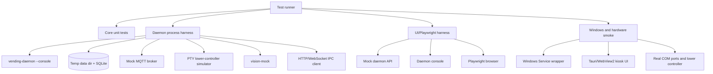
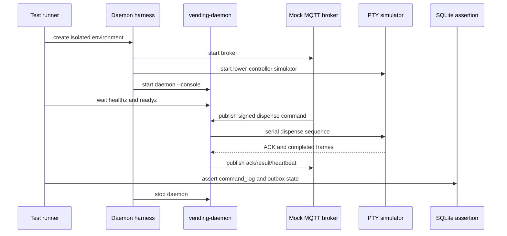
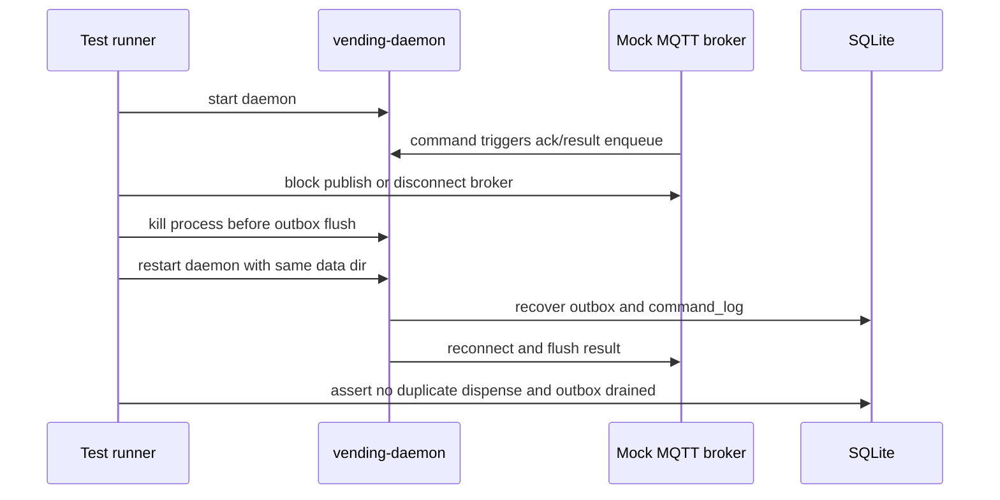
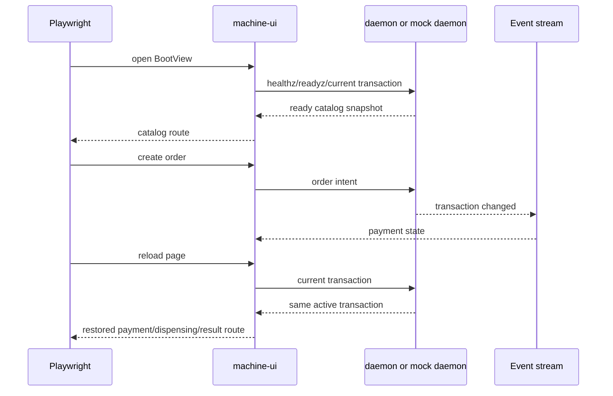
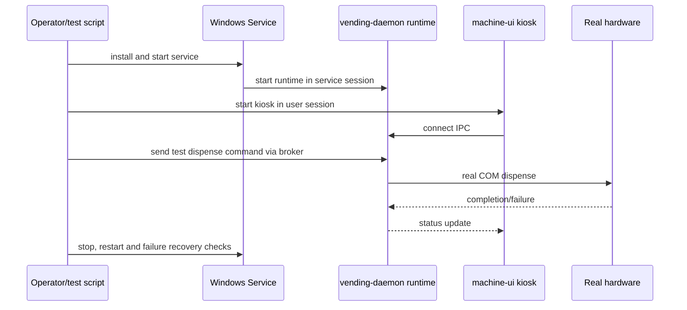

# 售货机 Daemon/UI 迁移验证设计规格说明

**状态**：草案
**日期**：2026-05-30

## 问题与目标

daemon/core 和 UI client 迁移改变了售货机端的进程边界、持久化边界、IPC 边界和故障恢复方式。仅依靠现有 machine 前端单元测试和 Tauri Rust 测试不足以证明“服务常驻、UI 可重启、交易可恢复”。本规格的目标是建立迁移后的验证体系：在当前 Linux 开发环境覆盖 core、daemon console、SQLite、MQTT、PTY 串口、IPC、UI 和故障恢复；在 Windows/真机环境覆盖 Service Control Manager、WebView2 kiosk、COM 口、服务账号权限和真实硬件差异。

成功状态是：大部分架构正确性可以在当前环境自动化执行，Windows/真机验收只承担平台和硬件差异；测试结果能证明 UI 崩溃不影响 daemon、daemon 重启可恢复 outbox/command log/order session、重复命令不会重复出货、付款码不会落库明文、服务安装和 kiosk UI 可以在工控 Windows 10 上按预期运行。

## 设计决策与取舍

- **测试金字塔以 daemon console 为核心**：console 模式与 Windows Service 共享同一 runtime，能在 Linux 和 CI 中覆盖绝大多数业务逻辑。Windows Service 测试只验证薄包装和操作系统集成。
- **使用模拟外设而不是等待真机**：PTY 模拟下位机串口，mock MQTT broker 模拟云端命令，vision-mock 模拟视觉模块，mock daemon 支撑 UI 快速测试。真机测试保留给驱动、权限、电气和 WebView2 行为。
- **黑盒测试覆盖进程边界**：除了 core 单元测试，还必须把 daemon 当成独立进程启动，通过 IPC、MQTT、SQLite 文件和进程信号验证恢复行为。
- **安全和隐私进入测试断言**：付款码明文、机器密钥和 MQTT 密钥不得出现在 SQLite、日志、UI 本地存储、HTTP 错误和事件流中。
- **故障注入是验收主线**：断网、broker 拒绝、串口忙碌、CRC 错误、daemon kill、UI reload、outbox 满、视觉进程退出和配置错误都必须有可断言结果。

## 约束条件

- 当前 Linux 环境只安装 `x86_64-unknown-linux-gnu` Rust target，没有 Windows GNU linker 和 wine，因此不把 Windows 二进制编译/运行作为本地自动化前提。
- Linux 自动化测试必须能覆盖 core、daemon console、SQLite、loopback IPC、mock MQTT、PTY 串口、vision-mock 和浏览器 UI。
- Windows/真机验收必须覆盖 service install/start/stop/shutdown/recovery、WebView2 kiosk、Windows COM 口命名、USB 转串口驱动、服务账号权限、开机启动和断电重启。
- 测试不得依赖真实生产 broker、真实支付密钥或真实付款码；需要真实 broker/TLS 时使用隔离测试环境和测试证书。
- 测试数据目录必须隔离，不能污染操作者真实机器配置、密钥、SQLite 数据库或本地日志。
- 所有进程级测试都必须有超时、清理和端口隔离，避免 daemon、mock broker、vision-mock 或 UI dev server 残留。
- 测试输出必须能定位失败组件：core、daemon startup、SQLite、MQTT、hardware serial、scanner、vision、IPC、UI、Windows service 或真机硬件。

## 架构

验证体系分为三层：第一层是无需进程和外设的 core 单元测试；第二层是 Linux 可执行的 daemon/UI 集成测试；第三层是 Windows 与真实硬件 smoke/验收。每层都用相同的领域合同和状态断言，避免平台测试变成另一套语义。

## 组件设计

### Core Test Suite

- **职责**：快速验证纯域逻辑和协议语义。
- **接口**：Rust 单元测试、共享合同测试、协议 fixtures。
- **依赖**：vending-core、共享 schema、固定时间/随机数注入。
- **设计要点**：覆盖串口 CRC、货道边界、多商品帧、下位机帧映射、扫码分帧/去抖、MQTT canonical JSON、HMAC 签名、状态机合法转换和错误码稳定性。该层失败说明域逻辑错误，不需要启动 daemon。

### Daemon Process Harness

- **职责**：以独立进程启动 daemon console 并提供可控测试环境。
- **接口**：分配临时数据目录、随机 IPC 端口、注入测试配置、启动/停止 daemon、读取 stdout/stderr、等待 health/ready、发送进程信号、检查 SQLite。
- **依赖**：daemon console、临时目录、端口分配、超时控制。
- **设计要点**：每个测试使用独立数据目录和 IPC token。harness 能模拟正常停止和强制 kill，并在重启后断言恢复结果。失败时保留可读日志和数据库副本路径供排查。

### SQLite Assertion Layer

- **职责**：验证本地权威状态和敏感数据不落库。
- **接口**：读取测试数据库、查询 command_log、outbox_events、order_sessions、health_events、runtime_metadata、扫描敏感字符串。
- **依赖**：SQLite 只读连接、测试 fixtures。
- **设计要点**：断言 command log 幂等、outbox 退避、TTL 裁剪、order session 恢复、异常退出标记和 schema 迁移。扫描付款码明文、机器密钥、MQTT 签名密钥和 MQTT 密码，确保数据库中只出现脱敏值、hash 或 configured 标记。

### Mock MQTT Broker

- **职责**：模拟云端 MQTT broker 与命令下发。
- **接口**：建立连接、下发签名/错误签名命令、捕获 ack/result/heartbeat、模拟断线、认证失败、TLS 配置错误和 QoS 重投。
- **依赖**：MQTT 测试 broker 或内嵌 mock、签名 fixtures。
- **设计要点**：broker 捕获到的消息要验证 topic、envelope、messageId、machineCode、签名、payload 和补发顺序。重复下发同一 `commandNo` 必须证明不会重复调用硬件。

### PTY Lower-Controller Simulator

- **职责**：在 Linux 下模拟下位机串口控制板。
- **接口**：创建伪终端、接收握手和出货帧、发送 ACK/busy/CRC error/机械故障/心跳/完成帧、记录硬件调用次数。
- **依赖**：PTY、串口协议 fixtures、可控时钟或超时。
- **设计要点**：覆盖握手成功、ACK 成功、busy 后重试、CRC error 后重发、ACK 超时后失败、机械故障失败、心跳中断和多商品帧。模拟器必须能证明 daemon 对同一命令只发一次真实出货序列。

### Scanner Simulator

- **职责**：模拟付款码扫码器输入。
- **接口**：通过 PTY 或 mock scanner feed 写入 CR/LF/LF/CR/无后缀帧、重复码、控制字符、断线重连。
- **依赖**：daemon scanner runtime、付款码 fixtures。
- **设计要点**：断言去抖、脱敏、活跃交易消费、无活跃交易时不落库、断线健康状态和 UI 事件流显示。明文付款码只允许出现在测试输入和受控内存路径，不出现在 SQLite、日志和 UI 本地存储。

### Vision Mock Integration

- **职责**：验证 daemon 与视觉模块的 ready、profile、error 和子进程托管。
- **接口**：启动 vision-mock、返回 ready、推送推荐、推送错误、模拟进程退出。
- **依赖**：vision-mock 应用、daemon vision supervisor。
- **设计要点**：覆盖视觉禁用、启用且 ready、启用但 camera/model 未 ready、请求超时、子进程退出和重启状态。UI 只消费 daemon 状态，不直接连接视觉进程。

### IPC Contract Test Suite

- **职责**：验证 daemon 对 UI 暴露的 HTTP/WebSocket 合同。
- **接口**：`healthz`、`readyz`、配置读写、目录快照、支付选项、当前交易、扫码事件、同步状态、远程运维状态、日志导出和事件流。
- **依赖**：Daemon Process Harness、HTTP/WebSocket client。
- **设计要点**：覆盖 token 正确、token 错误、事件版本、断线重连、状态快照与事件一致性、错误格式稳定和敏感字段缺失。合同测试作为 UI 与 daemon 的回归边界。

### UI Test Harness

- **职责**：验证 Tauri/Vue UI 作为 daemon client 的页面流转和状态展示。
- **接口**：mock daemon API、daemon console API、Playwright browser、UI dev server、可选 Tauri smoke。
- **依赖**：machine UI、DaemonApiClient、测试 fixtures。
- **设计要点**：优先用 mock daemon 快速覆盖页面状态矩阵，再用真实 daemon console 做少量端到端流。断言 BootView 不启动 MQTT/扫码/视觉，而是根据 daemon 快照路由。刷新页面后从 daemon 当前交易恢复。

### Fault-Recovery Suite

- **职责**：集中证明迁移目标中的恢复能力。
- **接口**：kill daemon、restart daemon、reload UI、断开 broker、填满 outbox、打断串口、停止 vision-mock、修改配置。
- **依赖**：Daemon Process Harness、Mock MQTT Broker、PTY 模拟器、UI harness。
- **设计要点**：每个故障都有明确预期：不重复出货、不丢 result、不丢 outbox、不泄露敏感信息、ready 状态正确、UI 显示可操作原因、恢复后自动补发或进入人工处理。

### Windows and Hardware Smoke

- **职责**：验证 Linux 自动化无法覆盖的平台和真实硬件差异。
- **接口**：Windows Service 安装、启动、停止、shutdown、失败重启；Tauri UI kiosk 启动；Windows COM 口下位机和扫码器；真实视觉进程；开机自启和断电恢复。
- **依赖**：Windows 10 工控主机、WebView2 Runtime、USB 转串口驱动、真实下位机、扫码器、视觉硬件、测试 broker。
- **设计要点**：该层不重复大量业务矩阵，只验证平台边界：服务账号权限、数据目录权限、IPC token 权限、防火墙、COM 口命名、Session 0 与用户 session 通信、WebView2 全屏置顶和 UI/daemon 独立重启。

## 数据模型

### Test environment manifest

每次进程级测试生成环境清单：测试名、临时数据目录、IPC 地址、daemon 版本、core 版本、mock broker 地址、PTY 路径、vision-mock 地址、随机种子和开始/结束时间。清单用于失败排查和工件归档。

### Test fixture catalog

测试 fixtures 包含出货命令、重复命令、签名错误命令、heartbeat payload、付款码输入、视觉 ready/profile/error、配置缺失/完整/错误样例和后端机器 API 响应样例。fixtures 不包含真实生产密钥或真实付款码。

### Evidence bundle

失败时保留 daemon stdout/stderr、UI console、mock broker transcript、PTY transcript、SQLite 只读副本、IPC 请求/响应摘要、截图和环境清单。证据包必须脱敏，不包含付款码明文和密钥明文。

### Windows acceptance record

Windows/真机验收记录包含主机版本、WebView2 版本、服务账号、安装路径、数据目录权限、COM 口设备、驱动版本、测试 broker、service recovery 配置、kiosk 启动方式、执行时间和结果摘要。

## 数据流

### Daemon 黑盒集成测试

该流证明 daemon 不需要 UI 即可完成云端命令到硬件出货再到结果上报的闭环。

### 重启恢复测试

该流证明异常退出不会丢失结果，也不会因重复命令造成重复出货。

### UI 迁移端到端测试

该流证明 UI 是 daemon 状态的投影，页面刷新不会丢失交易上下文。

### Windows/真机 smoke

该流验证平台交互，而不是替代 Linux 自动化中的业务矩阵。

## 错误处理

- **测试进程超时**：harness 终止 daemon、mock broker、vision-mock 和 UI，保留证据包并标记失败组件。
- **端口冲突**：harness 使用随机端口并在启动前探测；冲突时重新分配，不污染全局配置。
- **PTY 创建失败**：该测试标记为环境失败，core 和非串口测试继续执行。
- **mock broker 启动失败**：MQTT 集成测试标记为环境失败，daemon 非 MQTT 测试继续执行。
- **daemon 崩溃**：保留 stdout/stderr、SQLite 副本和环境清单；恢复测试明确区分预期 kill 与非预期 crash。
- **敏感数据扫描命中**：测试失败级别为高，输出命中位置的脱敏摘要，不打印敏感原文。
- **Windows service 权限失败**：记录服务账号、数据目录 ACL、IPC token 权限和 SCM 错误码，归类为平台集成失败。
- **真机硬件失败**：记录 COM 口、驱动、下位机返回帧和电气状态摘要，归类为硬件验收失败，不阻塞 Linux 自动化结论。

## 测试策略

### 当前环境自动化覆盖

- `vending-core` 单元测试覆盖核心协议、签名、状态机和错误映射。
- daemon console 集成测试覆盖启动、配置加载、SQLite、健康检查、ready 判断、优雅退出和异常重启恢复。
- loopback HTTP/WebSocket IPC 测试覆盖 `/healthz`、`/readyz`、配置、当前交易、事件流、同步状态和错误格式。
- PTY 串口模拟覆盖下位机握手、ACK、busy、CRC error、心跳中断、出货完成和失败。
- mock MQTT 测试覆盖命令订阅、ack/result、heartbeat、outbox 补发、签名错误和重复命令。
- scanner 模拟测试覆盖付款码分帧、去抖、脱敏、断线和明文不落库。
- vision-mock 测试覆盖 ready/profile/error、进程托管和禁用视觉。
- Playwright/browser UI 测试覆盖 BootView、maintenance、catalog、payment、dispensing、result、offline 和 UI 重启恢复。
- 故障恢复测试覆盖 daemon kill、broker 断线、outbox 满、串口异常、视觉退出、配置 reload 和 UI reload。

### Windows/真机验收覆盖

- Windows Service 安装、启动、停止、shutdown、失败自动重启和日志路径。
- 服务账号访问 daemon 数据目录、密钥存储、IPC token、MQTT TLS 证书和串口设备的权限。
- Session 0 daemon 与用户 session Tauri UI 的 IPC 连通性。
- Tauri WebView2 kiosk 的全屏、置顶、无边框、触控输入、开机自启和 UI 崩溃重启。
- Windows COM 口命名、USB 转串口驱动、真实下位机出货帧和扫码器输入。
- 生产 broker TLS、证书、认证失败和现场防火墙策略。
- 断电重启后 daemon 自动恢复、UI 自动重连、outbox 补发和 command log 幂等。

### 验收信号

- UI 关闭期间，daemon 仍能处理 MQTT 出货命令并发布 heartbeat。
- UI 重启后能恢复当前交易状态，不创建重复订单。
- daemon 被 kill 后重启，未补发 result 会从 SQLite outbox 恢复并补发。
- 重复 MQTT command 不会导致重复硬件出货。
- 付款码明文、机器密钥和 MQTT 密钥不出现在 SQLite、日志、UI 本地存储、HTTP 错误或事件流中。
- Windows Service 可以由 SCM 启停和恢复，Tauri UI 可以作为普通用户 session kiosk 独立重启。

## 串行交接边界

本规格在前两个 spec 的实现完成后执行。它不重新定义 daemon 或 UI 架构，而是用自动化、故障注入和平台 smoke 证明迁移目标成立。完成后，售货机端重构应具备可持续回归的测试入口，并清楚区分当前环境可自动化验证的内容与 Windows/真机必须验收的内容。
