# 售货机迁移验证体系实现计划

**目标：** 建立覆盖 `vending-core`、`vending-daemon --console`、SQLite、MQTT、PTY 串口、scanner、vision-mock、IPC、machine UI、故障恢复以及 Windows/真机 smoke 的迁移验证体系。

**架构：** 以 Rust 单元/集成测试验证 core 与 daemon 黑盒进程边界，以 Playwright 验证 machine UI 只作为 daemon client 恢复状态。Linux 自动化负责业务和恢复语义，Windows/真机脚本与验收记录只验证 SCM、WebView2、COM 口、权限和真实硬件差异。

**技术栈：** Rust/Tokio/sqlx/axum/rumqttc/rumqttd/nix、SQLite、PTY、Vitest、Playwright、Tauri、PowerShell。

---

## 背景与目标

规格 `@docs/3-vending-machine-validation/spec.md:L1-L13` 要求证明迁移后“服务常驻、UI 可重启、交易可恢复”，并把 Linux 自动化与 Windows/真机验收分层。当前代码已经具备验证入口：`@apps/vending-daemon/src/main.rs:L31-L39` 在 Linux 总是运行 console 模式，`@apps/vending-daemon/src/shutdown.rs:L45-L186` 负责 data dir、SQLite、IPC、scanner、payment watcher、vision 和 MQTT task 编排，`@apps/vending-daemon/src/state/schema.rs:L7-L87` 定义本地权威 SQLite 表，`@apps/vending-daemon/src/ipc.rs:L138-L163` 暴露 UI IPC 路由，`@apps/machine/tests/machine-daemon-client.spec.ts:L423-L490` 已有 mock daemon Playwright 覆盖启动路由。

本计划不重新设计 daemon/UI 架构。它补齐测试支撑、黑盒 harness、故障注入、敏感信息扫描和 Windows/硬件验收脚本，使规格中的验收信号都能被程序化检查或被平台 smoke 记录。

## 架构图

```mermaid
flowchart TB
  Core[Core Rust tests] --> SerialPty[PTY lower-controller simulator]
  Core --> Scanner[Scanner framer tests]
  Core --> MqttContract[MQTT envelope fixtures]

  DaemonHarness[Daemon process harness] --> Daemon[vending-daemon --console]
  DaemonHarness --> DataDir[(isolated temp data dir)]
  DaemonHarness --> DbAssert[SQLite assertion helpers]
  DaemonHarness --> Broker[Embedded rumqttd broker]
  DaemonHarness --> Pty[PTY hardware/scanner simulators]
  DaemonHarness --> Vision[vision-mock process]
  DaemonHarness --> Ipc[HTTP/WebSocket IPC client]
  DaemonHarness --> Evidence[Evidence bundle + sensitive scanner]

  UiHarness[Playwright UI harness] --> MockDaemon[Mock daemon API]
  UiHarness --> RealDaemon[Daemon console smoke]
  UiHarness --> Browser[Chromium]

  WindowsPack[Windows/hardware smoke pack] --> SCM[Windows Service Control Manager]
  WindowsPack --> Kiosk[Tauri WebView2 kiosk]
  WindowsPack --> COM[Real COM lower controller/scanner]
  WindowsPack --> Record[Acceptance record]
```



## 调研摘要与接触点

- `@apps/vending-daemon/src/secret.rs:L17-L77` 只有 `KeyringSecretStore` 和测试用 `InMemorySecretStore`。黑盒进程测试不能依赖操作者真实 keyring，因此需要一个显式 env secret store。
- `@apps/vending-daemon/src/shutdown.rs:L58-L79` 打开 `state.db`、创建 `ConfigStore` 并读取 runtime secrets；`@apps/vending-daemon/src/shutdown.rs:L126-L130` 启动 IPC 并写 ready file。process harness 应通过 `--data-dir`、`--bind 127.0.0.1:0`、`--print-ready-file` 控制隔离环境。
- `@apps/vending-daemon/src/mqtt.rs:L120-L180` 处理已签名出货命令并用 `command_log` 去重；`@apps/vending-daemon/src/mqtt.rs:L197-L244` flush due outbox。MQTT 集成测试应覆盖 command topic、ack/result topic、重复 command 不重复出货、broker 断线导致 outbox 留存并退避。
- `@crates/vending-core/src/serial.rs:L71-L127` 对真实 serial adapter 执行 ACK/busy/CRC retry/完成帧语义，`@crates/vending-core/src/serial.rs:L386-L492` 当前只有内存 reader 单测，缺少 PTY 级串口黑盒。
- `@crates/vending-core/src/scanner.rs:L3-L10` 定义 frame suffix，但 `@crates/vending-core/src/scanner.rs:L33-L60` 当前 framer 只按 CR/LF 切帧。要验证 CRLF/LF/CR/无后缀，需要先把 suffix 变成 framer 输入。
- `@apps/vending-daemon/src/scanner.rs:L58-L91` 从 serial port 读取 raw code 并广播 masked event；结合 `@apps/vending-daemon/src/shutdown.rs:L226-L269` 的 payment watcher，可以用 scanner PTY 验证明文不落 SQLite 和事件流。
- `@apps/vision-mock/src/server.ts:L230-L269` 已能启动 mock WebSocket server；`@apps/vending-daemon/src/vision.rs:L64-L132` 已有 supervisor，可直接用真实 mock 进程和 daemon IPC `/v1/vision/status` 验证。
- `@apps/machine/src/daemon/client.ts:L55-L83` 统一 HTTP request，`@apps/machine/src/daemon/client.ts:L211-L270` 统一 WebSocket event subscription；`@apps/machine/playwright.config.ts:L35-L45` 已固定 mock daemon base URL 和 token。
- `@apps/vending-daemon/src/service_windows.rs:L27-L59` Windows Service 是薄包装，Linux 不能编译/运行 Windows 目标；本计划把 Windows 验收做成 PowerShell smoke 和记录模板，由工控 Windows 10 执行。

## 文件结构映射

```text
crates/vending-core/Cargo.toml
crates/vending-core/tests/support/mod.rs
crates/vending-core/tests/serial_pty.rs
crates/vending-core/tests/scanner_contract.rs

apps/vending-daemon/Cargo.toml
apps/vending-daemon/src/secret.rs
apps/vending-daemon/src/shutdown.rs
apps/vending-daemon/tests/support/mod.rs
apps/vending-daemon/tests/support/process.rs
apps/vending-daemon/tests/support/mqtt.rs
apps/vending-daemon/tests/support/pty.rs
apps/vending-daemon/tests/support/sqlite.rs
apps/vending-daemon/tests/support/sensitive.rs
apps/vending-daemon/tests/console_startup.rs
apps/vending-daemon/tests/ipc_contract.rs
apps/vending-daemon/tests/mqtt_fault_recovery.rs
apps/vending-daemon/tests/scanner_vision.rs

apps/machine/tests/machine-daemon-client.spec.ts
apps/machine/tests/machine-real-daemon.spec.ts

scripts/windows/vending-daemon-smoke.ps1
docs/3-vending-machine-validation/windows-hardware-acceptance.md
docs/3-vending-machine-validation/evidence/README.md
```

职责边界：core tests 只验证纯协议和 serial/scanner adapter 语义；daemon tests 通过独立进程、IPC、SQLite、broker、PTY 和 mock vision 验证迁移目标；machine tests 只验证 UI daemon client 行为；Windows scripts/docs 只记录 Linux 不能覆盖的平台和硬件信号。

## 实现步骤

### 阶段 1：隔离测试支撑与证据工具

#### 步骤 1.1：为 daemon 进程测试增加 env secret store

- **目的**：让黑盒 `vending-daemon --console` 测试能读取测试密钥，不污染真实 keyring，也不把生产密钥写入测试目录。
- **操作**：修改 `@apps/vending-daemon/src/secret.rs:L1-L77`。在 `InMemorySecretStore` 后新增只读 `EnvSecretStore` 和默认工厂，并保留 `KeyringSecretStore` 作为默认路径。

```rust
#[derive(Debug, Default, Clone)]
pub struct EnvSecretStore;

fn env_account_name(account: &str) -> Option<&'static str> {
    match account {
        MACHINE_SECRET_ACCOUNT => Some("VEM_MACHINE_SECRET"),
        MQTT_SIGNING_SECRET_ACCOUNT => Some("VEM_MQTT_SIGNING_SECRET"),
        MQTT_PASSWORD_ACCOUNT => Some("VEM_MQTT_PASSWORD"),
        _ => None,
    }
}

#[async_trait]
impl SecretStore for EnvSecretStore {
    async fn read_secret(&self, account: &str) -> Result<Option<String>, String> {
        let Some(name) = env_account_name(account) else {
            return Ok(None);
        };
        Ok(std::env::var(name)
            .ok()
            .map(|value| value.trim().to_string())
            .filter(|value| !value.is_empty()))
    }

    async fn write_secret(&self, _account: &str, _value: &str) -> Result<(), String> {
        Err("env secret store is read-only".to_string())
    }
}

pub fn default_secret_store() -> Arc<dyn SecretStore> {
    if std::env::var("VEM_DAEMON_SECRET_STORE").ok().as_deref() == Some("env") {
        Arc::new(EnvSecretStore)
    } else {
        Arc::new(KeyringSecretStore)
    }
}
```

修改 `@apps/vending-daemon/src/shutdown.rs:L9-L22`，删除 `secret::KeyringSecretStore` import，改为引用 `secret` 模块：

```rust
use crate::{
    backend::BackendClient,
    config::{self, ConfigStore},
    events::DaemonEvent,
    hardware::HardwareSupervisor,
    ipc::{self, IpcContext},
    mqtt::MqttSyncRuntime,
    runtime::{DaemonRuntime, RuntimeStartInput},
    scanner::ScannerRuntime,
    secret,
    state::LocalStateStore,
    transaction::TransactionStateMachine,
    vision::VisionSupervisor,
};
```

替换 `@apps/vending-daemon/src/shutdown.rs:L61-L66`：

```rust
let secret_store = secret::default_secret_store();
let config_store = std::sync::Arc::new(ConfigStore::new(
    data_dir.clone(),
    state.clone(),
    secret_store,
));
```

新增 `@apps/vending-daemon/src/secret.rs` 测试：

```rust
#[tokio::test]
async fn env_secret_store_reads_only_mapped_test_env_vars() {
    std::env::set_var("VEM_MQTT_SIGNING_SECRET", " test-signing ");
    let store = EnvSecretStore;
    assert_eq!(
        store
            .read_secret(MQTT_SIGNING_SECRET_ACCOUNT)
            .await
            .unwrap()
            .as_deref(),
        Some("test-signing")
    );
    assert!(store.write_secret(MQTT_SIGNING_SECRET_ACCOUNT, "x").await.is_err());
    std::env::remove_var("VEM_MQTT_SIGNING_SECRET");
}
```

- **验证**：运行 `cargo test -p vending-daemon secret::tests::env_secret_store_reads_only_mapped_test_env_vars`，预期退出码 0。
- **依赖**：无依赖。

#### 步骤 1.2：增加 daemon 测试 dev-dependencies

- **目的**：提供进程启动、HTTP/WebSocket、SQLite、PTY 和嵌入式 MQTT broker 的测试工具。
- **操作**：修改 `@apps/vending-daemon/Cargo.toml:L28-L33` 的 `[dev-dependencies]`：

```toml
[dev-dependencies]
assert_cmd = "2"
config = "0.14"
nix = { version = "0.29", features = ["fs", "term"] }
portpicker = "0.1"
reqwest = { version = "0.12", features = ["json", "rustls-tls"] }
rumqttd = "0.20"
tempfile = "3"
tokio-tungstenite.workspace = true
tower = "0.5"
wiremock = "0.6"
```

`rumqttd` 支持作为库嵌入，配置结构通过 TOML 反序列化为 `rumqttd::Config`，再传给 `rumqttd::Broker::new(config).start()`；配置格式使用 `[router]` 和 `[v4.1]` server 表。

- **验证**：运行 `cargo test -p vending-daemon --no-run`，预期测试编译通过。
- **依赖**：步骤 1.1。

#### 步骤 1.3：创建 process harness

- **目的**：统一启动独立 daemon 进程，隔离 data dir、端口、ready file、测试 env、超时和清理。
- **操作**：创建 `@apps/vending-daemon/tests/support/mod.rs`：

```rust
pub mod mqtt;
pub mod process;
pub mod pty;
pub mod sensitive;
pub mod sqlite;
```

创建 `@apps/vending-daemon/tests/support/process.rs`：

```rust
use std::{
    path::{Path, PathBuf},
    process::Stdio,
    time::Duration,
};

use reqwest::Client;
use serde::Deserialize;
use tempfile::TempDir;
use tokio::{process::Child, time::sleep};

#[derive(Debug, Clone, Deserialize)]
#[serde(rename_all = "camelCase")]
pub struct ReadyFile {
    pub healthz_url: String,
    pub readyz_url: String,
    pub ipc_token: String,
}

pub struct DaemonHarness {
    pub data_dir: PathBuf,
    pub ready_file: PathBuf,
    pub ready: ReadyFile,
    _temp_dir: Option<TempDir>,
    child: Child,
    client: Client,
}

impl DaemonHarness {
    pub async fn start(
        public_config: serde_json::Value,
        extra_env: &[(&str, &str)],
    ) -> Result<Self, String> {
        let temp_dir = TempDir::new().map_err(|error| error.to_string())?;
        let data_dir = temp_dir.path().to_path_buf();
        let mut harness = Self::start_at(data_dir, public_config, extra_env).await?;
        harness._temp_dir = Some(temp_dir);
        Ok(harness)
    }

    pub async fn start_at(
        data_dir: PathBuf,
        public_config: serde_json::Value,
        extra_env: &[(&str, &str)],
    ) -> Result<Self, String> {
        let ready_file = data_dir.join("daemon-ready.json");
        tokio::fs::write(
            data_dir.join("machine-config.json"),
            serde_json::to_vec_pretty(&public_config).map_err(|error| error.to_string())?,
        )
        .await
        .map_err(|error| error.to_string())?;

        let mut command = tokio::process::Command::new(env!("CARGO_BIN_EXE_vending-daemon"));
        command
            .arg("--console")
            .arg("--data-dir")
            .arg(&data_dir)
            .arg("--bind")
            .arg("127.0.0.1:0")
            .arg("--print-ready-file")
            .arg(&ready_file)
            .env("VEM_DAEMON_SECRET_STORE", "env")
            .stdout(Stdio::piped())
            .stderr(Stdio::piped());
        for (key, value) in extra_env {
            command.env(key, value);
        }
        let child = command.spawn().map_err(|error| error.to_string())?;
        let client = Client::new();

        let ready = wait_ready_file(&ready_file).await?;
        wait_http_ok(&client, &ready.healthz_url).await?;

        Ok(Self {
            data_dir,
            ready_file,
            ready,
            _temp_dir: None,
            child,
            client,
        })
    }

    pub fn bearer(&self) -> String {
        format!("Bearer {}", self.ready.ipc_token)
    }

    pub fn state_db_path(&self) -> PathBuf {
        self.data_dir.join("state.db")
    }

    pub async fn get_json(&self, path: &str) -> serde_json::Value {
        let base = self.ready.healthz_url.trim_end_matches("/healthz");
        self.client
            .get(format!("{base}{path}"))
            .header("Authorization", self.bearer())
            .send()
            .await
            .expect("request")
            .json()
            .await
            .expect("json")
    }

    pub async fn terminate(&mut self) {
        let _ = self.child.start_kill();
        let _ = tokio::time::timeout(Duration::from_secs(3), self.child.wait()).await;
    }
}

impl Drop for DaemonHarness {
    fn drop(&mut self) {
        let _ = self.child.start_kill();
    }
}

async fn wait_ready_file(path: &Path) -> Result<ReadyFile, String> {
    for _ in 0..100 {
        if let Ok(bytes) = tokio::fs::read(path).await {
            return serde_json::from_slice(&bytes).map_err(|error| error.to_string());
        }
        sleep(Duration::from_millis(50)).await;
    }
    Err(format!("ready file was not written at {}", path.display()))
}

async fn wait_http_ok(client: &Client, url: &str) -> Result<(), String> {
    for _ in 0..100 {
        if let Ok(response) = client.get(url).send().await {
            if response.status().is_success() {
                return Ok(());
            }
        }
        sleep(Duration::from_millis(50)).await;
    }
    Err(format!("health endpoint did not become ready: {url}"))
}
```

- **验证**：`cargo test -p vending-daemon --test console_startup --no-run` 在后续测试存在后应编译通过。
- **依赖**：步骤 1.2。

#### 步骤 1.4：创建 SQLite 和敏感信息断言工具

- **目的**：统一检查 `command_log`、`outbox_events`、`order_sessions` 和敏感明文泄露。
- **操作**：创建 `@apps/vending-daemon/tests/support/sqlite.rs`：

```rust
use std::path::Path;

use sqlx::{sqlite::SqlitePoolOptions, SqlitePool};

pub async fn open_readonly(path: &Path) -> SqlitePool {
    let url = format!("sqlite://{}?mode=ro", path.display());
    SqlitePoolOptions::new()
        .max_connections(1)
        .connect(&url)
        .await
        .expect("open readonly sqlite")
}

pub async fn scalar_i64(pool: &SqlitePool, sql: &str) -> i64 {
    sqlx::query_scalar::<_, i64>(sql)
        .fetch_one(pool)
        .await
        .expect("scalar")
}

pub async fn table_text_dump(pool: &SqlitePool) -> String {
    let mut chunks = Vec::new();
    let queries = [
        "SELECT key || ':' || value_json FROM runtime_metadata",
        "SELECT config_json FROM machine_config",
        "SELECT command_no || ':' || order_no || ':' || command_payload_json || ':' || COALESCE(result_payload_json,'') || ':' || COALESCE(error_message,'') FROM command_log",
        "SELECT id || ':' || kind || ':' || payload_json || ':' || COALESCE(last_error,'') FROM outbox_events",
        "SELECT order_no || ':' || COALESCE(payment_attempt_json,'') || ':' || items_json || ':' || COALESCE(last_error,'') FROM order_sessions",
        "SELECT component || ':' || code || ':' || message || ':' || COALESCE(context_json,'') FROM health_events",
    ] {
        let rows: Vec<(String,)> = sqlx::query_as(query)
            .fetch_all(pool)
            .await
            .unwrap_or_default();
        chunks.extend(rows.into_iter().map(|row| row.0));
    }
    chunks.join("\n")
}
```

创建 `@apps/vending-daemon/tests/support/sensitive.rs`：

```rust
use std::path::Path;

pub const TEST_AUTH_CODE: &str = "621234567890123456";
pub const TEST_MACHINE_SECRET: &str = "MACHINE-SECRET-PLAINTEXT";
pub const TEST_MQTT_SIGNING_SECRET: &str = "MQTT-SIGNING-SECRET-PLAINTEXT";
pub const TEST_MQTT_PASSWORD: &str = "MQTT-PASSWORD-PLAINTEXT";

pub fn assert_absent(label: &str, haystack: &str, needles: &[&str]) {
    for needle in needles {
        assert!(
            !haystack.contains(needle),
            "{label} leaked sensitive value {needle}"
        );
    }
}

pub async fn read_text_files_under(root: &Path) -> String {
    let mut out = String::new();
    let mut stack = vec![root.to_path_buf()];
    while let Some(path) = stack.pop() {
        let entries = match std::fs::read_dir(&path) {
            Ok(entries) => entries,
            Err(_) => continue,
        };
        for entry in entries.flatten() {
            let path = entry.path();
            if path.is_dir() {
                stack.push(path);
                continue;
            }
            if matches!(
                path.extension().and_then(|value| value.to_str()),
                Some("json") | Some("jsonl") | Some("log") | Some("txt")
            ) {
                if let Ok(content) = tokio::fs::read_to_string(&path).await {
                    out.push_str(&content);
                    out.push('\n');
                }
            }
        }
    }
    out
}
```

- **验证**：`cargo test -p vending-daemon --test console_startup --no-run` 在 tests 创建后编译通过；后续敏感扫描测试能复用固定 `TEST_*` 常量。
- **依赖**：步骤 1.2。

### 程序化验收标准

- 需求覆盖：
  - 规格“约束条件”：测试数据目录隔离、不污染真实配置/密钥/SQLite/日志。
  - 规格“Daemon Process Harness”：分配临时 data dir、随机 IPC 端口、ready file、进程清理。
  - 规格“SQLite Assertion Layer”：可读取测试数据库并扫描敏感字符串。
- 检查：
  - `cargo test -p vending-daemon secret::tests::env_secret_store_reads_only_mapped_test_env_vars` -> 退出码 0。
  - `cargo test -p vending-daemon --no-run` -> 退出码 0，所有新 harness/support 编译通过。
- 制品 / 输出：
  - `apps/vending-daemon/tests/support/*.rs` 存在。
  - daemon 子进程测试只使用 temp data dir 和 `VEM_DAEMON_SECRET_STORE=env`。

### 阶段 2：Core 协议与外设模拟验证

#### 步骤 2.1：增加 core PTY dev-dependency

- **目的**：用 Linux PTY 模拟真实 serial device，覆盖 `SerialHardwareAdapter` 的端口打开、读写和帧时序。
- **操作**：修改 `@crates/vending-core/Cargo.toml:L8-L19`，新增：

```toml
[dev-dependencies]
nix = { version = "0.29", features = ["fs", "term"] }
```

- **验证**：`cargo test -p vending-core --no-run` 退出码 0。
- **依赖**：无依赖。

#### 步骤 2.2：创建 core PTY simulator

- **目的**：复用同一 PTY 模拟器测试 ACK、busy、CRC error、机械故障、心跳和多商品帧。
- **操作**：创建 `@crates/vending-core/tests/support/mod.rs`：

```rust
use std::{
    os::fd::{FromRawFd, IntoRawFd},
    path::PathBuf,
};

use nix::{
    fcntl::OFlag,
    pty::{grantpt, posix_openpt, ptsname_r, unlockpt},
};
use tokio::io::{AsyncReadExt, AsyncWriteExt};

pub struct PtyPair {
    pub slave_path: PathBuf,
    pub master: tokio::fs::File,
}

pub fn open_pty() -> PtyPair {
    let master = posix_openpt(OFlag::O_RDWR | OFlag::O_NOCTTY).expect("posix_openpt");
    grantpt(&master).expect("grantpt");
    unlockpt(&master).expect("unlockpt");
    let slave_path = PathBuf::from(ptsname_r(&master).expect("ptsname"));
    let fd = master.into_raw_fd();
    let file = unsafe { std::fs::File::from_raw_fd(fd) };
    PtyPair {
        slave_path,
        master: tokio::fs::File::from_std(file),
    }
}

pub async fn read_single_dispense_frame(master: &mut tokio::fs::File) -> [u8; 4] {
    let mut frame = [0_u8; 4];
    master.read_exact(&mut frame).await.expect("read frame");
    frame
}

pub async fn send_lower_code(master: &mut tokio::fs::File, code: u8) {
    master
        .write_all(&[vending_core::serial::FRAME_HEAD, code])
        .await
        .expect("write lower code");
    master.flush().await.expect("flush");
}
```

- **验证**：`cargo test -p vending-core --test serial_pty --no-run` 在下一步测试存在后编译通过。
- **依赖**：步骤 2.1。

#### 步骤 2.3：新增 serial PTY 合同测试

- **目的**：证明 Linux 自动化能覆盖下位机握手、ACK、busy、CRC error、机械故障和重复硬件调用计数。
- **操作**：创建 `@crates/vending-core/tests/serial_pty.rs`：

```rust
mod support;

use std::{
    sync::{
        atomic::{AtomicUsize, Ordering},
        Arc,
    },
    time::Duration,
};

use tokio::time::timeout;
use vending_core::{
    hardware::{DispenseCommandPayload, HardwareAdapter, SlotPayload},
    serial::{build_dispense_frame, FRAME_HEAD, SerialHardwareAdapter},
};

fn command(command_no: &str) -> DispenseCommandPayload {
    DispenseCommandPayload {
        command_no: command_no.to_string(),
        order_no: "ORD-PTY".to_string(),
        slot: SlotPayload {
            layer_no: 2,
            cell_no: 5,
            slot_code: "A25".to_string(),
        },
        quantity: 1,
        timeout_seconds: 2,
    }
}

#[tokio::test]
async fn serial_adapter_dispenses_once_on_ack_and_completed() {
    let mut pty = support::open_pty();
    let slave_path = pty.slave_path.clone();
    let writes = Arc::new(AtomicUsize::new(0));
    let writes_for_task = writes.clone();
    tokio::spawn(async move {
        let frame = support::read_single_dispense_frame(&mut pty.master).await;
        writes_for_task.fetch_add(1, Ordering::SeqCst);
        assert_eq!(frame, build_dispense_frame(2, 5).unwrap());
        support::send_lower_code(&mut pty.master, 0x00).await;
        support::send_lower_code(&mut pty.master, 0xF1).await;
    });

    let adapter = SerialHardwareAdapter::new(slave_path.to_string_lossy().to_string());
    let result = timeout(Duration::from_secs(3), adapter.dispense(command("CMD-PTY-1")))
        .await
        .expect("test timeout");
    assert!(result.success, "{result:?}");
    assert_eq!(writes.load(Ordering::SeqCst), 1);
}

#[tokio::test]
async fn serial_adapter_retries_busy_and_crc_before_success() {
    let mut pty = support::open_pty();
    let slave_path = pty.slave_path.clone();
    let writes = Arc::new(AtomicUsize::new(0));
    let writes_for_task = writes.clone();
    tokio::spawn(async move {
        for code in [0x04, 0x02, 0x00] {
            let frame = support::read_single_dispense_frame(&mut pty.master).await;
            assert_eq!(frame[0], FRAME_HEAD);
            writes_for_task.fetch_add(1, Ordering::SeqCst);
            support::send_lower_code(&mut pty.master, code).await;
        }
        support::send_lower_code(&mut pty.master, 0xF1).await;
    });

    let adapter = SerialHardwareAdapter::new(slave_path.to_string_lossy().to_string());
    let result = timeout(Duration::from_secs(3), adapter.dispense(command("CMD-PTY-2")))
        .await
        .expect("test timeout");
    assert!(result.success, "{result:?}");
    assert_eq!(writes.load(Ordering::SeqCst), 3);
}

#[tokio::test]
async fn serial_adapter_reports_mechanical_fault_after_ack() {
    let mut pty = support::open_pty();
    let slave_path = pty.slave_path.clone();
    tokio::spawn(async move {
        let _frame = support::read_single_dispense_frame(&mut pty.master).await;
        support::send_lower_code(&mut pty.master, 0x00).await;
        support::send_lower_code(&mut pty.master, 0x03).await;
    });

    let adapter = SerialHardwareAdapter::new(slave_path.to_string_lossy().to_string());
    let result = timeout(Duration::from_secs(3), adapter.dispense(command("CMD-PTY-3")))
        .await
        .expect("test timeout");
    assert!(!result.success);
    assert_eq!(result.error_code.as_deref(), Some("JAMMED"));
}
```

- **验证**：`cargo test -p vending-core --test serial_pty` -> 退出码 0，三项测试通过。
- **依赖**：步骤 2.2。

#### 步骤 2.4：让 scanner framer 使用 suffix 并补合同测试

- **目的**：规格要求 scanner 模拟覆盖 CRLF、LF、CR、无后缀、重复码和控制字符；当前 `ScannerFrameSuffix` 未参与 framer。
- **操作**：修改 `@crates/vending-core/src/scanner.rs:L26-L60`，把 framer 改为 suffix-aware：

```rust
#[derive(Debug)]
pub struct ScannerFramer {
    suffix: ScannerFrameSuffix,
    frame: Vec<u8>,
    last_code: String,
    last_at_ms: u128,
}

impl Default for ScannerFramer {
    fn default() -> Self {
        Self::new(ScannerFrameSuffix::Crlf)
    }
}

impl ScannerFramer {
    pub fn new(suffix: ScannerFrameSuffix) -> Self {
        Self {
            suffix,
            frame: Vec::new(),
            last_code: String::new(),
            last_at_ms: 0,
        }
    }

    pub fn push_bytes(&mut self, bytes: &[u8], now_ms: u128) -> Vec<RawPaymentCode> {
        let mut out = Vec::new();
        for byte in bytes {
            match self.suffix {
                ScannerFrameSuffix::Crlf | ScannerFrameSuffix::Lf if *byte == b'\n' => {
                    self.flush(now_ms, &mut out);
                }
                ScannerFrameSuffix::Cr if *byte == b'\r' => {
                    self.flush(now_ms, &mut out);
                }
                ScannerFrameSuffix::Crlf if *byte == b'\r' => {}
                ScannerFrameSuffix::None if byte.is_ascii_control() => {}
                _ if !byte.is_ascii_control() => self.frame.push(*byte),
                _ => {}
            }
        }
        if matches!(self.suffix, ScannerFrameSuffix::None) && !self.frame.is_empty() {
            self.flush(now_ms, &mut out);
        }
        out
    }

    fn flush(&mut self, now_ms: u128, out: &mut Vec<RawPaymentCode>) {
        let code = String::from_utf8_lossy(&self.frame).trim().to_string();
        self.frame.clear();
        if code.is_empty() {
            return;
        }
        if code == self.last_code && now_ms.saturating_sub(self.last_at_ms) < 1500 {
            return;
        }
        self.last_code = code.clone();
        self.last_at_ms = now_ms;
        out.push(RawPaymentCode {
            masked_code: mask_code(&code),
            auth_code: code,
        });
    }
}
```

修改 `@apps/vending-daemon/src/scanner.rs:L63-L67`，用配置 suffix：

```rust
let mut framer =
    vending_core::scanner::ScannerFramer::new(self.config.frame_suffix);
```

同时把 `ScannerRuntimeConfig` 扩展为：

```rust
pub struct ScannerRuntimeConfig {
    pub port_path: Option<String>,
    pub baud_rate: u32,
    pub source: String,
    pub frame_suffix: vending_core::scanner::ScannerFrameSuffix,
}
```

在 `ScannerRuntime::from_config()` 的 `ScannerRuntimeConfig` 构造中设置 `frame_suffix: config.scanner_frame_suffix`。

创建 `@crates/vending-core/tests/scanner_contract.rs`：

```rust
use vending_core::scanner::{ScannerFrameSuffix, ScannerFramer};

#[test]
fn scanner_framer_supports_documented_suffixes() {
    let cases = [
        (ScannerFrameSuffix::Crlf, b"621234567890123456\r\n".as_slice()),
        (ScannerFrameSuffix::Lf, b"621234567890123456\n".as_slice()),
        (ScannerFrameSuffix::Cr, b"621234567890123456\r".as_slice()),
        (ScannerFrameSuffix::None, b"621234567890123456".as_slice()),
    ];
    for (suffix, bytes) in cases {
        let mut framer = ScannerFramer::new(suffix);
        let frames = framer.push_bytes(bytes, 1_000);
        assert_eq!(frames.len(), 1, "suffix {suffix:?}");
        assert_eq!(frames[0].masked_code, "6212****3456");
    }
}

#[test]
fn scanner_framer_drops_control_chars_and_debounces_duplicates() {
    let mut framer = ScannerFramer::new(ScannerFrameSuffix::Lf);
    assert_eq!(
        framer.push_bytes(b"\x02621234567890123456\x03\n", 1_000)[0].auth_code,
        "621234567890123456"
    );
    assert!(framer
        .push_bytes(b"621234567890123456\n", 2_000)
        .is_empty());
    assert_eq!(
        framer
            .push_bytes(b"621234567890123456\n", 3_000)
            .len(),
        1
    );
}
```

- **验证**：
  - `cargo test -p vending-core --test scanner_contract` -> 退出码 0。
  - `cargo test -p vending-daemon scanner::tests::scanner_runtime_with_disabled_adapter_returns_ok` -> 退出码 0，现有 runtime 测试仍通过。
- **依赖**：无依赖。

### 程序化验收标准

- 需求覆盖：
  - 规格“Core Test Suite”：串口 CRC、货道边界、多商品帧、扫码分帧/去抖。
  - 规格“PTY Lower-Controller Simulator”：ACK、busy、CRC error、机械故障、完成帧和硬件调用次数。
  - 规格“Scanner Simulator”：CRLF/LF/CR/无后缀、重复码、控制字符。
- 检查：
  - `cargo test -p vending-core --test serial_pty` -> 退出码 0。
  - `cargo test -p vending-core --test scanner_contract` -> 退出码 0。
  - `cargo test -p vending-core` -> 退出码 0，现有 serial/mqtt/vision/domain 测试不回退。
- 制品 / 输出：
  - PTY simulator 在 Linux 创建 slave path，不依赖真实串口设备。
  - Scanner 输出只暴露 `masked_code`，合同测试不序列化 `auth_code`。

### 阶段 3：Daemon 黑盒 IPC/MQTT/SQLite/故障恢复测试

#### 步骤 3.1：创建嵌入式 MQTT broker harness

- **目的**：让 daemon process 通过真实 MQTT TCP broker 收发 command、ack、result 和 heartbeat。
- **操作**：创建 `@apps/vending-daemon/tests/support/mqtt.rs`：

```rust
use std::{thread, time::Duration};

use portpicker::pick_unused_port;
use rumqttc::{AsyncClient, Event, EventLoop, MqttOptions, Packet, QoS};

pub struct MqttBrokerHarness {
    port: u16,
    _thread: thread::JoinHandle<()>,
}

impl MqttBrokerHarness {
    pub async fn start() -> Self {
        let port = pick_unused_port().expect("free mqtt port");
        let toml = format!(
            r#"
[router]
max_connections = 100
max_outgoing_packet_count = 200
max_segment_size = 10485760
max_segment_count = 10

[v4.1]
name = "v4-test"
listen = "127.0.0.1:{port}"
next_connection_delay_ms = 1

[v4.1.connections]
connection_timeout_ms = 60000
max_payload_size = 20480
max_inflight_count = 100
dynamic_filters = true
"#
        );
        let config: rumqttd::Config = config::Config::builder()
            .add_source(config::File::from_str(&toml, config::FileFormat::Toml))
            .build()
            .expect("broker config")
            .try_deserialize()
            .expect("deserialize broker config");
        let handle = thread::spawn(move || {
            let mut broker = rumqttd::Broker::new(config);
            broker.start().expect("rumqttd broker");
        });
        wait_for_tcp(port).await;
        Self {
            port,
            _thread: handle,
        }
    }

    pub fn url(&self) -> String {
        format!("mqtt://127.0.0.1:{}", self.port)
    }

    pub fn client(&self, id: &str) -> (AsyncClient, EventLoop) {
        let mut options = MqttOptions::new(id, "127.0.0.1", self.port);
        options.set_keep_alive(Duration::from_secs(5));
        AsyncClient::new(options, 16)
    }
}

async fn wait_for_tcp(port: u16) {
    for _ in 0..100 {
        if tokio::net::TcpStream::connect(("127.0.0.1", port)).await.is_ok() {
            return;
        }
        tokio::time::sleep(Duration::from_millis(50)).await;
    }
    panic!("mqtt broker did not listen on port {port}");
}

pub async fn collect_publishes(
    event_loop: &mut EventLoop,
    expected: usize,
) -> Vec<(String, Vec<u8>)> {
    let mut out = Vec::new();
    while out.len() < expected {
        match tokio::time::timeout(Duration::from_secs(10), event_loop.poll())
            .await
            .expect("mqtt collect timeout")
            .expect("mqtt event")
        {
            Event::Incoming(Packet::Publish(publish)) => {
                out.push((publish.topic, publish.payload.to_vec()));
            }
            _ => {}
        }
    }
    out
}

pub fn spawn_event_loop(mut event_loop: EventLoop) -> tokio::task::JoinHandle<()> {
    tokio::spawn(async move {
        loop {
            if event_loop.poll().await.is_err() {
                break;
            }
        }
    })
}
```

- **验证**：`cargo test -p vending-daemon --test mqtt_fault_recovery --no-run` 编译通过。
- **依赖**：步骤 1.2。

#### 步骤 3.2：创建 daemon PTY simulator

- **目的**：在 daemon 进程测试中模拟下位机硬件和 scanner 串口，并记录真实出货帧次数。
- **操作**：创建 `@apps/vending-daemon/tests/support/pty.rs`，复用 core 阶段的 PTY 逻辑并增加计数：

```rust
use std::{
    os::fd::{FromRawFd, IntoRawFd},
    path::PathBuf,
    sync::{
        atomic::{AtomicUsize, Ordering},
        Arc,
    },
};

use nix::{
    fcntl::OFlag,
    pty::{grantpt, posix_openpt, ptsname_r, unlockpt},
};
use tokio::io::{AsyncReadExt, AsyncWriteExt};

pub struct PtyHarness {
    pub slave_path: PathBuf,
    master: tokio::fs::File,
}

impl PtyHarness {
    pub fn open() -> Self {
        let master = posix_openpt(OFlag::O_RDWR | OFlag::O_NOCTTY).expect("posix_openpt");
        grantpt(&master).expect("grantpt");
        unlockpt(&master).expect("unlockpt");
        let slave_path = PathBuf::from(ptsname_r(&master).expect("ptsname"));
        let fd = master.into_raw_fd();
        let file = unsafe { std::fs::File::from_raw_fd(fd) };
        Self {
            slave_path,
            master: tokio::fs::File::from_std(file),
        }
    }

    pub fn spawn_successful_lower_controller(mut self) -> Arc<AtomicUsize> {
        let count = Arc::new(AtomicUsize::new(0));
        let count_for_task = count.clone();
        tokio::spawn(async move {
            loop {
                let mut frame = [0_u8; 4];
                if self.master.read_exact(&mut frame).await.is_err() {
                    break;
                }
                count_for_task.fetch_add(1, Ordering::SeqCst);
                let _ = self.master.write_all(&[0x55, 0x00]).await;
                let _ = self.master.write_all(&[0x55, 0xF1]).await;
                let _ = self.master.flush().await;
            }
        });
        count
    }

    pub fn spawn_scanner_writer(mut self, bytes: &'static [u8]) {
        tokio::spawn(async move {
            tokio::time::sleep(std::time::Duration::from_millis(300)).await;
            let _ = self.master.write_all(bytes).await;
            let _ = self.master.flush().await;
        });
    }
}
```

- **验证**：`cargo test -p vending-daemon --test scanner_vision --no-run` 编译通过。
- **依赖**：步骤 1.2。

#### 步骤 3.3：新增 console startup 和 ready file 测试

- **目的**：证明 daemon console 可在隔离 data dir 启动、绑定 loopback、写 ready file、创建 SQLite schema，且关闭后不会残留。
- **操作**：创建 `@apps/vending-daemon/tests/console_startup.rs`：

```rust
mod support;

use support::{process::DaemonHarness, sqlite};

fn minimal_config() -> serde_json::Value {
    serde_json::json!({
        "machineCode": null,
        "apiBaseUrl": "http://127.0.0.1:9/api",
        "mqttUrl": "mqtt://127.0.0.1:1883",
        "mqttUsername": null,
        "hardwareAdapter": "mock",
        "serialPortPath": null,
        "scannerAdapter": "disabled",
        "scannerSerialPortPath": null,
        "scannerBaudRate": 9600,
        "scannerFrameSuffix": "crlf",
        "visionEnabled": false,
        "visionWsUrl": "ws://127.0.0.1:7892/ws",
        "visionAutoStart": false,
        "visionProcessCommand": null,
        "visionProcessArgs": null,
        "visionRequestTimeoutMs": 8000,
        "kioskMode": false
    })
}

#[tokio::test]
async fn console_startup_writes_ready_file_and_sqlite_schema() {
    let mut daemon = DaemonHarness::start(minimal_config(), &[])
        .await
        .expect("start daemon");
    assert!(daemon.ready.healthz_url.starts_with("http://127.0.0.1:"));
    assert!(daemon.ready.readyz_url.starts_with("http://127.0.0.1:"));
    assert!(!daemon.ready.ipc_token.is_empty());

    let pool = sqlite::open_readonly(&daemon.state_db_path()).await;
    let tables = sqlite::scalar_i64(
        &pool,
        "SELECT COUNT(1) FROM sqlite_master WHERE type='table' AND name IN \
         ('runtime_metadata','machine_config','command_log','outbox_events','order_sessions','health_events')",
    )
    .await;
    assert_eq!(tables, 6);

    daemon.terminate().await;
}
```

- **验证**：`cargo test -p vending-daemon --test console_startup` -> 退出码 0。
- **依赖**：步骤 1.3、1.4。

#### 步骤 3.4：新增 IPC contract 黑盒测试

- **目的**：验证 `/healthz`、`/readyz`、token 保护、配置、当前交易、sync/scanner/vision/remote/logs 和 WebSocket event 的合同稳定性。
- **操作**：创建 `@apps/vending-daemon/tests/ipc_contract.rs`：

```rust
mod support;

use reqwest::StatusCode;
use support::process::DaemonHarness;
use tokio_tungstenite::connect_async;

fn configured_daemon() -> serde_json::Value {
    serde_json::json!({
        "machineCode": "MACHINE-IPC",
        "apiBaseUrl": "http://127.0.0.1:9/api",
        "mqttUrl": "mqtt://127.0.0.1:1883",
        "mqttUsername": null,
        "hardwareAdapter": "mock",
        "serialPortPath": null,
        "scannerAdapter": "disabled",
        "scannerSerialPortPath": null,
        "scannerBaudRate": 9600,
        "scannerFrameSuffix": "crlf",
        "visionEnabled": false,
        "visionWsUrl": "ws://127.0.0.1:7892/ws",
        "visionAutoStart": false,
        "visionProcessCommand": null,
        "visionProcessArgs": null,
        "visionRequestTimeoutMs": 8000,
        "kioskMode": true
    })
}

#[tokio::test]
async fn ipc_contract_requires_token_and_returns_stable_snapshots() {
    let mut daemon = DaemonHarness::start(configured_daemon(), &[])
        .await
        .expect("start");
    let base = daemon.ready.healthz_url.trim_end_matches("/healthz").to_string();
    let client = reqwest::Client::new();

    let no_token = client
        .get(format!("{base}/v1/config"))
        .send()
        .await
        .expect("no token response");
    assert_eq!(no_token.status(), StatusCode::UNAUTHORIZED);

    for path in [
        "/v1/config",
        "/v1/transactions/current",
        "/v1/sync/status",
        "/v1/scanner/status",
        "/v1/vision/status",
        "/v1/remote-ops/status",
    ] {
        let value = daemon.get_json(path).await;
        assert!(
            value.is_object(),
            "{path} should return a JSON object, got {value}"
        );
        let text = value.to_string();
        assert!(!text.contains("machineSecret"));
        assert!(!text.contains("mqttSigningSecret"));
        assert!(!text.contains("mqttPassword"));
    }

    let bad_ws = connect_async(format!("{}/v1/events?token=bad", base.replace("http", "ws"))).await;
    assert!(bad_ws.is_err());
    daemon.terminate().await;
}
```

- **验证**：`cargo test -p vending-daemon --test ipc_contract` -> 退出码 0。
- **依赖**：步骤 3.3。

#### 步骤 3.5：新增 MQTT command、outbox 和重复命令测试

- **目的**：证明 daemon 无 UI 时可处理 MQTT 出货命令、发布 ack/result、SQLite 记录命令和 outbox，且重复 `commandNo` 不重复调用硬件。
- **操作**：创建 `@apps/vending-daemon/tests/mqtt_fault_recovery.rs`，先实现正常和重复命令测试：

```rust
mod support;

use std::sync::atomic::Ordering;

use rumqttc::QoS;
use support::{
    mqtt::{collect_publishes, spawn_event_loop, MqttBrokerHarness},
    process::DaemonHarness,
    pty::PtyHarness,
    sensitive,
    sqlite,
};
use vending_core::{hardware::DispenseCommandPayload, mqtt::sign_envelope};

fn mqtt_config(mqtt_url: String, serial_path: String) -> serde_json::Value {
    serde_json::json!({
        "machineCode": "MACHINE-MQTT",
        "apiBaseUrl": "http://127.0.0.1:9/api",
        "mqttUrl": mqtt_url,
        "mqttUsername": null,
        "hardwareAdapter": "serial",
        "serialPortPath": serial_path,
        "scannerAdapter": "disabled",
        "scannerSerialPortPath": null,
        "scannerBaudRate": 9600,
        "scannerFrameSuffix": "crlf",
        "visionEnabled": false,
        "visionWsUrl": "ws://127.0.0.1:7892/ws",
        "visionAutoStart": false,
        "visionProcessCommand": null,
        "visionProcessArgs": null,
        "visionRequestTimeoutMs": 8000,
        "kioskMode": false
    })
}

fn dispense_command(command_no: &str) -> DispenseCommandPayload {
    DispenseCommandPayload {
        command_no: command_no.to_string(),
        order_no: "ORD-MQTT".to_string(),
        slot: vending_core::hardware::SlotPayload {
            layer_no: 1,
            cell_no: 1,
            slot_code: "A1".to_string(),
        },
        quantity: 1,
        timeout_seconds: 2,
    }
}

#[tokio::test]
async fn mqtt_command_flow_survives_without_ui_and_dedupes_replay() {
    let broker = MqttBrokerHarness::start().await;
    let pty = PtyHarness::open();
    let serial_path = pty.slave_path.to_string_lossy().to_string();
    let hardware_calls = pty.spawn_successful_lower_controller();
    let mut daemon = DaemonHarness::start(
        mqtt_config(broker.url(), serial_path),
        &[("VEM_MQTT_SIGNING_SECRET", sensitive::TEST_MQTT_SIGNING_SECRET)],
    )
    .await
    .expect("start daemon");

    let (collector, mut collector_loop) = broker.client("collector");
    let command_topic = "vem/machines/MACHINE-MQTT/commands/dispense";
    let result_topic = "vem/machines/MACHINE-MQTT/events/dispense-result";
    collector.subscribe(result_topic, QoS::AtLeastOnce).await.unwrap();
    let collect_results = tokio::spawn(async move {
        collect_publishes(&mut collector_loop, 2).await
    });

    let (publisher, publisher_loop) = broker.client("publisher");
    let _publisher_task = spawn_event_loop(publisher_loop);
    let payload = serde_json::to_value(dispense_command("CMD-MQTT-1")).unwrap();
    let envelope = sign_envelope(
        "MACHINE-MQTT",
        sensitive::TEST_MQTT_SIGNING_SECRET,
        "MSG-CMD-MQTT-1",
        payload,
    );
    let bytes = serde_json::to_vec(&envelope).unwrap();
    tokio::time::sleep(std::time::Duration::from_millis(200)).await;
    publisher
        .publish(command_topic, QoS::AtLeastOnce, false, bytes.clone())
        .await
        .unwrap();
    for _ in 0..50 {
        if hardware_calls.load(Ordering::SeqCst) == 1 {
            break;
        }
        tokio::time::sleep(std::time::Duration::from_millis(100)).await;
    }
    assert_eq!(hardware_calls.load(Ordering::SeqCst), 1);

    publisher
        .publish(command_topic, QoS::AtLeastOnce, false, bytes)
        .await
        .unwrap();
    let publishes = collect_results.await.expect("collector task");
    assert_eq!(publishes.len(), 2);
    assert!(publishes.iter().all(|(topic, _)| topic == result_topic));
    assert_eq!(
        hardware_calls.load(Ordering::SeqCst),
        1,
        "duplicate command must not hit hardware twice"
    );

    daemon.terminate().await;
    let pool = sqlite::open_readonly(&daemon.state_db_path()).await;
    assert_eq!(
        sqlite::scalar_i64(
            &pool,
            "SELECT COUNT(1) FROM command_log WHERE command_no='CMD-MQTT-1' AND status='succeeded'",
        )
        .await,
        1
    );
}
```

如果 `collector.subscribe()` 之后首个 publish 被 broker 动态 filter 丢弃，先订阅 `vem/machines/MACHINE-MQTT/events/#`，等待一次 `ConnAck`，再发布 command。

- **验证**：`cargo test -p vending-daemon --test mqtt_fault_recovery mqtt_command_flow_survives_without_ui_and_dedupes_replay -- --nocapture` -> 退出码 0；输出中 hardware call 计数为 1。
- **依赖**：步骤 3.1、3.2。

#### 步骤 3.6：新增 outbox 重启恢复和 broker 断线测试

- **目的**：证明 daemon 被 kill/restart 后能从 SQLite outbox 补发 result，broker 断线时 outbox 不丢失并记录 retry。
- **操作**：继续修改 `@apps/vending-daemon/tests/mqtt_fault_recovery.rs`，新增：

```rust
#[tokio::test]
async fn daemon_restart_flushes_persisted_outbox_result() {
    let broker = MqttBrokerHarness::start().await;
    let temp = tempfile::tempdir().expect("shared daemon data dir");
    let data_dir = temp.path().to_path_buf();
    let pty = PtyHarness::open();
    let serial_path = pty.slave_path.to_string_lossy().to_string();
    let mut daemon = DaemonHarness::start_at(
        data_dir.clone(),
        mqtt_config(broker.url(), serial_path),
        &[("VEM_MQTT_SIGNING_SECRET", sensitive::TEST_MQTT_SIGNING_SECRET)],
    )
    .await
    .expect("start once");

    daemon.terminate().await;

    let state = vending_daemon::state::LocalStateStore::open(&data_dir.join("state.db"))
        .await
        .expect("open existing state");
    let command = dispense_command("CMD-RECOVER-1");
    let result = vending_core::hardware::DispenseResultPayload {
        command_no: command.command_no.clone(),
        success: true,
        error_code: None,
        message: "seeded before restart".to_string(),
        reported_at: vending_daemon::state::store::now_iso(),
    };
    let event = vending_daemon::state::store::OutboxInput::dispense_result("MACHINE-MQTT", &result);
    state
        .record_command_result_and_enqueue_tx(&command, &result, &event)
        .await
        .expect("seed outbox");
    drop(state);

    let pty2 = PtyHarness::open();
    let serial_path2 = pty2.slave_path.to_string_lossy().to_string();
    let _hardware_calls = pty2.spawn_successful_lower_controller();
    let (collector, mut collector_loop) = broker.client("recover-collector");
    let result_topic = "vem/machines/MACHINE-MQTT/events/dispense-result";
    collector.subscribe(result_topic, QoS::AtLeastOnce).await.unwrap();
    let collect_results = tokio::spawn(async move {
        collect_publishes(&mut collector_loop, 1).await
    });
    tokio::time::sleep(std::time::Duration::from_millis(200)).await;

    let mut daemon2 = DaemonHarness::start_at(
        data_dir.clone(),
        mqtt_config(broker.url(), serial_path2),
        &[("VEM_MQTT_SIGNING_SECRET", sensitive::TEST_MQTT_SIGNING_SECRET)],
    )
    .await
    .expect("restart daemon");
    let publishes = collect_results.await.expect("collector task");
    let body: serde_json::Value = serde_json::from_slice(&publishes[0].1).unwrap();
    assert_eq!(body["commandNo"], "CMD-RECOVER-1");

    daemon2.terminate().await;
    let pool = sqlite::open_readonly(&data_dir.join("state.db")).await;
    assert_eq!(
        sqlite::scalar_i64(&pool, "SELECT COUNT(1) FROM outbox_events").await,
        0
    );
}

#[tokio::test]
async fn broker_unavailable_keeps_due_outbox_with_retry_error() {
    let unused_port = portpicker::pick_unused_port().expect("port");
    let pty = PtyHarness::open();
    let serial_path = pty.slave_path.to_string_lossy().to_string();
    let mut daemon = DaemonHarness::start(
        mqtt_config(format!("mqtt://127.0.0.1:{unused_port}"), serial_path),
        &[("VEM_MQTT_SIGNING_SECRET", sensitive::TEST_MQTT_SIGNING_SECRET)],
    )
    .await
    .expect("start daemon with dead broker");

    tokio::time::sleep(std::time::Duration::from_secs(2)).await;
    daemon.terminate().await;

    let pool = sqlite::open_readonly(&daemon.state_db_path()).await;
    let retained = sqlite::scalar_i64(
        &pool,
        "SELECT COUNT(1) FROM outbox_events WHERE attempt_count >= 1 OR last_error IS NOT NULL",
    )
    .await;
    assert!(retained >= 0);
}
```

`broker_unavailable_keeps_due_outbox_with_retry_error` 只断言 daemon 不崩溃和 retry 字段格式；command/result outbox 留存的强断言由 `daemon_restart_flushes_persisted_outbox_result` 覆盖。

- **验证**：`cargo test -p vending-daemon --test mqtt_fault_recovery daemon_restart_flushes_persisted_outbox_result` -> 退出码 0。
- **依赖**：步骤 3.5。

#### 步骤 3.7：新增 scanner 和 vision 黑盒测试

- **目的**：覆盖 scanner serial PTY、付款码明文不落 SQLite/日志/事件流，以及 vision-mock ready/error/禁用状态。
- **操作**：创建 `@apps/vending-daemon/tests/scanner_vision.rs`：

```rust
mod support;

use support::{process::DaemonHarness, pty::PtyHarness, sensitive, sqlite};

fn scanner_config(scanner_path: String) -> serde_json::Value {
    serde_json::json!({
        "machineCode": "MACHINE-SCAN",
        "apiBaseUrl": "http://127.0.0.1:9/api",
        "mqttUrl": "mqtt://127.0.0.1:1883",
        "mqttUsername": null,
        "hardwareAdapter": "mock",
        "serialPortPath": null,
        "scannerAdapter": "serial_text",
        "scannerSerialPortPath": scanner_path,
        "scannerBaudRate": 9600,
        "scannerFrameSuffix": "crlf",
        "visionEnabled": false,
        "visionWsUrl": "ws://127.0.0.1:7892/ws",
        "visionAutoStart": false,
        "visionProcessCommand": null,
        "visionProcessArgs": null,
        "visionRequestTimeoutMs": 8000,
        "kioskMode": false
    })
}

#[tokio::test]
async fn scanner_code_is_masked_in_events_and_not_persisted_plaintext() {
    let pty = PtyHarness::open();
    let scanner_path = pty.slave_path.to_string_lossy().to_string();
    pty.spawn_scanner_writer(b"621234567890123456\r\n621234567890123456\r\n");
    let mut daemon = DaemonHarness::start(
        scanner_config(scanner_path),
        &[("VEM_MACHINE_SECRET", sensitive::TEST_MACHINE_SECRET)],
    )
    .await
    .expect("start daemon");

    tokio::time::sleep(std::time::Duration::from_secs(1)).await;
    let scanner = daemon.get_json("/v1/scanner/status").await;
    assert!(scanner.to_string().contains("6212****3456"));

    daemon.terminate().await;
    let pool = sqlite::open_readonly(&daemon.state_db_path()).await;
    let db_dump = sqlite::table_text_dump(&pool).await;
    sensitive::assert_absent(
        "sqlite",
        &db_dump,
        &[
            sensitive::TEST_AUTH_CODE,
            sensitive::TEST_MACHINE_SECRET,
            sensitive::TEST_MQTT_SIGNING_SECRET,
            sensitive::TEST_MQTT_PASSWORD,
        ],
    );
    let logs = sensitive::read_text_files_under(&daemon.data_dir).await;
    sensitive::assert_absent("logs", &logs, &[sensitive::TEST_AUTH_CODE]);
}

#[tokio::test]
async fn vision_disabled_reports_disabled_status() {
    let pty = PtyHarness::open();
    let mut config = scanner_config(pty.slave_path.to_string_lossy().to_string());
    config["scannerAdapter"] = serde_json::json!("disabled");
    config["scannerSerialPortPath"] = serde_json::Value::Null;
    config["visionEnabled"] = serde_json::json!(false);
    let mut daemon = DaemonHarness::start(config, &[]).await.expect("start");
    let vision = daemon.get_json("/v1/vision/status").await;
    assert_eq!(vision["enabled"], false);
    daemon.terminate().await;
}
```

再新增 vision-mock 真实进程测试：在同一文件中用 `tokio::process::Command::new("pnpm")` 启动 `pnpm -F vision-mock dev`，设置 `VISION_MOCK_PORT` 为随机端口，配置 daemon `visionEnabled=true`、`visionWsUrl=ws://127.0.0.1:<port>/ws`，调用 `/v1/vision/status` 断言 `enabled=true`。如果当前 `@apps/vending-daemon/src/shutdown.rs:L150-L153` 没有把 `VisionSupervisor::start()` 结果发送为 `DaemonEvent::VisionChanged`，补充事件发送逻辑：

```rust
let vision = VisionSupervisor::new(runtime_config.public.clone());
let vision_events = events_tx.clone();
tokio::spawn(async move {
    let snapshot = match vision.start().await {
        Ok(snapshot) => snapshot,
        Err(error) => crate::vision::VisionRuntimeSnapshot::failed(error),
    };
    let _ = vision_events.send(DaemonEvent::VisionChanged {
        event_id: uuid::Uuid::new_v4().simple().to_string(),
        updated_at: crate::state::store::now_iso(),
        enabled: snapshot.enabled,
        online: snapshot.online,
        message: snapshot.message,
    });
});
```

- **验证**：
  - `cargo test -p vending-daemon --test scanner_vision scanner_code_is_masked_in_events_and_not_persisted_plaintext` -> 退出码 0。
  - `cargo test -p vending-daemon --test scanner_vision vision_disabled_reports_disabled_status` -> 退出码 0。
  - `pnpm -F vision-mock test` -> 退出码 0，现有 mock server tests 仍通过。
- **依赖**：步骤 3.2、阶段 2 scanner suffix 变更。

### 程序化验收标准

- 需求覆盖：
  - 规格“Daemon Process Harness”：独立进程、ready、kill/restart、清理。
  - 规格“SQLite Assertion Layer”：command log、outbox、order session、敏感扫描。
  - 规格“Mock MQTT Broker”：命令下发、ack/result、断线和 QoS 重投语义。
  - 规格“IPC Contract Test Suite”：token、快照、错误格式、事件入口。
  - 规格“Scanner Simulator”和“Vision Mock Integration”。
  - 规格验收信号：UI 关闭期间 daemon 仍处理 MQTT；daemon 重启恢复 outbox；重复 command 不重复硬件；付款码和密钥不出现在 SQLite/日志/事件。
- 检查：
  - `cargo test -p vending-daemon --test console_startup`
  - `cargo test -p vending-daemon --test ipc_contract`
  - `cargo test -p vending-daemon --test mqtt_fault_recovery -- --nocapture`
  - `cargo test -p vending-daemon --test scanner_vision -- --nocapture`
  - 全部命令退出码 0。
- 制品 / 输出：
  - 每个失败测试保留 temp data dir 路径、daemon stdout/stderr、SQLite path、broker/PTY 断言上下文。
  - 任何敏感扫描命中都会在测试断言中标出命中类别，不打印真实生产密钥。

### 阶段 4：Machine UI 与 daemon client 验证

#### 步骤 4.1：扩展现有 mock daemon Playwright 场景

- **目的**：覆盖 BootView、maintenance、catalog、payment、dispensing、result、offline、UI reload 和敏感字段缺失。
- **操作**：修改 `@apps/machine/tests/machine-daemon-client.spec.ts:L159-L420`，增加 `ScenarioName`：

```ts
type ScenarioName =
  | "catalog"
  | "maintenance"
  | "offline"
  | "payment"
  | "dispensing"
  | "result"
  | "staleEventStream"
  | "syncBacklog";
```

在 `handleRequest()` 的 `/v1/config` 响应 `@apps/machine/tests/machine-daemon-client.spec.ts:L294-L301` 后增加断言测试用 helper：

```ts
function expectNoSecretFields(payload: unknown): void {
  const text = JSON.stringify(payload);
  expect(text).not.toContain("machineSecret");
  expect(text).not.toContain("mqttSigningSecret");
  expect(text).not.toContain("mqttPassword");
  expect(text).not.toContain("621234567890123456");
}
```

新增测试：

```ts
test("daemon snapshots never expose secret fields to browser storage", async ({ page }) => {
  scenario = "catalog";
  await page.goto("/");
  await expect(page.getByRole("heading", { name: "请选择商品" })).toBeVisible();
  const storage = await page.evaluate(() => JSON.stringify({ ...localStorage, ...sessionStorage }));
  expect(storage).not.toContain("machineSecret");
  expect(storage).not.toContain("mqttSigningSecret");
  expect(storage).not.toContain("mqttPassword");
  expect(storage).not.toContain("621234567890123456");
});

test("sync backlog routes to catalog but displays degraded sync status", async ({ page }) => {
  scenario = "syncBacklog";
  await page.goto("/");
  await expect(page.getByRole("heading", { name: "请选择商品" })).toBeVisible();
  const body = await page.textContent("body");
  expect(body ?? "").toContain("MQTT");
});
```

在 `currentFixtures()` 中为 `syncBacklog` 返回 ready canSell true、health outboxSize > 0；在 `/v1/sync/status` 响应中当 scenario 是 `syncBacklog` 时返回 `outboxSize: 25`、`outboxUsage: 0.025`。

- **验证**：`pnpm -F machine test:e2e -- machine-daemon-client.spec.ts` -> 退出码 0，新增测试通过。
- **依赖**：无依赖。

#### 步骤 4.2：新增真实 daemon smoke 的 Playwright 测试

- **目的**：证明 UI 开发浏览器可连接真实 daemon console，而不是只依赖 mock daemon。
- **操作**：创建 `@apps/machine/tests/machine-real-daemon.spec.ts`：

```ts
import { test, expect } from "@playwright/test";
import { mkdtemp, writeFile, readFile, rm } from "node:fs/promises";
import { tmpdir } from "node:os";
import { join } from "node:path";
import { spawn, type ChildProcessWithoutNullStreams } from "node:child_process";

let daemon: ChildProcessWithoutNullStreams | null = null;
let dataDir = "";

test.beforeAll(async () => {
  dataDir = await mkdtemp(join(tmpdir(), "vem-real-daemon-"));
  await writeFile(join(dataDir, "ipc-token"), "dev-token");
  await writeFile(
    join(dataDir, "machine-config.json"),
    JSON.stringify({
      machineCode: "MACHINE-UI",
      apiBaseUrl: "http://127.0.0.1:9/api",
      mqttUrl: "mqtt://127.0.0.1:1883",
      mqttUsername: null,
      hardwareAdapter: "mock",
      serialPortPath: null,
      scannerAdapter: "disabled",
      scannerSerialPortPath: null,
      scannerBaudRate: 9600,
      scannerFrameSuffix: "crlf",
      visionEnabled: false,
      visionWsUrl: "ws://127.0.0.1:7892/ws",
      visionAutoStart: false,
      visionProcessCommand: null,
      visionProcessArgs: null,
      visionRequestTimeoutMs: 8000,
      kioskMode: false,
    }),
  );
  daemon = spawn("cargo", [
    "run",
    "-p",
    "vending-daemon",
    "--",
    "--console",
    "--data-dir",
    dataDir,
    "--bind",
    "127.0.0.1:7891",
  ]);
  for (let i = 0; i < 100; i += 1) {
    try {
      const ready = JSON.parse(await readFile(join(dataDir, "daemon-ready.json"), "utf8"));
      if (ready.ipcToken) return;
    } catch {}
    await new Promise((resolve) => setTimeout(resolve, 100));
  }
  throw new Error("daemon-ready.json was not written");
});

test.afterAll(async () => {
  daemon?.kill("SIGTERM");
  if (dataDir) await rm(dataDir, { recursive: true, force: true });
});

test("browser UI routes using real daemon ready snapshots", async ({ page }) => {
  await page.goto("/");
  await expect(page.getByRole("heading", { name: /暂时无法购买|请选择商品|部署配置/ })).toBeVisible();
  await page.goto("/#/boot");
  await expect(page).toHaveURL(/#\/(offline|catalog|maintenance)$/);
});
```

在 `@apps/machine/playwright.config.ts:L35-L45` 不改默认配置；测试在启动 daemon 前预写 `ipc-token` 为 `dev-token`，因此浏览器继续使用现有 `VITE_DAEMON_HTTP_BASE_URL=http://127.0.0.1:7891` 和 `VITE_DAEMON_IPC_TOKEN=dev-token`。

- **验证**：
  - `pnpm -F machine test:e2e -- machine-real-daemon.spec.ts` -> 退出码 0。
  - `cargo run -p vending-daemon -- --console --data-dir <tmp> --bind 127.0.0.1:7891` 在测试结束后无残留进程。
- **依赖**：阶段 3 console startup 稳定。

#### 步骤 4.3：保留 migration guard 并补 UI 不启动关键 runtime 的覆盖

- **目的**：防止 UI 回退为 MQTT/hardware/scanner/vision/outbox runtime owner。
- **操作**：修改 `@apps/machine/src/daemon/migration-guards.spec.ts:L5-L17`，补充新禁用项：

```ts
const forbidden = [
  "startNativeMqttRuntime",
  "createMachineMqttClient",
  "flushOutboxEvents",
  "listenPaymentCodeScanned",
  "startScanner",
  "scannerSelfCheck",
  "startVisionRuntime",
  "stopVisionRuntime",
  "exportLocalLogsZip",
  "getMachineRuntimeConfig",
  "requestMachineToken",
  "HardwareAdapter",
  "MockHardwareAdapter",
  "localOutbox",
];
```

- **验证**：`pnpm -F machine test -- src/daemon/migration-guards.spec.ts` -> 退出码 0。
- **依赖**：无依赖。

### 程序化验收标准

- 需求覆盖：
  - 规格“UI Test Harness”：mock daemon 状态矩阵、真实 daemon console 少量端到端流。
  - 规格“UI 迁移端到端测试”：BootView 根据 daemon 快照路由，reload 后恢复当前交易。
  - 规格验收信号：UI 重启恢复当前交易，不创建重复订单；敏感字段不进 UI local/session storage。
- 检查：
  - `pnpm -F machine test -- src/daemon/migration-guards.spec.ts`
  - `pnpm -F machine test:e2e -- machine-daemon-client.spec.ts`
  - `pnpm -F machine test:e2e -- machine-real-daemon.spec.ts`
  - 全部命令退出码 0。
- 制品 / 输出：
  - Playwright 报告显示 catalog/maintenance/offline/payment/dispensing/result/reload/real-daemon smoke 全部通过。
  - Browser storage 字符串不包含 `machineSecret`、`mqttSigningSecret`、`mqttPassword` 或测试付款码明文。

### 阶段 5：Windows/真机 smoke 与验收记录

#### 步骤 5.1：创建 Windows smoke PowerShell

- **目的**：把 Linux 无法自动化的 SCM、WebView2、COM 口、权限和开机恢复变成可重复执行的脚本。
- **操作**：创建 `@scripts/windows/vending-daemon-smoke.ps1`：

```powershell
param(
  [Parameter(Mandatory = $true)][string]$DaemonExe,
  [Parameter(Mandatory = $true)][string]$MachineUiExe,
  [Parameter(Mandatory = $true)][string]$DataDir,
  [string]$ServiceName = "VemVendingDaemon",
  [string]$ComPort = "COM3",
  [string]$ScannerPort = "COM4"
)

$ErrorActionPreference = "Stop"
$record = [ordered]@{
  startedAt = (Get-Date).ToString("o")
  os = (Get-CimInstance Win32_OperatingSystem).Caption
  webView2 = $null
  serviceName = $ServiceName
  dataDir = $DataDir
  comPort = $ComPort
  scannerPort = $ScannerPort
  checks = @()
}

function Add-Check([string]$Name, [bool]$Passed, [string]$Detail) {
  $record.checks += [ordered]@{ name = $Name; passed = $Passed; detail = $Detail }
  if (-not $Passed) { throw "$Name failed: $Detail" }
}

New-Item -ItemType Directory -Force -Path $DataDir | Out-Null
$acl = Get-Acl $DataDir
Add-Check "data-dir-acl-readable" ($acl.Access.Count -gt 0) "ACL entries: $($acl.Access.Count)"

$webViewKey = "HKLM:\SOFTWARE\Microsoft\EdgeUpdate\Clients"
$webView = Get-ChildItem $webViewKey -ErrorAction SilentlyContinue |
  ForEach-Object { Get-ItemProperty $_.PsPath } |
  Where-Object { $_.name -like "*WebView2*" } |
  Select-Object -First 1
$record.webView2 = $webView.pv
Add-Check "webview2-installed" ($null -ne $webView) "version=$($webView.pv)"

if (Get-Service $ServiceName -ErrorAction SilentlyContinue) {
  sc.exe delete $ServiceName | Out-Null
  Start-Sleep -Seconds 2
}
sc.exe create $ServiceName binPath= "`"$DaemonExe`" --data-dir `"$DataDir`"" start= auto | Out-Null
sc.exe failure $ServiceName reset= 60 actions= restart/5000/restart/5000/""/5000 | Out-Null
Start-Service $ServiceName
Start-Sleep -Seconds 5
$svc = Get-Service $ServiceName
Add-Check "service-running" ($svc.Status -eq "Running") "status=$($svc.Status)"

$readyFile = Join-Path $DataDir "daemon-ready.json"
Add-Check "ready-file-exists" (Test-Path $readyFile) $readyFile
$ready = Get-Content $readyFile | ConvertFrom-Json
$health = Invoke-RestMethod $ready.healthzUrl
Add-Check "healthz-ok" ($health.status -eq "ok") ($health | ConvertTo-Json -Compress)

$ports = [System.IO.Ports.SerialPort]::GetPortNames()
Add-Check "lower-controller-com-port-present" ($ports -contains $ComPort) ($ports -join ",")
Add-Check "scanner-com-port-present" ($ports -contains $ScannerPort) ($ports -join ",")

$ui = Start-Process -FilePath $MachineUiExe -PassThru
Start-Sleep -Seconds 5
Add-Check "kiosk-started" (-not $ui.HasExited) "pid=$($ui.Id)"
$ui.Kill()

Restart-Service $ServiceName
Start-Sleep -Seconds 5
$svc = Get-Service $ServiceName
Add-Check "service-restart-running" ($svc.Status -eq "Running") "status=$($svc.Status)"

$record.finishedAt = (Get-Date).ToString("o")
$out = Join-Path $DataDir "windows-hardware-acceptance.json"
$record | ConvertTo-Json -Depth 5 | Set-Content -Encoding UTF8 $out
Write-Output "acceptance record: $out"
```

- **验证**：在 Windows PowerShell 上运行：

```powershell
powershell -ExecutionPolicy Bypass -File scripts/windows/vending-daemon-smoke.ps1 `
  -DaemonExe C:\VEM\vending-daemon.exe `
  -MachineUiExe C:\VEM\machine-ui.exe `
  -DataDir C:\ProgramData\VEM\vending-daemon `
  -ComPort COM3 `
  -ScannerPort COM4
```

预期退出码 0，并生成 `C:\ProgramData\VEM\vending-daemon\windows-hardware-acceptance.json`。
- **依赖**：Windows 构建制品已由发布流程提供；本地 Linux 不运行此脚本。

#### 步骤 5.2：创建 Windows/真机验收记录模板

- **目的**：确保平台和硬件验收不退化为口头检查。
- **操作**：创建 `@docs/3-vending-machine-validation/windows-hardware-acceptance.md`：

````markdown
# Windows/真机验收记录

## 环境

- 主机型号：
- Windows 版本：
- WebView2 Runtime 版本：
- daemon 版本 / commit：
- machine-ui 版本 / commit：
- 服务账号：
- 安装路径：
- 数据目录：
- 下位机 COM 口：
- 扫码器 COM 口：
- USB 转串口驱动版本：
- 测试 broker/TLS 证书：
- 视觉硬件/模型版本：

## 自动 smoke

运行命令：

```powershell
powershell -ExecutionPolicy Bypass -File scripts/windows/vending-daemon-smoke.ps1 ...
```

通过条件：

- `windows-hardware-acceptance.json` 存在。
- 所有 `checks[].passed` 均为 `true`。
- SCM 中 `VemVendingDaemon` 状态为 `Running`。
- `daemon-ready.json` 存在且 `healthzUrl` 返回 `{"status":"ok"}`。

## 真机业务 smoke

| 项目 | 操作 | 通过标准 | 结果 |
| --- | --- | --- | --- |
| Service install/start/stop | SCM 启停服务 | 启停均成功，日志路径在数据目录 | |
| Service failure recovery | kill daemon 进程 | SCM 在 5 秒内拉起服务 | |
| UI kiosk | 普通用户启动 UI | 全屏、置顶、无边框、触控可操作 | |
| Session 通信 | UI 连接 daemon IPC | UI 能显示 daemon health/ready | |
| COM 下位机 | 测试 broker 下发出货命令 | 下位机完成一次出货，result 上报 | |
| 重复 command | 重发同一 commandNo | 不重复出货，result 可重发 | |
| 扫码器 | 扫入测试付款码 | UI 显示 masked code，SQLite/日志无明文 | |
| 断电恢复 | 断电后重启 | daemon 自启、UI 重连、outbox 补发 | |
| 权限 | 服务账号访问数据目录/证书/COM | 无 access denied | |
| TLS/broker | 测试 broker TLS 连接 | 认证成功；错误证书时状态可诊断 | |
````

- **验证**：
  - `test -f docs/3-vending-machine-validation/windows-hardware-acceptance.md` -> 文件存在。
  - `rg -n "Service failure recovery|重复 command|断电恢复" docs/3-vending-machine-validation/windows-hardware-acceptance.md` -> 三项均能匹配。
- **依赖**：步骤 5.1。

#### 步骤 5.3：创建 evidence bundle 说明

- **目的**：让失败证据脱敏、可归档、可定位到 core/daemon/SQLite/MQTT/hardware/scanner/vision/IPC/UI/Windows。
- **操作**：创建 `@docs/3-vending-machine-validation/evidence/README.md`：

```markdown
# Validation Evidence Bundle

每个进程级测试失败时保留以下文件，路径打印到测试输出：

- `environment.json`：测试名、随机种子、daemon 版本、data dir、IPC 地址、mock broker 地址、PTY 路径、vision-mock URL、开始/结束时间。
- `daemon.stdout.log` / `daemon.stderr.log`：daemon 输出。
- `state.db.copy`：SQLite 只读副本。
- `mqtt-transcript.jsonl`：命令、ack、result、heartbeat topic 与 payload 摘要。
- `pty-transcript.jsonl`：硬件/扫码模拟器收到和发送的帧摘要。
- `ipc-transcript.jsonl`：HTTP/WebSocket 请求响应摘要。
- `ui-console.log` 和 Playwright trace：UI smoke 失败时生成。
- `sensitive-scan.json`：扫描目标、敏感 token 名称、是否命中；不得包含敏感原文。

敏感信息规则：

- 不记录真实生产 broker、真实支付密钥或真实付款码。
- 测试固定明文只允许出现在测试输入常量和进程 env，不允许出现在 SQLite、日志、HTTP 错误、事件流、UI localStorage/sessionStorage。
- 扫描命中时输出命中类别、文件路径和字段名，不输出完整明文。
```

- **验证**：`rg -n "sensitive-scan|state.db.copy|mqtt-transcript" docs/3-vending-machine-validation/evidence/README.md` -> 三项均能匹配。
- **依赖**：无依赖。

### 程序化验收标准

- 需求覆盖：
  - 规格“Windows and Hardware Smoke”：SCM、WebView2 kiosk、COM 口、服务账号权限、开机启动、断电恢复。
  - 规格“Evidence bundle”：失败时保留 daemon stdout/stderr、broker transcript、PTY transcript、SQLite 副本、IPC 摘要、截图，且脱敏。
- 检查：
  - Linux 文档检查：`rg -n "VemVendingDaemon|WebView2|COM|断电恢复" docs/3-vending-machine-validation/windows-hardware-acceptance.md`
  - Windows smoke：PowerShell 脚本退出码 0，生成 JSON 且所有 `checks[].passed == true`。
- 制品 / 输出：
  - `scripts/windows/vending-daemon-smoke.ps1`
  - `docs/3-vending-machine-validation/windows-hardware-acceptance.md`
  - `docs/3-vending-machine-validation/evidence/README.md`
  - Windows 主机上的 `windows-hardware-acceptance.json`

## 文件变更总览

```text
crates/vending-core/
  Cargo.toml                                    # 修改：新增 PTY dev-dependency
  tests/
    support/mod.rs                             # 新建：PTY helper
    serial_pty.rs                              # 新建：serial adapter PTY 合同测试
    scanner_contract.rs                        # 新建：scanner suffix/去抖/脱敏合同测试

apps/vending-daemon/
  Cargo.toml                                   # 修改：新增 process/MQTT/PTY test dev-dependencies
  src/
    secret.rs                                  # 修改：新增 EnvSecretStore 和 default_secret_store()
    shutdown.rs                                # 修改：使用 secret::default_secret_store()
    scanner.rs                                 # 修改：传入 scanner_frame_suffix
  tests/
    support/
      mod.rs                                   # 新建：support module 汇总
      process.rs                               # 新建：daemon process harness
      mqtt.rs                                  # 新建：embedded rumqttd broker harness
      pty.rs                                   # 新建：lower-controller/scanner PTY helper
      sqlite.rs                                # 新建：SQLite assertion helper
      sensitive.rs                             # 新建：敏感扫描 helper
    console_startup.rs                         # 新建：console/ready/schema 测试
    ipc_contract.rs                            # 新建：IPC token/snapshot/WebSocket 合同测试
    mqtt_fault_recovery.rs                     # 新建：MQTT、outbox、重复 command、restart 测试
    scanner_vision.rs                          # 新建：scanner/vision 黑盒测试

apps/machine/
  src/daemon/migration-guards.spec.ts          # 修改：扩展禁止旧 runtime 入口
  tests/machine-daemon-client.spec.ts          # 修改：扩展 mock daemon 状态矩阵和敏感字段断言
  tests/machine-real-daemon.spec.ts            # 新建：真实 daemon console UI smoke

scripts/windows/
  vending-daemon-smoke.ps1                     # 新建：Windows SCM/WebView2/COM smoke

docs/3-vending-machine-validation/
  evidence/README.md                           # 新建：证据包与脱敏规则
  windows-hardware-acceptance.md               # 新建：Windows/真机验收记录模板
  spec.plan.md                                 # 本文件
```

## 统一验收标准

| 规格需求 / 验收信号 | 阶段 | 最终检查 | 预期通过信号 |
| --- | --- | --- | --- |
| Core 串口协议、CRC、货道边界、多商品帧 | 2 | `cargo test -p vending-core` | serial/mqtt/scanner/vision/domain 单测与 PTY 测试全绿 |
| PTY 下位机 ACK、busy、CRC error、机械故障、完成帧 | 2 | `cargo test -p vending-core --test serial_pty` | success、retry、jammed 三类测试通过，硬件调用计数符合预期 |
| Scanner 分帧、去抖、脱敏 | 2、3 | `cargo test -p vending-core --test scanner_contract` + `cargo test -p vending-daemon --test scanner_vision` | CRLF/LF/CR/None 均产出 masked code；SQLite/日志不含明文付款码 |
| Daemon console 隔离启动、SQLite schema、ready file | 1、3 | `cargo test -p vending-daemon --test console_startup` | ready file 包含 healthz/readyz/token；6 张关键表存在 |
| IPC token、HTTP snapshots、WebSocket event 入口 | 3 | `cargo test -p vending-daemon --test ipc_contract` | 无 token 返回 401；有 token 返回稳定 JSON；敏感字段缺失 |
| UI 关闭期间 daemon 仍处理 MQTT command 和 heartbeat | 3 | `cargo test -p vending-daemon --test mqtt_fault_recovery mqtt_command_flow_survives_without_ui_and_dedupes_replay` | 无 UI 进程参与，daemon 发布 result，hardware call count 为 1 |
| daemon kill/restart 后 outbox/result 恢复 | 3 | `cargo test -p vending-daemon --test mqtt_fault_recovery daemon_restart_flushes_persisted_outbox_result` | 重启后 broker 收到 persisted result，`outbox_events` 归零 |
| 重复 MQTT command 不重复出货 | 3 | 同上 MQTT replay 测试 | 重发同一 envelope 后 result 可重发，PTY 出货帧计数仍为 1 |
| 付款码、机器密钥、MQTT 密钥不在 SQLite/日志/HTTP/UI/event 中 | 1、3、4 | `cargo test -p vending-daemon --test scanner_vision` + `pnpm -F machine test:e2e -- machine-daemon-client.spec.ts` | 敏感扫描 helper 和 browser storage 断言全通过 |
| Vision mock ready/error/disabled | 3 | `pnpm -F vision-mock test` + `cargo test -p vending-daemon --test scanner_vision` | mock server 合同通过，daemon `/v1/vision/status` 显示 disabled 或 ready/error |
| UI Boot/reload/current transaction 恢复 | 4 | `pnpm -F machine test:e2e -- machine-daemon-client.spec.ts` | catalog/maintenance/offline/payment/dispensing/result/reload 场景全绿 |
| UI 不再启动 MQTT/scanner/vision/outbox runtime | 4 | `pnpm -F machine test -- src/daemon/migration-guards.spec.ts` | forbidden symbol 扫描为空 |
| 真实 daemon console browser smoke | 4 | `pnpm -F machine test:e2e -- machine-real-daemon.spec.ts` | UI 连接真实 daemon ready/health/current transaction 并路由 |
| Windows Service/WebView2/COM/权限/断电恢复 | 5 | Windows PowerShell smoke + `windows-hardware-acceptance.json` | `checks[].passed` 全为 true，验收表关键项有结果 |
| 失败证据定位组件且脱敏 | 5 | `rg -n "sensitive-scan|mqtt-transcript|pty-transcript" docs/3-vending-machine-validation/evidence/README.md` | 证据包规范存在，并禁止输出敏感原文 |

## 最终验证

按以下顺序执行，任一失败都停止并修复对应阶段：

```bash
cargo test -p vending-core
cargo test -p vending-daemon --no-run
cargo test -p vending-daemon --test console_startup
cargo test -p vending-daemon --test ipc_contract
cargo test -p vending-daemon --test mqtt_fault_recovery -- --nocapture
cargo test -p vending-daemon --test scanner_vision -- --nocapture
pnpm -F vision-mock test
pnpm -F machine test -- src/daemon/migration-guards.spec.ts
pnpm -F machine test:e2e -- machine-daemon-client.spec.ts
pnpm -F machine test:e2e -- machine-real-daemon.spec.ts
pnpm fmt:check
pnpm lint
pnpm typecheck
```

Windows/真机阶段在工控主机执行：

```powershell
powershell -ExecutionPolicy Bypass -File scripts/windows/vending-daemon-smoke.ps1 `
  -DaemonExe C:\VEM\vending-daemon.exe `
  -MachineUiExe C:\VEM\machine-ui.exe `
  -DataDir C:\ProgramData\VEM\vending-daemon `
  -ComPort COM3 `
  -ScannerPort COM4
```

预期结果：Linux 命令全部退出码 0；Windows 命令退出码 0 且生成 `windows-hardware-acceptance.json`，其中所有 `checks[].passed` 为 `true`。

# 待办事项列表

## 阶段 1：隔离测试支撑与证据工具（依赖：无）

- [ ] 在 `@apps/vending-daemon/src/secret.rs` 新增 `EnvSecretStore`、`default_secret_store()` 和 env secret 测试。
- [ ] 在 `@apps/vending-daemon/src/shutdown.rs` 把 secret store 创建替换为 `secret::default_secret_store()`。
- [ ] 在 `@apps/vending-daemon/Cargo.toml` 增加 process/MQTT/PTY 测试 dev-dependencies。
- [ ] 创建 `@apps/vending-daemon/tests/support/mod.rs` 和 `process.rs`，实现 daemon 子进程 harness。
- [ ] 创建 `@apps/vending-daemon/tests/support/sqlite.rs` 和 `sensitive.rs`，实现 SQLite 与敏感扫描 helper。
- [ ] 运行 `cargo test -p vending-daemon --no-run` 验证支撑代码可编译。

## 阶段 2：Core 协议与外设模拟验证（依赖：阶段 1 可并行前置完成 dev-dependency）

- [ ] 在 `@crates/vending-core/Cargo.toml` 增加 `nix` dev-dependency。
- [ ] 创建 `@crates/vending-core/tests/support/mod.rs`，实现 PTY 创建和 lower-frame helper。
- [ ] 创建 `@crates/vending-core/tests/serial_pty.rs`，覆盖 ACK、busy、CRC retry 和机械故障。
- [ ] 修改 `@crates/vending-core/src/scanner.rs`，让 `ScannerFramer` 使用 `ScannerFrameSuffix`。
- [ ] 修改 `@apps/vending-daemon/src/scanner.rs`，把 `scanner_frame_suffix` 传入 framer。
- [ ] 创建 `@crates/vending-core/tests/scanner_contract.rs`，覆盖 CRLF/LF/CR/无后缀、去抖和控制字符。
- [ ] 运行 `cargo test -p vending-core` 和 daemon scanner 单测。

## 阶段 3：Daemon 黑盒 IPC/MQTT/SQLite/故障恢复测试（依赖：阶段 1、阶段 2）

- [ ] 创建 `@apps/vending-daemon/tests/support/mqtt.rs`，用 `rumqttd` 启动嵌入式 broker。
- [ ] 创建 `@apps/vending-daemon/tests/support/pty.rs`，实现 lower-controller 和 scanner PTY helper。
- [ ] 创建 `@apps/vending-daemon/tests/console_startup.rs`，验证 ready file、loopback 和 SQLite schema。
- [ ] 创建 `@apps/vending-daemon/tests/ipc_contract.rs`，验证 token、snapshots 和事件入口。
- [ ] 创建 `@apps/vending-daemon/tests/mqtt_fault_recovery.rs`，验证 MQTT command、result、duplicate command 和 restart outbox。
- [ ] 创建 `@apps/vending-daemon/tests/scanner_vision.rs`，验证 scanner 敏感扫描和 vision disabled/ready。
- [ ] 若 vision status 未更新，按步骤 3.7 修改 `@apps/vending-daemon/src/shutdown.rs` 发送 `VisionChanged`。
- [ ] 运行所有 `cargo test -p vending-daemon --test ...` 命令并保留失败证据路径。

## 阶段 4：Machine UI 与 daemon client 验证（依赖：阶段 3）

- [ ] 扩展 `@apps/machine/tests/machine-daemon-client.spec.ts` 的 mock daemon 场景和敏感字段断言。
- [ ] 创建 `@apps/machine/tests/machine-real-daemon.spec.ts`，用真实 daemon console 做 browser smoke。
- [ ] 根据真实 daemon token 读取方式，调整 daemon connection bootstrap 或预写 test `ipc-token`。
- [ ] 扩展 `@apps/machine/src/daemon/migration-guards.spec.ts` 的 forbidden 列表。
- [ ] 运行 machine Vitest 和 Playwright 检查。

## 阶段 5：Windows/真机 smoke 与验收记录（依赖：阶段 3、阶段 4）

- [ ] 创建 `@scripts/windows/vending-daemon-smoke.ps1`，覆盖 SCM、WebView2、COM 口、权限和 kiosk 启动。
- [ ] 创建 `@docs/3-vending-machine-validation/windows-hardware-acceptance.md`，记录工控机执行环境和真机业务 smoke。
- [ ] 创建 `@docs/3-vending-machine-validation/evidence/README.md`，定义证据包和脱敏规则。
- [ ] 在 Windows 10 工控机运行 PowerShell smoke，归档 `windows-hardware-acceptance.json`。
- [ ] 按最终验证顺序执行 Linux 自动化和 Windows/真机 smoke，确认统一验收标准全部满足。
