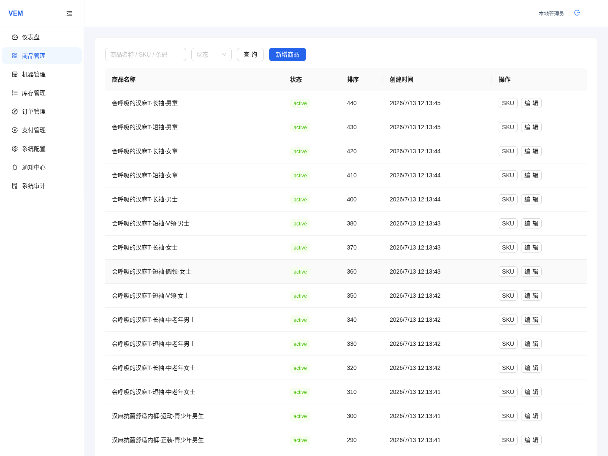
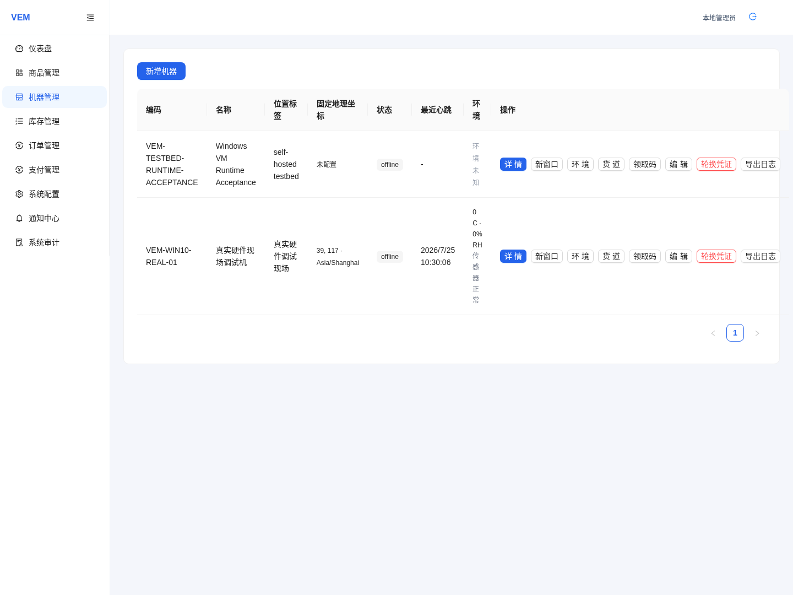
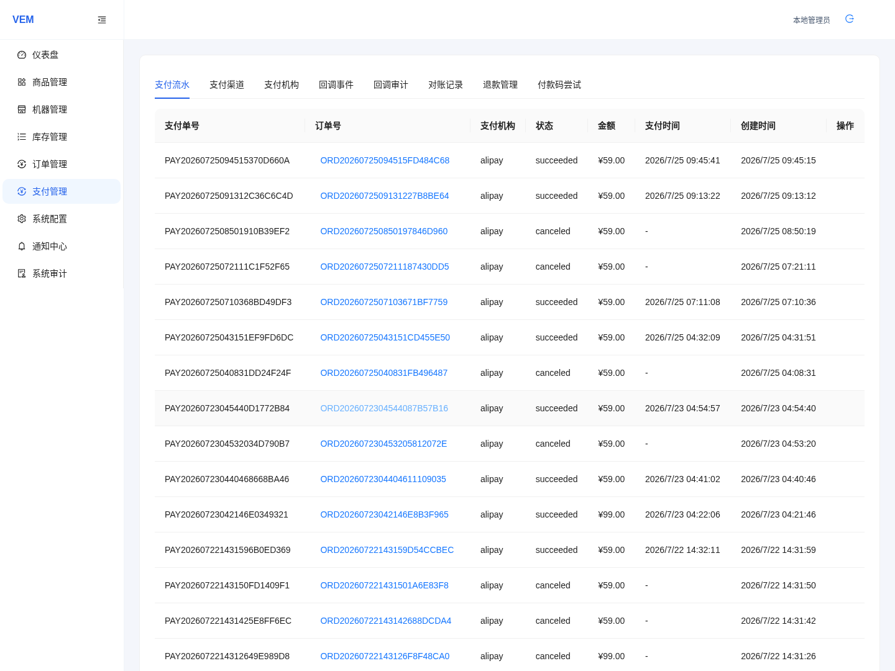
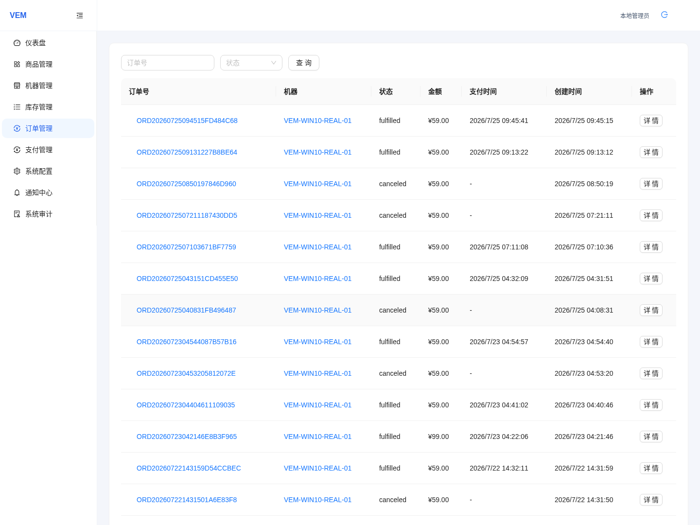

# VEM 运营操作手册（初版）

## 1. 适用范围

本手册面向日常业务运营人员，用于完成 VEM 后台与机器端的常见运营动作。

本手册只说明可见界面上的业务操作，不包含以下实施细节：

- Docker、SSH、API、MQTT、环境变量
- 数据库修改、脚本修复、日志采集命令
- 支付平台开户、密钥申请、证书生成
- 机器本地凭证、令牌、配置文件路径

## 2. 使用前说明

- 后台页面名称以当前 Admin Operations Console 为准。
- 机器端操作以 Machine Runtime Console 的本地运维入口为准。
- 本手册中的“补货”仅指机器端 `Routine Refill`。后台 `库存调整` 只用于异常核对，不作为日常补货流程。
- 本版先建立结构、步骤和截图规则；已通过质检的截图可作为当前界面证据，仍标为占位的步骤不得当作已验收证据。

## 3. 截图使用约定

每张正式截图都应有独立编号，并记录：

- 截图编号
- 来源页面或路由
- 视口尺寸或屏幕方向
- 期望出现的中文界面文字
- 截图时间与提交版本
- 质检结果：`passed`、`manual-review`、`rejected`

已采集截图使用图片和相邻证据说明；尚未采集的截图位统一写成如下形式，待真实截图补齐后替换：

> 截图占位：`admin-products-list`
> 期望文字：`商品管理`、`新增商品`
> 状态：待采集

## 4. 商品与 SKU 管理

### 4.1 商品信息维护

适用场景：新增商品、修改商品名称、调整商品介绍、下架不再售卖的商品。

建议步骤：

1. 进入后台商品管理页面。
2. 先按商品名称搜索，确认是否已存在同款商品。
3. 新增或编辑商品基础信息。
4. 检查商品展示名称是否便于顾客识别。
5. 保存后返回列表，确认状态与展示信息正确。

截图占位：

截图证据：`admin-products-list` / 期望文字：`商品管理`、`新增商品` / 质检：`passed`

### 4.2 SKU 维护

适用场景：同一商品存在多个尺码、颜色或规格。

建议步骤：

1. 进入目标商品详情。
2. 在 SKU 区域新增或编辑规格项。
3. 保证顾客可区分的规格信息完整，例如颜色、尺码。
4. 停售规格应单独处理，不要误删仍在售的其他规格。

运营要点：

- SKU 是库存绑定、价格销售和上架售卖的基础单位。
- 同款不同尺码应分别维护 SKU。

截图占位：

> `admin-product-sku-editor` / 期望文字：`规格`、`新增 SKU` / 状态：待采集

### 4.3 价格调整

适用场景：日常调价、活动结束恢复原价。

建议步骤：

1. 进入商品或 SKU 编辑页面。
2. 找到销售价格字段并修改。
3. 保存后回到列表或详情页复核新价格。
4. 如机器已在售，确认相关商品在机器端售价展示正常。

运营要点：

- 调价前先确认影响范围，避免误改同系列多个 SKU。
- 价格调整后，建议抽查对应机器的商品展示页。

截图占位：

> `admin-product-price-edit` / 期望文字：`售价`、`保存` / 状态：待采集

## 5. 商品图与试衣剪影

### 5.1 商品图

商品图用于顾客浏览商品列表和商品详情时识别商品。

建议要求：

- 图片应直接展示售卖商品本体。
- 保持清晰、完整，避免严重裁切。
- 同一商品不同颜色可使用对应颜色图片。

建议步骤：

1. 进入商品编辑页。
2. 上传或替换商品图。
3. 保存后检查列表与详情页是否能正确显示。

截图占位：

> `admin-product-image-upload` / 期望文字：`商品图片`、`上传` / 状态：待采集

### 5.2 试衣剪影

试衣剪影只用于支持试衣体验的款式/颜色，不按尺码重复维护。

建议步骤：

1. 进入商品或相关规格的试衣资源区域。
2. 仅为支持试衣的款式/颜色配置剪影。
3. 保存后在机器端试衣预览中确认剪影位置和方向合理。

运营要点：

- 商品图不等于试衣剪影。
- 没有试衣能力的商品无需上传剪影。
- 同款同色不同尺码通常共用一份剪影资源。

截图占位：

> `admin-try-on-silhouette-upload` / 期望文字：`试衣剪影`、`上传` / 状态：待采集

## 6. 机器商品上架与补货

### 6.1 货道与商品绑定

适用场景：新机器上架、改货道、换商品。

建议步骤：

1. 进入机器详情页。
2. 查看货道、库存或商品绑定区域。
3. 按货道位置确认当前绑定商品。
4. 调整绑定后复核销售状态与可售状态。

运营要点：

- 先确认货道位置，再确认商品，不要只看商品名称。
- 绑定调整后应同时复核售价和库存记录是否与现场一致。

截图占位：

截图证据：`admin-machines-list` / 期望文字：`机器管理` / 质检：`passed`

具体货道绑定页面仍待采集。

### 6.2 机器端 Routine Refill 日常补货

`Routine Refill` 是日常补货的标准入口，用于记录这次实际补进了多少件商品。

建议步骤：

1. 在机器端进入本地运维入口。
2. 打开库存维护任务。
3. 选择 `Routine Refill`。
4. 按实际补入数量填写各货道新增件数。
5. 提交前检查补货后的预计库存。
6. 完成后返回库存维护列表，确认同步状态与可售状态恢复正常。

运营要点：

- 日常补货录入的是“新增数量”，不是“最终盘点数量”。
- 如果现场发现后台库存与实物严重不一致，应先记录异常，再决定是否需要后台库存调整。
- 后台 `库存调整` 仅用于调查或纠偏，不叫补货。

截图占位：

> `machine-routine-refill-entry` / 期望文字：`库存维护`、`Routine Refill` / 状态：待采集

> `machine-routine-refill-confirm` / 期望文字：`新增数量`、`提交` / 状态：待采集

## 7. 支付配置

### 7.1 支付宝商户配置

本节只说明如何在后台填写已准备好的支付宝商户信息，不说明商户申请、密钥生成或证书办理。

建议步骤：

1. 进入支付配置页面。
2. 选择支付宝相关商户配置入口。
3. 按页面字段填写或上传已准备好的商户资料。
4. 保存后检查配置状态、密钥状态或回调状态是否正常。

运营要点：

- 商户配置与支付渠道启用是两个动作，不能混为一步。
- 若配置状态异常，应记录页面提示并转交实施或技术支持处理。

截图占位：

截图证据：`admin-payments-tabs` / 期望文字：`支付管理`、`支付流水`、`退款管理` / 质检：`passed`

支付宝商户配置弹窗或详情页仍待采集。

### 7.2 支付渠道启用

建议步骤：

1. 进入支付渠道管理页面。
2. 找到需要启用的渠道。
3. 按全局或机器范围启用渠道。
4. 保存后复核默认渠道、展示顺序和适用范围。

运营要点：

- 先确认商户配置已就绪，再启用渠道。
- 启用后应抽查目标机器是否出现预期支付方式。

截图占位：

截图证据：`admin-payments-tabs` / 期望文字：`支付管理`、`支付流水`、`退款管理` / 质检：`passed`

支付渠道启用的具体编辑状态仍待采集。

## 8. 机器认领与重领

### 8.1 首次认领

建议步骤：

1. 在后台进入机器认领管理。
2. 为目标机器生成认领码。
3. 到机器端本地运维入口输入或完成认领。
4. 返回后台确认机器身份、位置和在线状态已关联到正确机器。

截图占位：

截图证据：`admin-machines-list` / 期望文字：`机器管理` / 质检：`passed`

认领码生成窗口仍待采集。

> `machine-claim-entry` / 期望文字：`认领`、`提交` / 状态：待采集

### 8.2 重领

适用场景：机器重装、替换、现场恢复后重新绑定。

建议步骤：

1. 在后台确认目标机器记录无误。
2. 使用后台的重领或重新认领入口生成新认领码。
3. 在机器端完成重领。
4. 复核机器是否仍归属于正确门店、位置和业务主体。

运营要点：

- 重领前先确认不是误操作到其他机器。
- 发现机器信息错绑时，先停手并保留页面证据。

## 9. 机器环境控制与基础操作

### 9.1 后台远程环境控制

适用场景：需要临时调整空调开关、目标温度或风阀/风速。

建议步骤：

1. 进入机器详情页。
2. 找到环境控制区域。
3. 一次只发起一个控制动作。
4. 记录页面上的成功或失败反馈。

运营要点：

- 环境控制是一次性操作，不表示持续托管状态。
- 如需再次调整，应重新发起新的控制动作。

截图占位：

截图证据：`admin-machines-list` / 期望文字：`机器管理` / 质检：`passed`

机器详情内的环境控制区域仍待采集。

### 9.2 机器端基础检查

机器端本地运维可用于查看运行状态、网络与认领、设备检查、库存维护、声音与视觉、诊断工具。

运营要点：

- 本手册只覆盖业务操作相关入口，不覆盖系统级修复步骤。
- 本地运维完成后，应返回顾客界面并确认机器可正常待机。

截图占位：

> `machine-maintenance-home` / 期望文字：`运行状态`、`库存维护` / 状态：待采集

## 10. 订单、支付与出货异常查看

### 10.1 订单异常查看

建议步骤：

1. 进入订单页面并搜索订单号、机器或时间范围。
2. 打开订单详情。
3. 核对订单状态、支付状态、出货状态和时间线。

建议记录：

- 订单号
- 机器名称或编号
- 异常发生时间
- 当前订单状态
- 是否已见到支付事件、退款动作或人工处理入口

截图占位：

截图证据：`admin-orders-list` / 期望文字：`订单管理` / 质检：`passed`

订单详情抽屉仍待采集。

### 10.2 支付异常查看

建议重点查看：

- 支付状态是否停留在处理中、失败或待人工处理
- 支付事件记录是否完整
- 是否存在退款、关闭、查询等安全操作入口

运营要点：

- 只使用后台已有的安全动作入口。
- 不直接修改数据库或支付状态。
- 页面缺少安全操作时，应记录为产品缺口，不用线下变通替代。

截图占位：

截图证据：`admin-payments-tabs` / 期望文字：`支付管理`、`支付流水`、`退款管理` / 质检：`passed`

支付异常详情与人工处理入口仍待采集。

### 10.3 出货异常查看

建议重点查看：

- 出货状态
- 订单时间线
- 是否已有退款或人工处理记录
- 是否需要同步现场核实货道情况

运营要点：

- 先保留后台证据，再安排现场复核。
- 若订单、支付、出货信息彼此矛盾，应记录完整页面信息并升级处理。

## 11. 异常记录要求

遇到无法按手册完成的情况，请至少记录：

- 页面名称
- 操作前提
- 实际步骤
- 报错提示或异常状态
- 订单号、机器号、商品或 SKU
- 截图编号

缺少安全入口、页面契约错误、请求异常、流程无法闭环，都应作为产品问题跟踪，而不是写进正式操作手册作为常规绕行步骤。

## 12. 当前未完成项

以下内容在本版仍未完成，不能视为已验收：

- Admin UI 细节交互截图采集：商品/SKU 编辑、图片上传、剪影上传、货道绑定、支付配置编辑、机器认领、环境控制、订单详情、支付异常详情
- 真实机器端截图采集
- 机器端截图质量门槛在实际截图批次上的跑批结果
- 按手册逐条完成的运营工作流验收证据

在这些证据补齐前，本手册属于“结构初版”，可用于统一术语和操作边界，但不能单独作为最终交付验收凭据。
